# Diagrams

## Dripper

Used by OUSD on Mainnet.

### Hierarchy

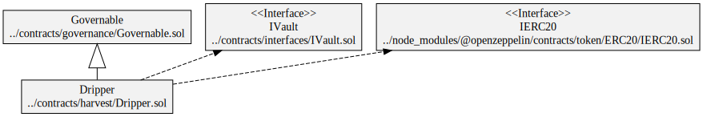

### Squashed

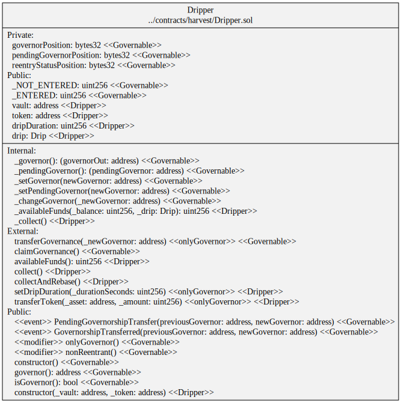

### Storage

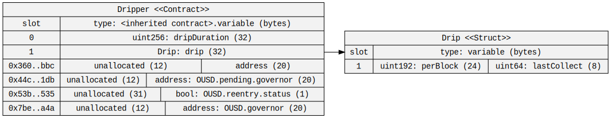

## Fixed Rate Dripper

Used on Mainnet for OETH, Base and Sonic.

### Hierarchy

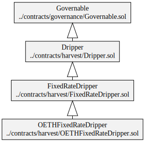

### Squashed

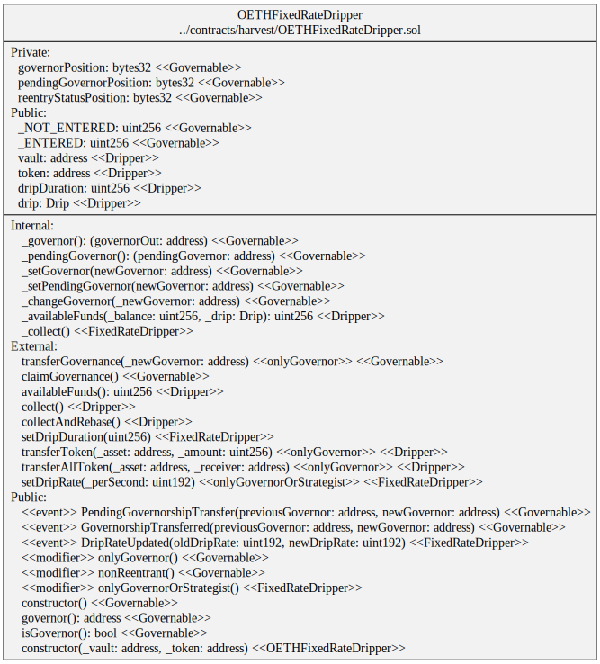

### Storage

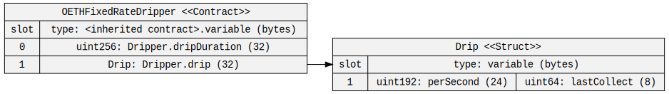

## Harvester

Used on Mainnet for OUSD.

### Hierarchy

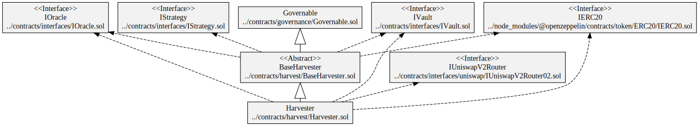

### Squashed

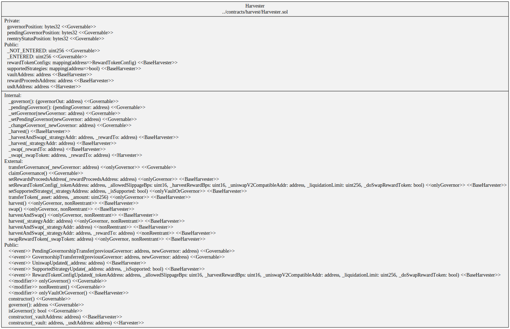

### Storage

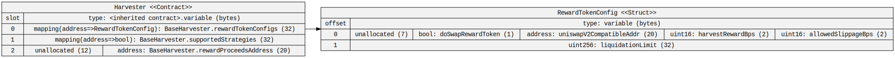

## OETH Simple Harvester

Used on Mainnet for OETH.

### Hierarchy

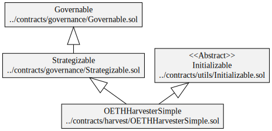

### Squashed

### Storage

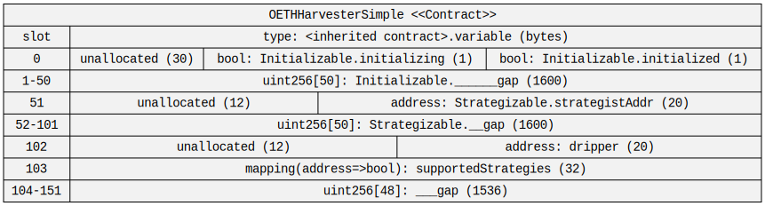

## Base Harvester

### Hierarchy

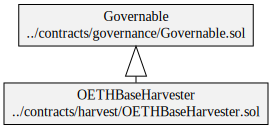

### Squashed

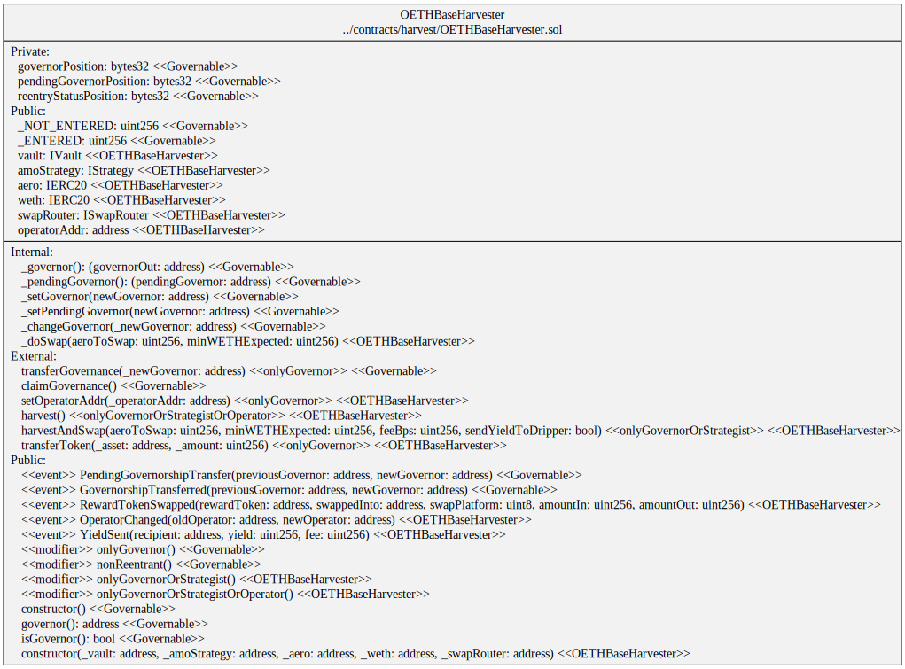

### Storage

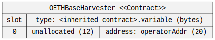

## Sonic Harvester

### Hierarchy

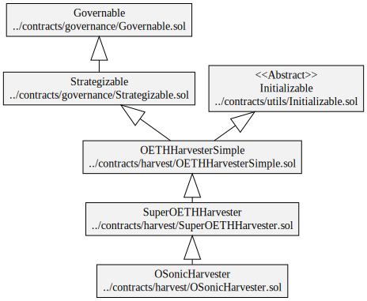

### Squashed

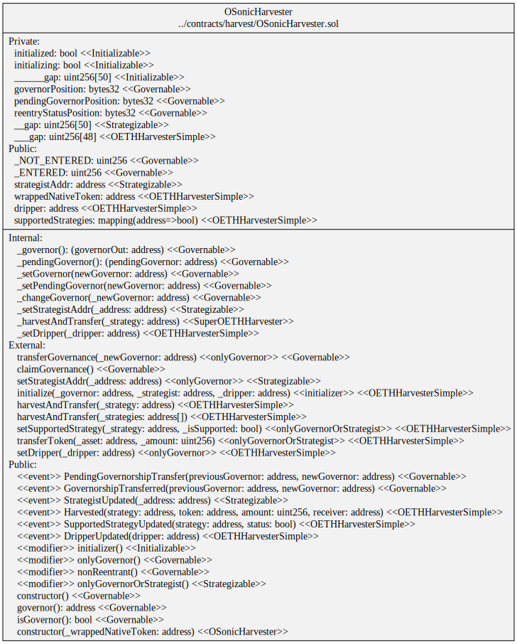

### Storage

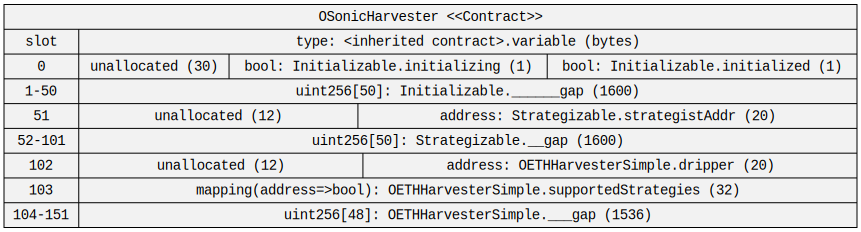
