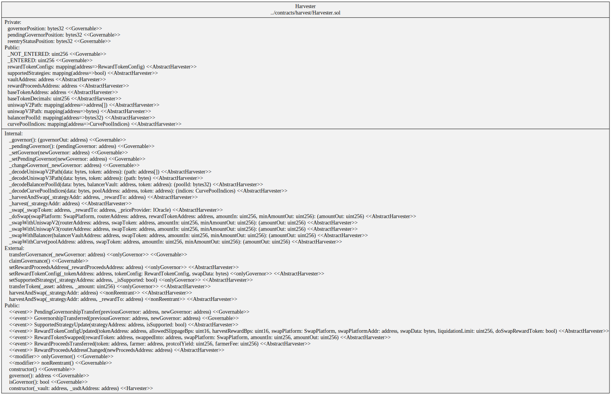
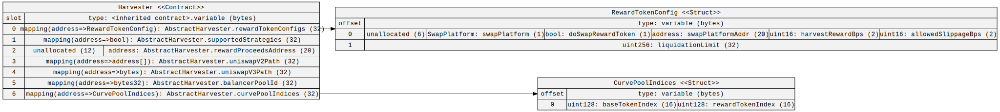

# Diagrams

## Dripper

Used by OUSD on Mainnet.

### Hierarchy

### Squashed

### Storage

## Fixed Rate Dripper

Used on Mainnet for OETH, Base and Sonic.

### Hierarchy

### Squashed

### Storage

## Harvester

Used on Mainnet for OUSD.

### Hierarchy

### Squashed

### Storage

## OETH Simple Harvester

Used on Mainnet for OETH.

### Hierarchy

### Squashed

### Storage

## Base Harvester

### Hierarchy

### Squashed

### Storage

## Sonic Harvester

### Hierarchy

### Squashed

### Storage

