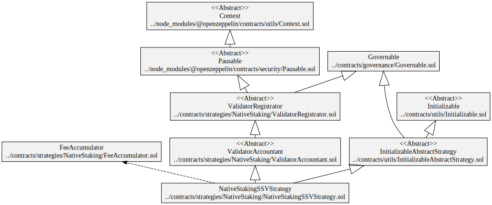
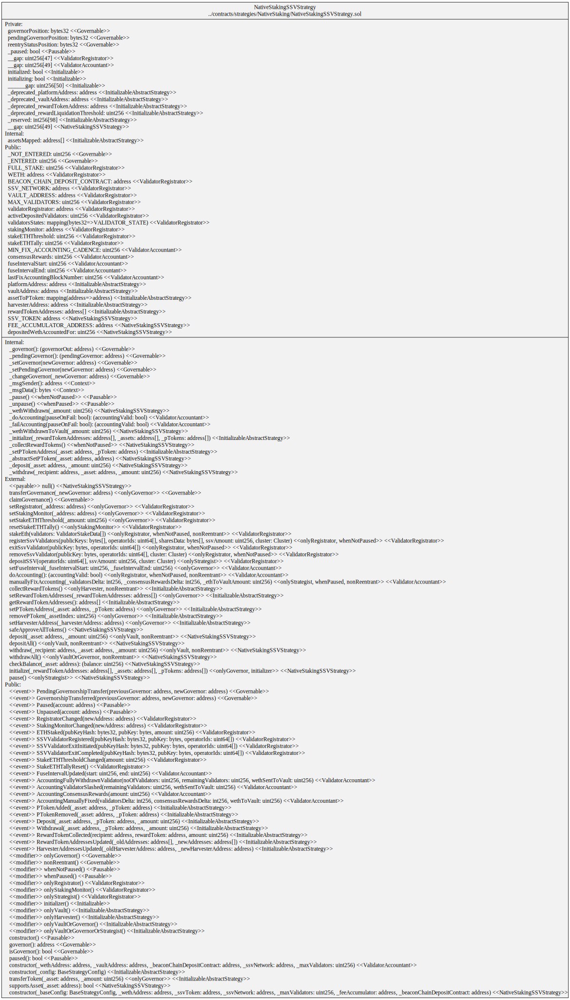
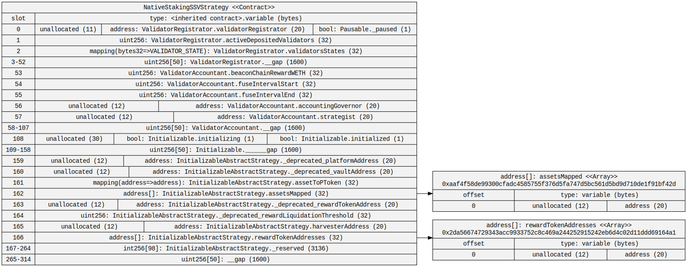
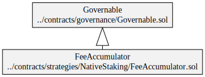
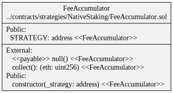
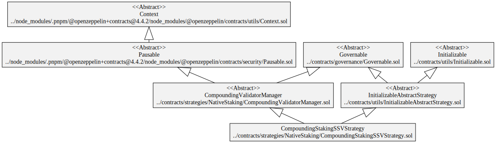
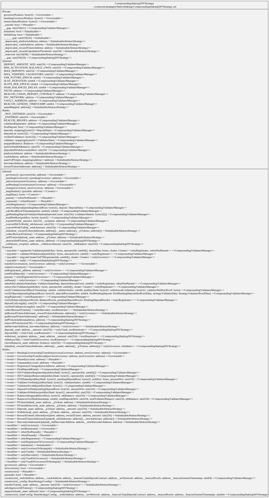
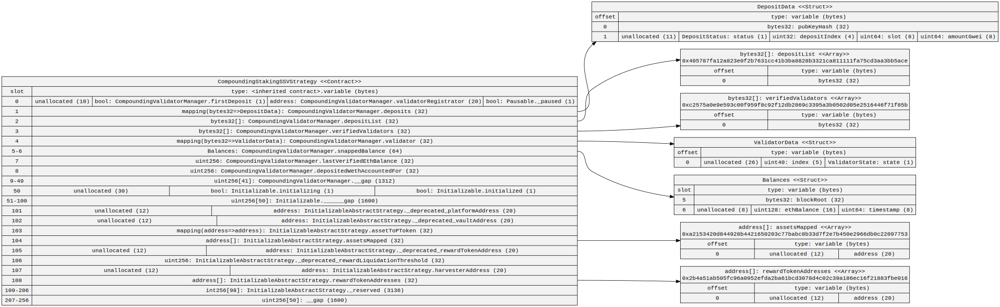
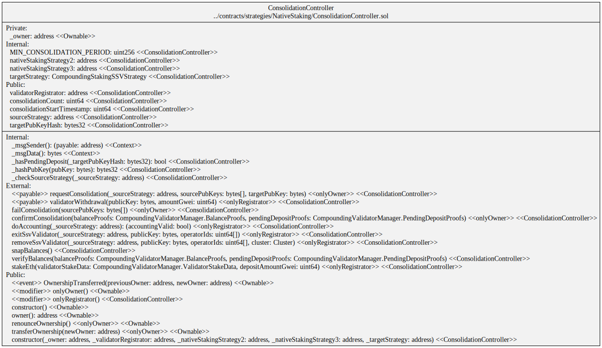

# Diagrams

## Native Staking Strategy

### Hierarchy

### Squashed

### Storage

## Fee Accumulator

### Hierarchy

### Squashed

## Compounding Staking Strategy

### Hierarchy

### Squashed

### Storage

## Consolidation Controller

### Squashed

