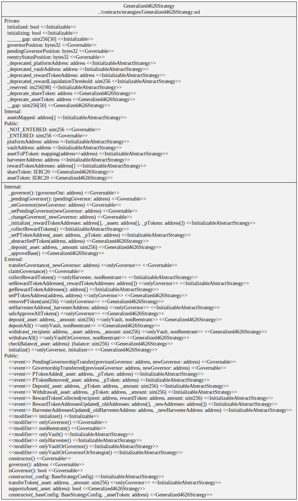

# Diagrams

## Generalized ERC-4626 Strategy

### Hierarchy

### Squashed

### Storage

## Curve AMO Strategy

### Hierarchy

### Squashed

### Storage

## Base Curve AMO Strategy

### Hierarchy

### Squashed

### Storage

