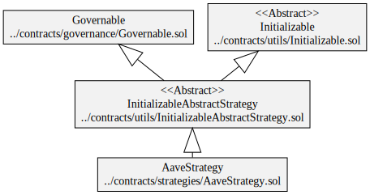
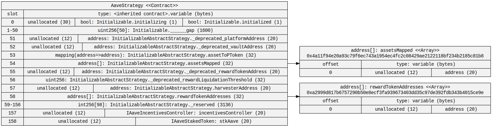
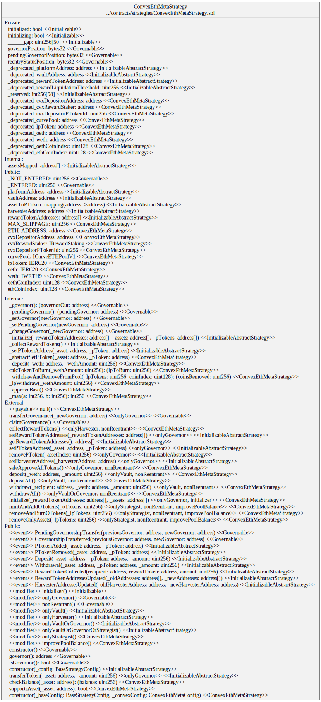
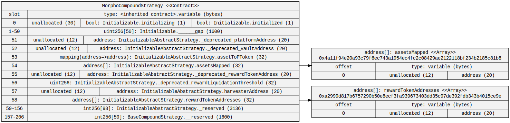

# Diagrams

## Aave Strategy

### Hierarchy

### Squashed

### Storage

## Compound Strategy

### Hierarchy

### Squashed

### Storage

## Convex ETH Metapool Strategy

### Hierarchy

### Squashed

<!-- ### Storage

 -->

## Generalized 4626 Strategy

### Hierarchy

### Squashed

<!-- ### Storage

 -->

## Morpho Aave Strategy

### Hierarchy

### Squashed

### Storage

## Morpho Compound Strategy

### Hierarchy

### Squashed

### Storage

