# Diagrams

## Aave Strategy

### Hierarchy

### Squashed

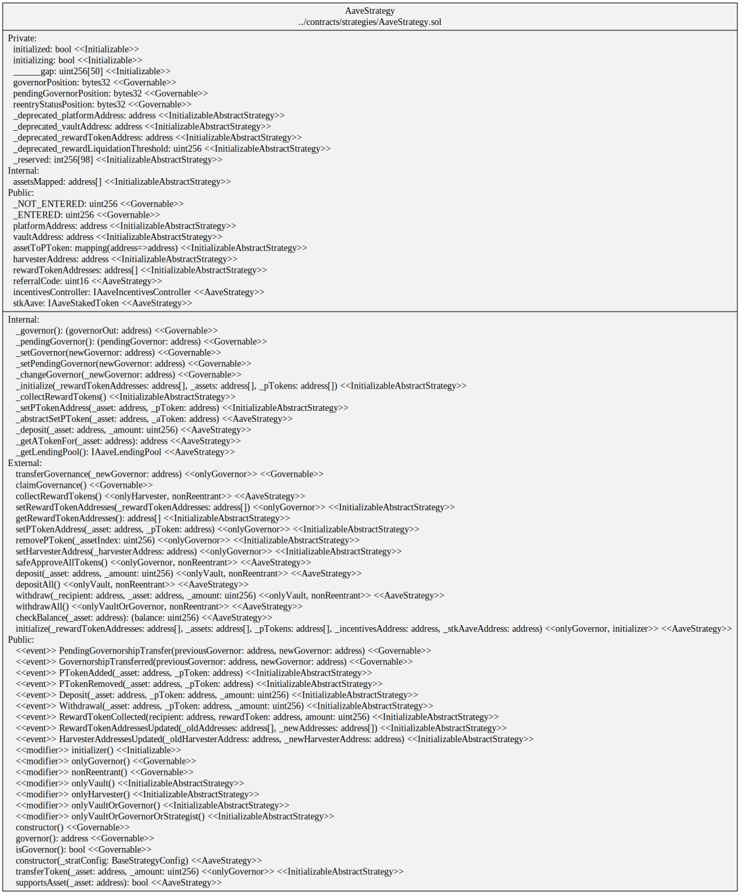

### Storage

## Three Pool Convex Strategy

### Hierarchy

### Squashed

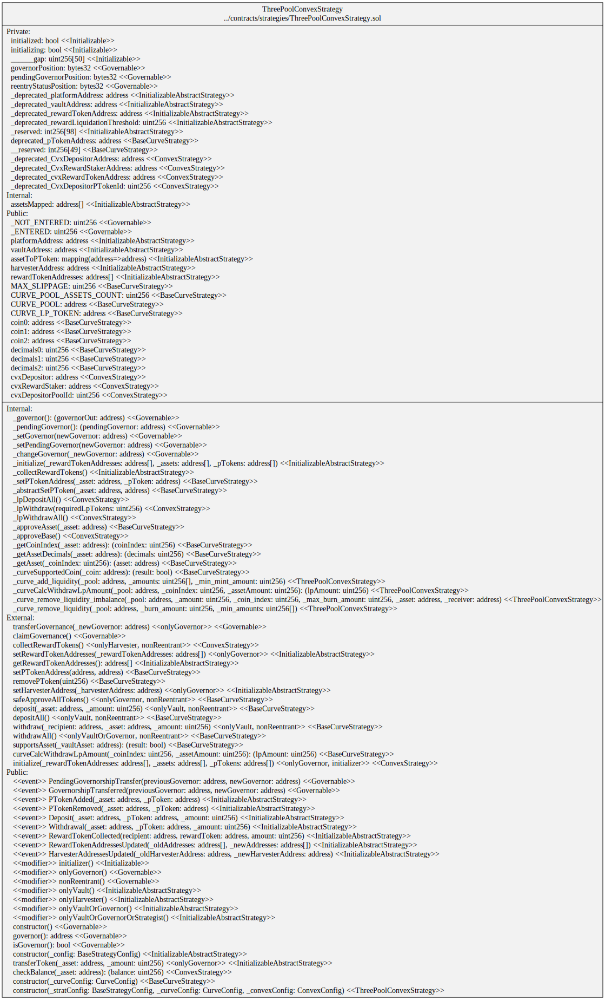

### Storage

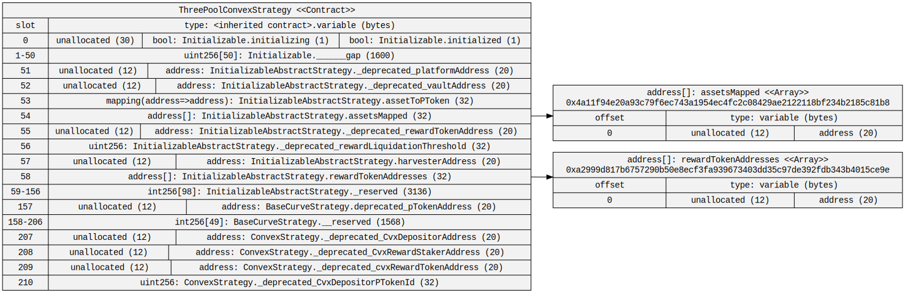

## Two Pool Convex Strategy

### Hierarchy

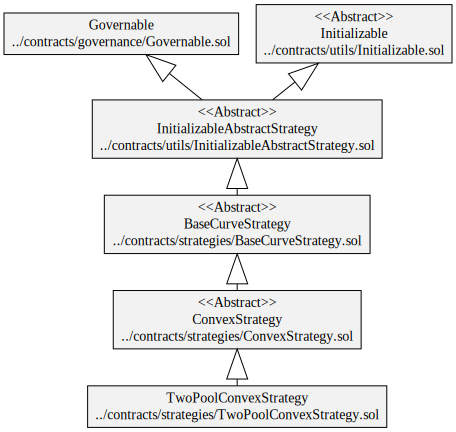

### Squashed

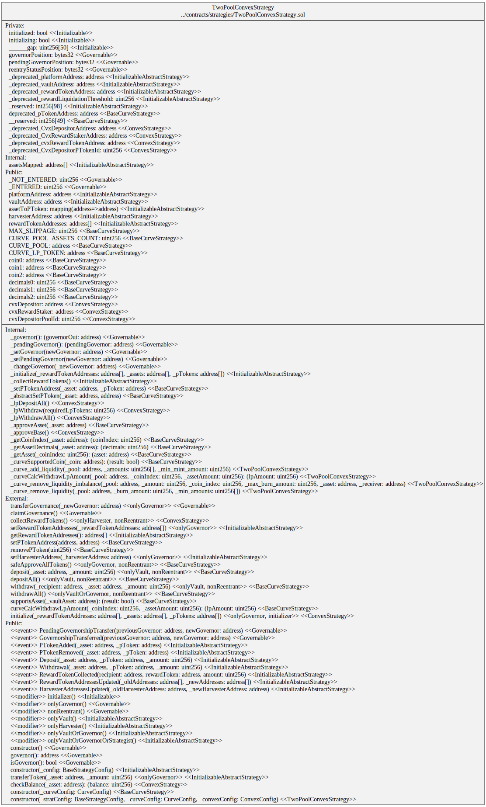

### Storage

## Convex ETH AMO Strategy

### Hierarchy

### Squashed

### Storage

## Convex OUSD AMO Strategy

### Hierarchy

### Squashed

<!-- ### Storage

 -->

## Flux Strategy

### Hierarchy

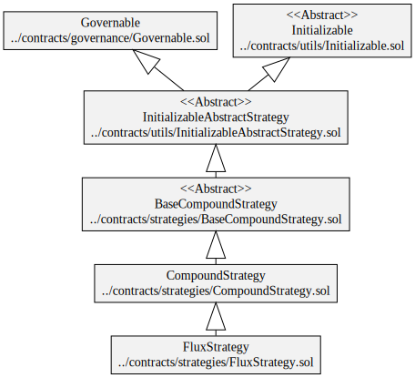

### Squashed

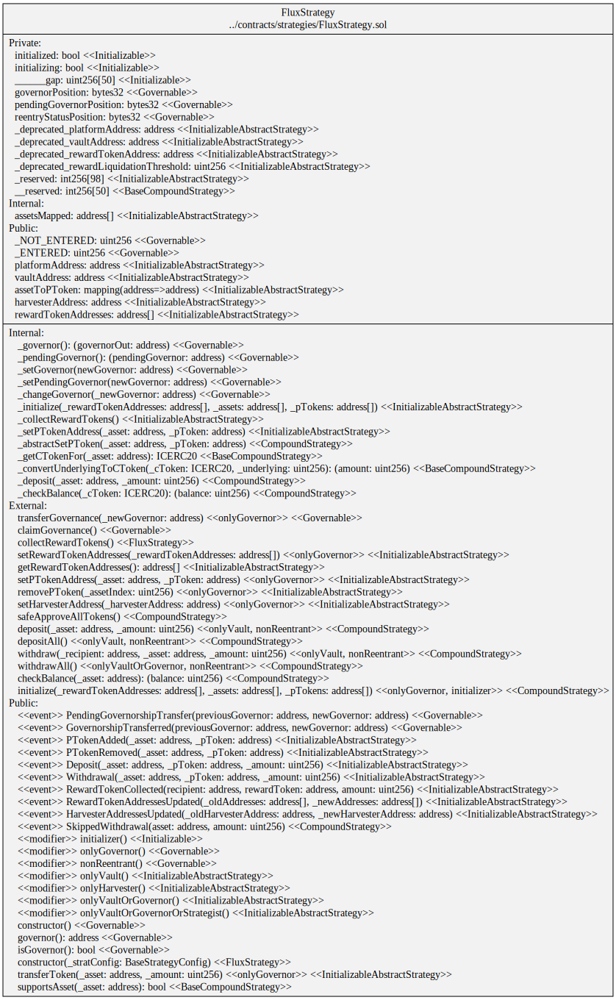

### Storage

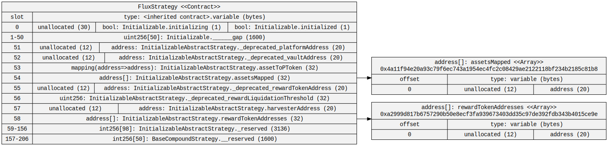

## Frax ETH Strategy

### Hierarchy

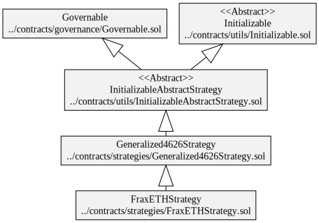

### Squashed

<!-- ### Storage

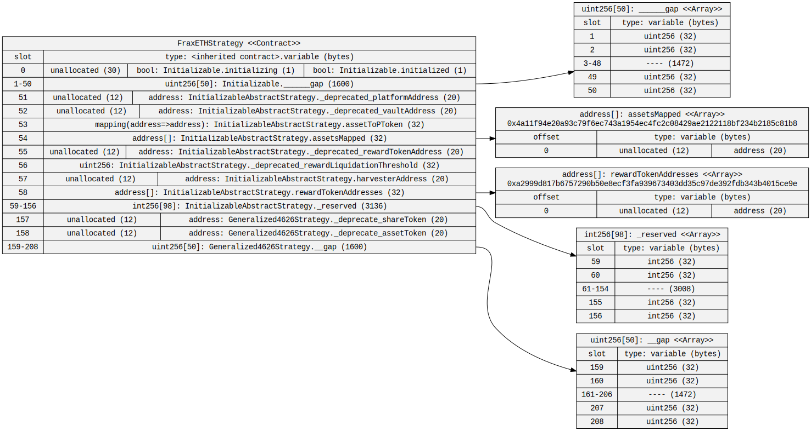 -->

## Generalized ERC-4626 Strategy

### Hierarchy

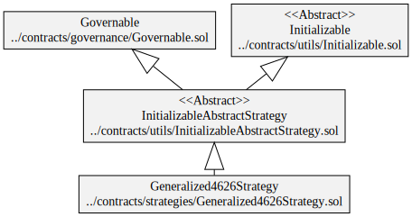

### Squashed

### Storage

## Morpho Aave Strategy

### Hierarchy

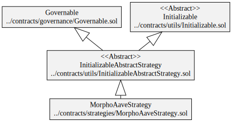

### Squashed

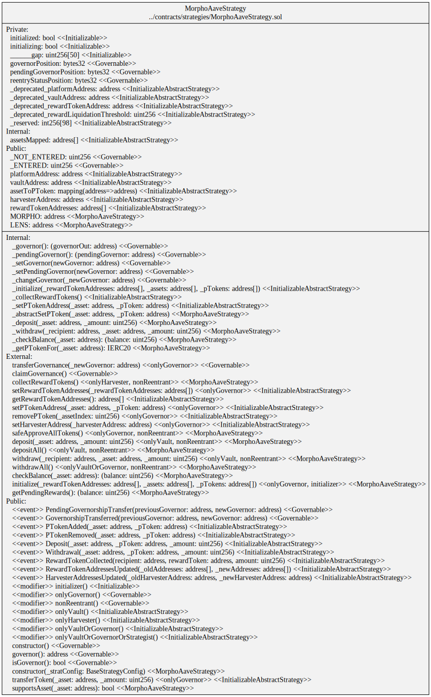

### Storage

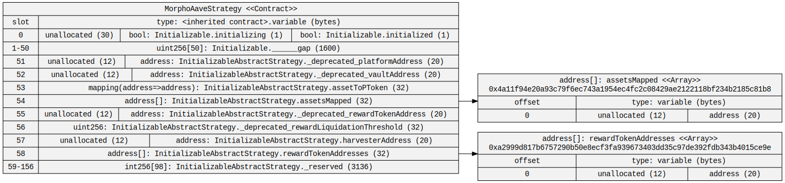

## Morpho Compound Strategy

### Hierarchy

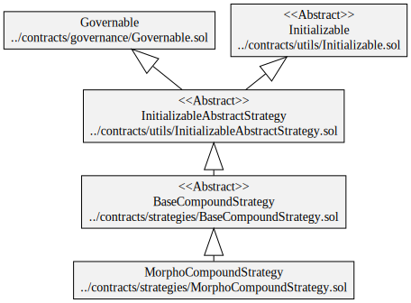

### Squashed

### Storage

