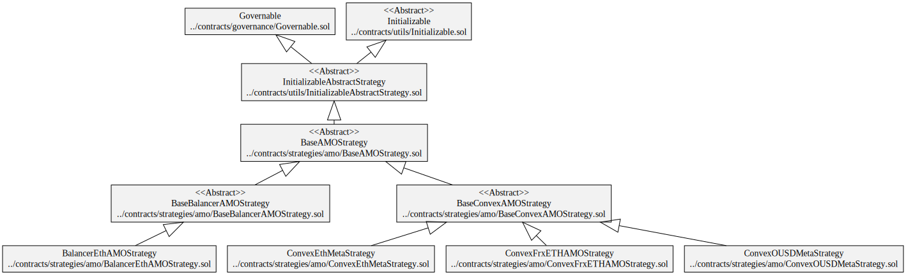
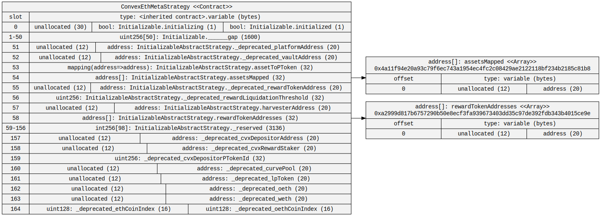
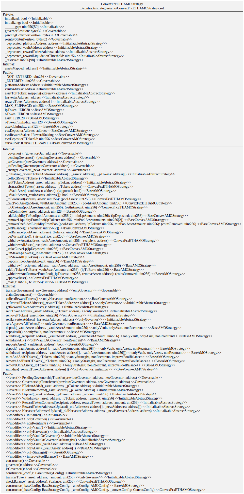
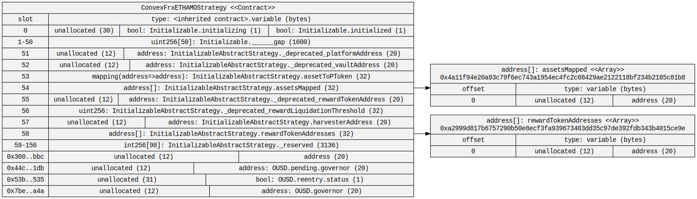
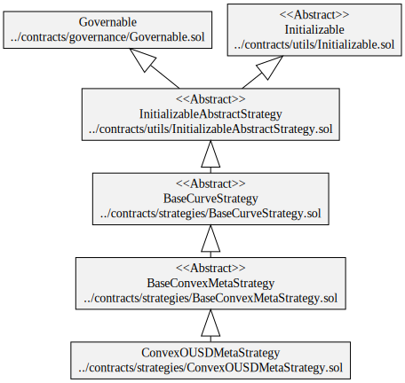
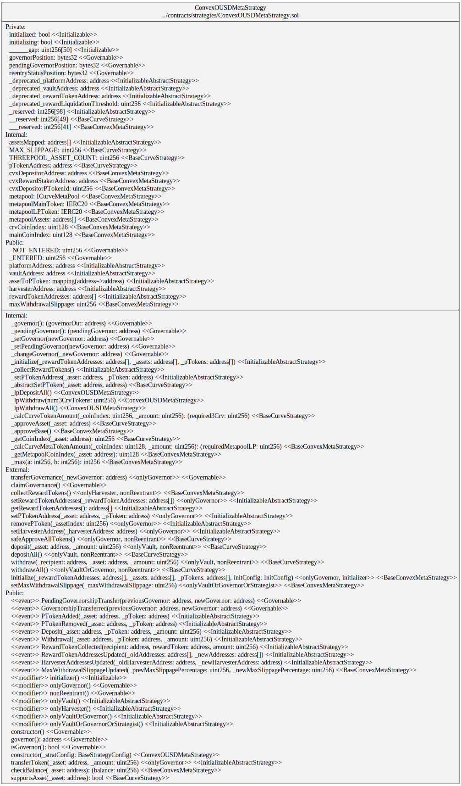
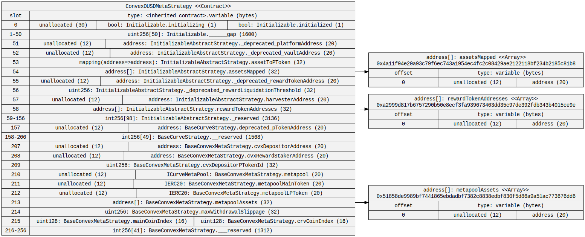

# Diagrams

## Convex AMO Strategy for OETH/ETH

### Hierarchy

### Squashed

### Storage

## Convex AMO Strategy for OETH/frxETH

### Hierarchy

### Squashed

### Storage

## Convex AMO Strategy for OUSD/3CRV

### Hierarchy

### Squashed

### Storage

