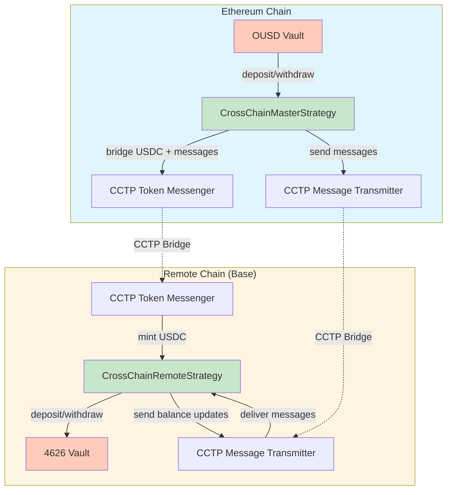
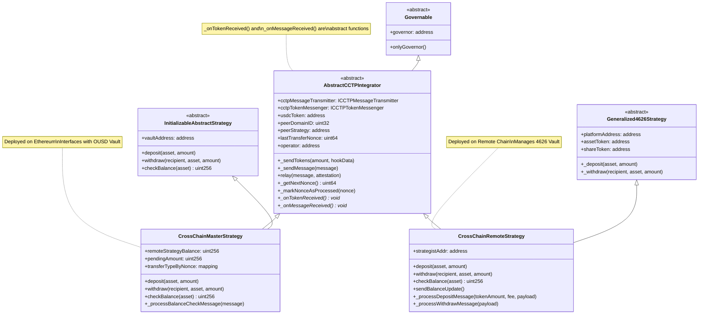
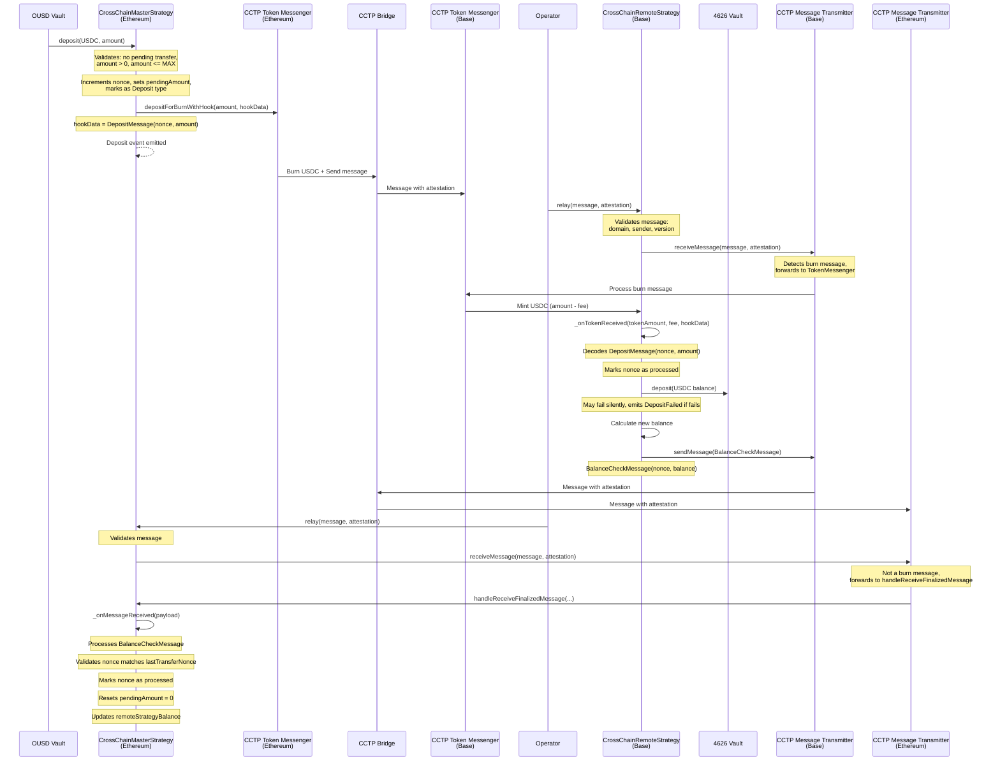
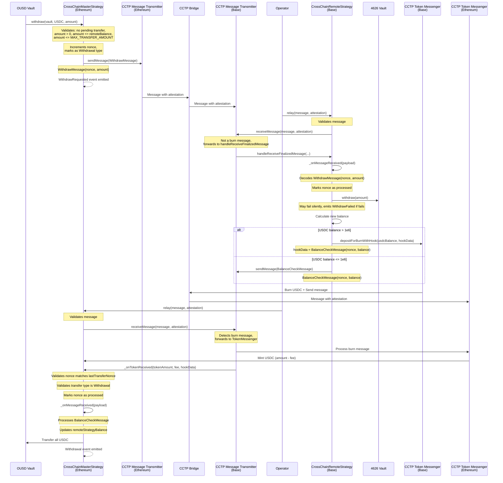
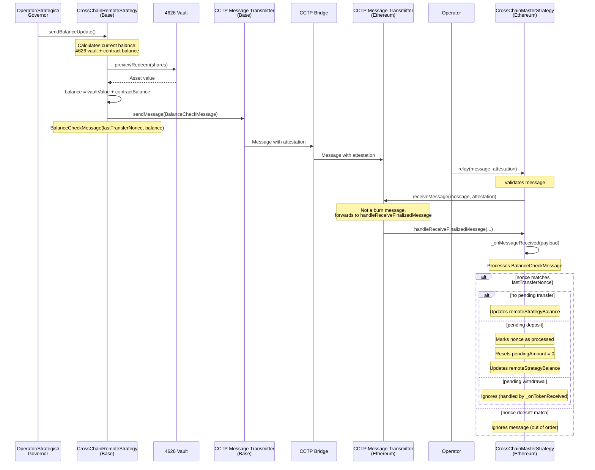

# Cross-Chain Strategy Documentation

## Overview

The Cross-Chain Strategy enables OUSD Vault to deploy funds across multiple EVM chains using Circle's Cross-Chain Transfer Protocol (CCTP). The strategy consists of two main contracts:

- **CrossChainMasterStrategy**: Deployed on Ethereum (same chain as OUSD Vault), acts as the primary strategy interface
- **CrossChainRemoteStrategy**: Deployed on a remote EVM chain (e.g., Base), manages funds in a 4626-compatible vault

### Key Design Decisions

- **Single Pending Transfer**: Only one deposit or withdrawal can be in-flight at a time to simplify state management and prevent race conditions
- **Nonce-Based Ordering**: All transfers use incrementing nonces to ensure proper sequencing and prevent replay attacks
- **CCTP Integration**: Uses Circle's CCTP for secure cross-chain token transfers and message passing

---

## Architecture

### High-Level Flow



### Contract Inheritance



---

## Contracts and Libraries

### AbstractCCTPIntegrator

**Purpose**: Base contract providing CCTP integration functionality shared by both Master and Remote strategies.

**Key Responsibilities**:
- CCTP message handling (`handleReceiveFinalizedMessage`, `handleReceiveUnfinalizedMessage`)
- Token bridging via CCTP Token Messenger (`_sendTokens`)
- Message sending via CCTP Message Transmitter (`_sendMessage`)
- Message relaying by operators (`relay`)
- Nonce management for transfer ordering
- Security checks (domain validation, sender validation)

**Key State Variables**:
- `cctpMessageTransmitter`: CCTP Message Transmitter contract
- `cctpTokenMessenger`: CCTP Token Messenger contract
- `usdcToken`: USDC address on local chain
- `peerDomainID`: Domain ID of the peer chain
- `peerStrategy`: Address of the strategy on peer chain
- `minFinalityThreshold`: Minimum finality threshold (1000 or 2000)
- `feePremiumBps`: Fee premium in basis points (max 3000)
- `lastTransferNonce`: Last known transfer nonce
- `nonceProcessed`: Mapping of processed nonces
- `operator`: Address authorized to relay messages

**Key Functions**:
- `_sendTokens(uint256 tokenAmount, bytes memory hookData)`: Bridges USDC via CCTP with hook data
- `_sendMessage(bytes memory message)`: Sends a message via CCTP
- `relay(bytes memory message, bytes memory attestation)`: Relays a finalized CCTP message (operator-only)
- `_getNextNonce()`: Gets and increments the next nonce
- `_markNonceAsProcessed(uint64 nonce)`: Marks a nonce as processed
- `isTransferPending()`: Checks if there's a pending transfer
- `isNonceProcessed(uint64 nonce)`: Checks if a nonce has been processed

**Abstract Functions** (implemented by child contracts):
- `_onTokenReceived(uint256 tokenAmount, uint256 feeExecuted, bytes memory payload)`: Called when USDC is received via CCTP
- `_onMessageReceived(bytes memory payload)`: Called when a message is received

### CrossChainMasterStrategy

**Purpose**: Strategy deployed on Ethereum that interfaces with OUSD Vault and coordinates with Remote strategy.

**Key Responsibilities**:
- Receiving deposits from OUSD Vault
- Initiating withdrawals requested by OUSD Vault
- Tracking remote strategy balance
- Managing pending transfer state
- Processing balance check messages from Remote strategy

**Key State Variables**:
- `remoteStrategyBalance`: Cached balance of funds in Remote strategy
- `pendingAmount`: Amount bridged but not yet confirmed received
- `transferTypeByNonce`: Mapping of nonce to transfer type (Deposit/Withdrawal)

**Key Functions**:
- `deposit(address _asset, uint256 _amount)`: Called by Vault to deposit funds
- `withdraw(address _recipient, address _asset, uint256 _amount)`: Called by Vault to withdraw funds
- `checkBalance(address _asset)`: Returns total balance (local + pending + remote)
- `_deposit(address _asset, uint256 depositAmount)`: Internal deposit handler
- `_withdraw(address _asset, address _recipient, uint256 _amount)`: Internal withdrawal handler
- `_processBalanceCheckMessage(bytes memory message)`: Processes balance check from Remote

**Deposit Flow**:
1. Validate no pending transfer exists
2. Get next nonce and mark as Deposit type
3. Set `pendingAmount`
4. Bridge USDC via CCTP with deposit message in hook data
5. Wait for balance check message to confirm

**Withdrawal Flow**:
1. Validate no pending transfer exists
2. Validate sufficient remote balance
3. Get next nonce and mark as Withdrawal type
4. Send withdrawal message via CCTP
5. Wait for tokens to be bridged back with balance check in hook data

**Balance Check Processing**:
- Validates nonce matches `lastTransferNonce`
- Updates `remoteStrategyBalance`
- If pending deposit: marks nonce as processed, resets `pendingAmount`
- If pending withdrawal: skips balance update (handled in `_onTokenReceived`)

### CrossChainRemoteStrategy

**Purpose**: Strategy deployed on remote chain that manages funds in a 4626 vault and responds to Master strategy commands.

**Key Responsibilities**:
- Receiving bridged USDC from Master strategy
- Depositing to 4626 vault
- Withdrawing from 4626 vault
- Sending balance check messages to Master strategy
- Managing strategist permissions

**Key State Variables**:
- `strategistAddr`: Address of strategist (for compatibility with Generalized4626Strategy)

**Key Functions**:
- `deposit(address _asset, uint256 _amount)`: Deposits to 4626 vault (governor/strategist only)
- `withdraw(address _recipient, address _asset, uint256 _amount)`: Withdraws from 4626 vault (governor/strategist only)
- `checkBalance(address _asset)`: Returns total balance (4626 vault + contract balance)
- `sendBalanceUpdate()`: Manually sends balance check message (operator/strategist/governor)
- `_processDepositMessage(uint256 tokenAmount, uint256 feeExecuted, bytes memory payload)`: Handles deposit message
- `_processWithdrawMessage(bytes memory payload)`: Handles withdrawal message
- `_deposit(address _asset, uint256 _amount)`: Internal deposit to 4626 vault (with error handling)
- `_withdraw(address _recipient, address _asset, uint256 _amount)`: Internal withdrawal from 4626 vault (with error handling)

**Deposit Message Handling**:
1. Decode nonce and amount from payload
2. Verify nonce not already processed
3. Mark nonce as processed
4. Deposit all USDC balance to 4626 vault (may fail silently)
5. Send balance check message with updated balance

**Withdrawal Message Handling**:
1. Decode nonce and amount from payload
2. Verify nonce not already processed
3. Mark nonce as processed
4. Withdraw from 4626 vault (may fail silently)
5. Bridge USDC back to Master (if balance > 1e6) with balance check in hook data
6. If balance <= 1e6, send balance check message only

### CrossChainStrategyHelper

**Purpose**: Library for encoding and decoding cross-chain messages.

**Message Constants**:
- `DEPOSIT_MESSAGE = 1`
- `WITHDRAW_MESSAGE = 2`
- `BALANCE_CHECK_MESSAGE = 3`
- `CCTP_MESSAGE_VERSION = 1`
- `ORIGIN_MESSAGE_VERSION = 1010`

**Message Format**:
```
[0-4 bytes]:   Origin Message Version (1010)
[4-8 bytes]:   Message Type (1, 2, or 3)
[8+ bytes]:    Message Payload (ABI-encoded)
```

**Key Functions**:
- `encodeDepositMessage(uint64 nonce, uint256 depositAmount)`: Encodes deposit message
- `decodeDepositMessage(bytes memory message)`: Decodes deposit message
- `encodeWithdrawMessage(uint64 nonce, uint256 withdrawAmount)`: Encodes withdrawal message
- `decodeWithdrawMessage(bytes memory message)`: Decodes withdrawal message
- `encodeBalanceCheckMessage(uint64 nonce, uint256 balance)`: Encodes balance check message
- `decodeBalanceCheckMessage(bytes memory message)`: Decodes balance check message
- `getMessageVersion(bytes memory message)`: Extracts message version
- `getMessageType(bytes memory message)`: Extracts message type
- `verifyMessageVersionAndType(bytes memory _message, uint32 _type)`: Validates message format

**Message Payloads**:
- **Deposit**: `abi.encode(nonce, depositAmount)`
- **Withdraw**: `abi.encode(nonce, withdrawAmount)`
- **Balance Check**: `abi.encode(nonce, balance)`

### BytesHelper

**Purpose**: Utility library for extracting typed data from byte arrays.

**Key Functions**:
- `extractSlice(bytes memory data, uint256 start, uint256 end)`: Extracts a byte slice
- `extractUint32(bytes memory data, uint256 start)`: Extracts uint32 at offset
- `extractUint256(bytes memory data, uint256 start)`: Extracts uint256 at offset
- `extractAddress(bytes memory data, uint256 start)`: Extracts address at offset (32-byte padded)

**Usage**: Used by `CrossChainStrategyHelper` and `AbstractCCTPIntegrator` to parse CCTP message headers and bodies.

---

## Message Protocol

### CCTP Message Structure

CCTP messages have a header and body:

**Header**:
Ref: https://developers.circle.com/cctp/technical-guide#message-header

**Message Body for Burn Messages (V2)**:
Ref: https://developers.circle.com/cctp/technical-guide#message-body
Ref: https://github.com/circlefin/evm-cctp-contracts/blob/master/src/messages/v2/BurnMessageV2.sol

### Origin's Custom Message Body

All Origin messages follow this format:
```
[0-4 bytes]:   ORIGIN_MESSAGE_VERSION (1010)
[4-8 bytes]:   MESSAGE_TYPE (1, 2, or 3)
[8+ bytes]:    Payload (ABI-encoded)
```

### Message Types

#### 1. Deposit Message

**Sent By**: Master Strategy  
**Sent Via**: CCTP Token Messenger (as hook data)  
**Contains**:
- Nonce (uint64)
- Deposit Amount (uint256)

**Encoding**: `abi.encodePacked(ORIGIN_MESSAGE_VERSION, DEPOSIT_MESSAGE, abi.encode(nonce, depositAmount))`

**Flow**:
1. Master bridges USDC with deposit message as hook data
2. Remote receives USDC and hook data via `_onTokenReceived`
3. Remote deposits to 4626 vault
4. Remote sends balance check message

#### 2. Withdraw Message

**Sent By**: Master Strategy  
**Sent Via**: CCTP Message Transmitter  
**Contains**:
- Nonce (uint64)
- Withdraw Amount (uint256)

**Encoding**: `abi.encodePacked(ORIGIN_MESSAGE_VERSION, WITHDRAW_MESSAGE, abi.encode(nonce, withdrawAmount))`

**Flow**:
1. Master sends withdrawal message
2. Remote receives via `_onMessageReceived`
3. Remote withdraws from 4626 vault
4. Remote bridges USDC back with balance check as hook data
5. Master receives USDC and processes balance check

#### 3. Balance Check Message

**Sent By**: Remote Strategy  
**Sent Via**: CCTP Message Transmitter (or as hook data in burn message)  
**Contains**:
- Nonce (uint64)
- Balance (uint256)

**Encoding**: `abi.encodePacked(ORIGIN_MESSAGE_VERSION, BALANCE_CHECK_MESSAGE, abi.encode(nonce, balance))`

**Flow**:
1. Remote sends balance check after deposit/withdrawal
2. Master receives and validates nonce
3. Master updates `remoteStrategyBalance`
4. If nonce matches pending transfer, marks as processed

---

## Communication Flows

### Deposit Flow



### Withdrawal Flow



### Balance Update Flow (Manual)



---

## Nonce Management

### Nonce Lifecycle

1. **Initialization**: Nonces start at 0 (but 0 is disregarded, first nonce is 1)
2. **Increment**: `_getNextNonce()` increments `lastTransferNonce` and returns new value
3. **Processing**: `_markNonceAsProcessed(nonce)` marks nonce as processed
4. **Validation**: `isNonceProcessed(nonce)` checks if nonce has been processed

### Nonce Rules

- Nonces must be strictly increasing
- A nonce can only be marked as processed once
- Only the latest nonce can be marked as processed (nonce >= lastTransferNonce)
- New transfers cannot start if last nonce hasn't been processed

### Replay Protection

- Each message includes a nonce
- Nonces are checked before processing
- Once processed, a nonce cannot be processed again
- Out-of-order messages with non-matching nonces are ignored

---

## State Management

### Master Strategy State

**Local State**:
- `IERC20(usdcToken).balanceOf(address(this))`: USDC held locally
- `pendingAmount`: USDC bridged but not confirmed
- `remoteStrategyBalance`: Cached balance in Remote strategy

**Total Balance**: `localBalance + pendingAmount + remoteStrategyBalance`

**Transfer State**:
- `lastTransferNonce`: Last known nonce
- `transferTypeByNonce`: Type of each transfer (Deposit/Withdrawal)
- `nonceProcessed`: Which nonces have been processed

### Remote Strategy State

**Local State**:
- `IERC20(usdcToken).balanceOf(address(this))`: USDC held locally
- `IERC4626(platformAddress).balanceOf(address(this))`: Shares in 4626 vault

**Total Balance**: `contractBalance + previewRedeem(shares)`

**Transfer State**:
- `lastTransferNonce`: Last known nonce
- `nonceProcessed`: Which nonces have been processed

---

## Error Handling and Edge Cases

### Deposit Failures

**Remote Strategy Deposit Failure**:
- If 4626 vault deposit fails, Remote emits `DepositFailed` event
- Balance check message is still sent (includes undeposited USDC)
- Master strategy updates balance correctly
- Funds remain on Remote contract until manual deposit by the Guardian

### Withdrawal Failures

**Remote Strategy Withdrawal Failure**:
- If 4626 vault withdrawal fails, Remote emits `WithdrawFailed` event
- Balance check message is still sent (with original balance)
- Master strategy updates balance correctly
- No tokens are bridged back (or minimal dust if balance <= 1e6)
- Guardian will have to manually call the public `withdraw` method later to process the withdrawal and then call the `relay` method the WithdrawMessage again

### Message Ordering

**Out-of-Order Messages**:
- Balance check messages with non-matching nonces are ignored
- Master strategy only processes balance checks for `lastTransferNonce`
- Older messages are safely discarded

**Race Conditions**:
- Single pending transfer design prevents most race conditions
- Withdrawal balance checks are ignored if withdrawal is pending (handled by `_onTokenReceived`)

### Nonce Edge Cases

**Nonce Too Low**:
- `_markNonceAsProcessed` reverts if nonce < lastTransferNonce
- Prevents replay attacks with old nonces

**Nonce Already Processed**:
- `_markNonceAsProcessed` reverts if nonce already processed
- Prevents duplicate processing

**Pending Transfer**:
- `_getNextNonce` reverts if last nonce not processed
- Prevents starting new transfer while one is pending

### CCTP Limitations

**Max Transfer Amount**:
- CCTP limits transfers to 10M USDC per transaction
- Both strategies enforce `MAX_TRANSFER_AMOUNT = 10_000_000 * 10**6`

**Finality Thresholds**:
- Supports 1000 (safe, 1 epoch) or 2000 (finalized, 2 epochs)
- Configurable via `setMinFinalityThreshold`
- Unfinalized messages only supported if threshold is 1000

**Fee Handling**:
- Fee premium configurable up to 30% (3000 bps)
- Fees are deducted from bridged amount
- Remote strategy receives `tokenAmount - feeExecuted`

### Operator Requirements

**Message Relaying**:
- Only `operator` can call `relay()`
- Operator must provide valid CCTP attestation
- Operator is responsible for monitoring and relaying finalized messages

**Security**:
- Messages are validated for domain, sender, and recipient
- Only messages from `peerStrategy` are accepted
- Only messages to `address(this)` are processed

---

## Other Notes

### Proxies
- Both strategies use Create2 to deploy their proxy to the same address on all networks

### Initialization

Both strategies require initialization:
- **Master**: `initialize(operator, minFinalityThreshold, feePremiumBps)`
- **Remote**: `initialize(strategist, operator, minFinalityThreshold, feePremiumBps)`

### Governance

- Both strategies inherit from `Governable`
- Governor can upgrade implementation, update operator, finality threshold, fee premium
- Remote strategy governor can update strategist address

## Analytics & Monitoring

### Useful Contract Methods and Variables
- `MasterStrategy.checkBalance(address)`: Returns the sum of balance held locally in the master contract, balance reported by the remote strategy and any tokens that are being bridged and are yet to be acknowledged by the rremote strategy
- `MasterStrategy.pendingAmount`: Returns the amount that is being bridged from Master to Remote strategy. Once it's received on Remote strategy and it sends back an acknowledgement, it'll set back to zero.
- `MasterStrategy.remoteStrategyBalacne`: Last reported balance of Remote strategy
- `RemoteStrategy.checkBalance(address)`: Returns the balance held by the remote strategy as well as the amount it has deposited into the underlying 4626 vault
- `RemoteStrategy.platformAddress`: Returns the underlying 4626 Vault to which remote strategy deposits funds to.


### Contract Events 
The following events need to be monitored from the contracts and an alert be sent to any of the channels as they happen:

    ```
    event CCTPMinFinalityThresholdSet(uint16 minFinalityThreshold);
    event CCTPFeePremiumBpsSet(uint16 feePremiumBps);
    event OperatorChanged(address operator);

    event TokensBridged(
        uint32 destinationDomain,
        address peerStrategy,
        address tokenAddress,
        uint256 tokenAmount,
        uint256 maxFee,
        uint32 minFinalityThreshold,
        bytes hookData
    );

    event MessageTransmitted(
        uint32 destinationDomain,
        address peerStrategy,
        uint32 minFinalityThreshold,
        bytes message
    );

    event DepositUnderlyingFailed(string reason);
    event WithdrawalFailed(uint256 amountRequested, uint256 amountAvailable);
    event WithdrawUnderlyingFailed(string reason);
    event StrategistUpdated(address _address);

    event RemoteStrategyBalanceUpdated(uint256 balance);
    event WithdrawRequested(address indexed asset, uint256 amount);
    ```

Out of these, `DepositUnderlyingFailed`, `WithdrawalFailed` and `WithdrawUnderlyingFailed` are of higher importance as they require manual intervention by Guardian when they get emitted. 