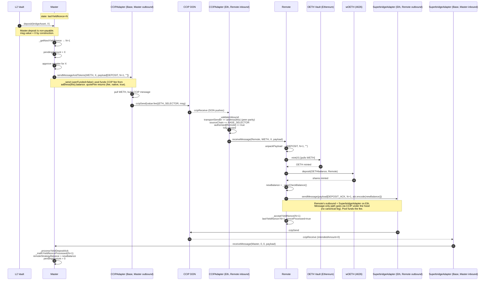
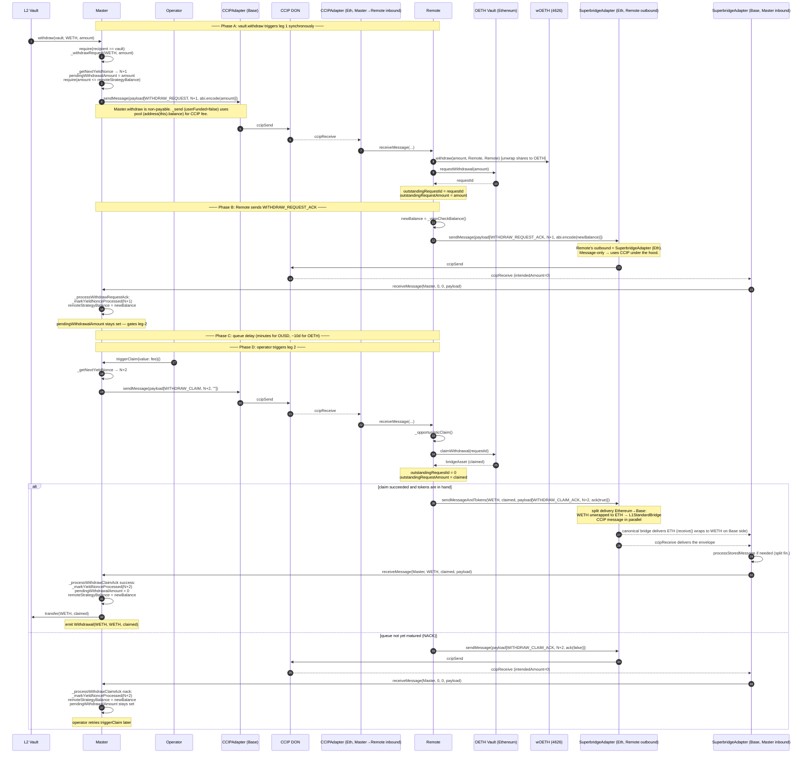
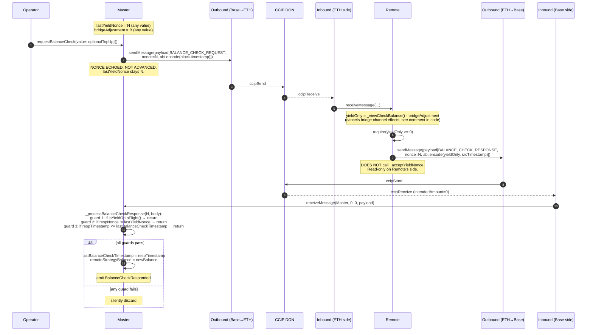
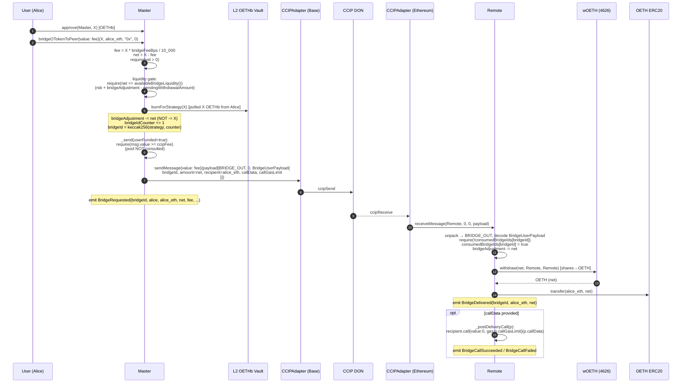
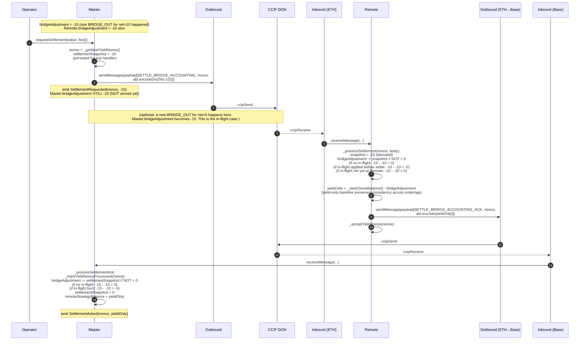

# OUSD V3 Cross-Chain Strategy — Flow Walkthroughs

This document walks through each of the five cross-chain flows end-to-end with
sequence diagrams and prose annotations. Use `README.md` for the reference
material (file map, message envelope, authorisation surface, message-type
table); use this document for "what happens when X."

The contracts are generic across two products:

- **OETHb** — OETH bridged between Base (where OETHb lives) and Ethereum
  (where wOETH lives and earns yield). Bridge mix: CCIP for messages, OP Stack
  canonical bridge for native ETH transfers (split delivery via
  `SuperbridgeAdapter`).
- **OUSD V3** — OUSD bridged between Ethereum (where OUSD lives) and L2 spoke
  chains (Base, HyperEVM, etc.). Bridge mix: Circle CCTP V2 for everything,
  atomic delivery in both directions.

Walkthroughs default to OETHb for concreteness. Differences for OUSD V3 are
called out inline.

---

## 1. Architecture overview

### Master and Remote roles

The strategy pair always has the same role split, regardless of product:

- **Master** lives on the chain that hosts the rebasing OToken vault. It's the
  strategy registered with that vault. The vault calls `Master.deposit()` /
  `Master.withdraw()`. Master holds an accounting view of how much value sits
  on the peer chain via `remoteStrategyBalance` + a signed `bridgeAdjustment`.
  It never holds the yield-earning shares directly.
- **Remote** lives on the chain that hosts the wOToken (the yield-earning
  ERC-4626 wrapper). Remote isn't registered with any vault — it's a custodian
  for wOToken shares held on behalf of the L2 vault. Remote runs the
  bridgeAsset ↔ OToken ↔ wOToken pipeline using the local OToken vault for
  mint/redeem.

For OETHb: Master on Base (OETHb's chain), Remote on Ethereum (wOETH's chain).
For OUSD V3: each spoke chain has a Master in its sub-OUSD vault; Remote on
Ethereum holds the wOUSD that backs that spoke.

### Two channels

The cross-chain protocol carries two distinct kinds of messages, gated
differently:

- **Yield channel** — DEPOSIT, WITHDRAW_REQUEST, WITHDRAW_CLAIM,
  BALANCE_CHECK_REQUEST, SETTLE_BRIDGE_ACCOUNTING and their ACK variants.
  Nonce-gated (yield-channel nonce machinery in
  `AbstractCrossChainV3Strategy`), serialised — one in-flight at a time —
  except for balance check which is non-blocking. Drives the protocol-level
  accounting between Master and Remote.

- **Bridge channel** — BRIDGE_IN and BRIDGE_OUT. Nonceless and user-facing.
  Multiple can be in flight simultaneously. Replay protection via
  `bridgeId = keccak256(strategy, counter)` on the destination side. No ack.

### Fee model

Two separate fee dimensions, never conflated:

1. **Native fee** (paid in ETH/msg.value) — CCIP and Superbridge charge for
   message delivery. CCTP doesn't.
2. **Token-side fee** (deducted from bridged tokens) — CCTP V2 fast-finality
   takes a fee out of the burned amount. CCIP and Superbridge don't.

Native fees come from one of two places depending on who initiated:

- **User-initiated** (`bridgeOTokenToPeer`) → `msg.value` only. Strict
  requirement; pool is not consulted. Prevents pool drain by user paths.
- **Operator-initiated** (yield channel + every Remote-side ack) → the
  strategy's local ETH pool (`address(this).balance`). Operator pre-funds.

Token-side fees are surfaced on the adapter's `MessageDelivered` event (not
forwarded to `receiveMessage`). The receiving strategy accounts on
`amountReceived`; the delta becomes implicit yield drag.

ETH on the strategy is **never** counted in `checkBalance` — `checkBalance`
only reads bridge-asset-denominated slots. Sweep via
`transferNative(amount) onlyGovernor`.

---

## 2. Topology

### OETHb (single pair)

```
                          BASE                          │      ETHEREUM
                                                        │
   L2 OETHb vault                                       │
        │                                               │
        ▼                                               │
   ┌─────────────┐    CCIPAdapter outbound        ┌─────────────┐
   │   Master    │──────────────────────────────▶│ CCIPAdapter │
   │  (Base)     │     (yield + bridge channel    │ (Ethereum)  │
   │             │      messages; native fee)     │   inbound   │
   │             │◀─────────────────────────────  │             │
   │             │  SuperbridgeAdapter inbound    │             │
   │             │  (split delivery: CCIP msg     │             │
   │             │   + L1StandardBridge ETH)      │             │
   └─────────────┘                                 └─────────────┘
                                                          │
                                                          ▼
                                                    ┌──────────┐
                                                    │  Remote  │──holds──▶ wOETH shares
                                                    │(Ethereum)│           (earning OETH yield)
                                                    └──────────┘
                                                          │
                                                          ▼
                                                    OETH vault on Ethereum
                                                    (mint/redeem OETH ↔ WETH)
```

Adapters: `CCIPAdapter` (both sides) and `SuperbridgeAdapter` (both sides; L1
side does `bridgeETHTo`, L2 side wraps incoming ETH to WETH).

### OUSD V3 (hub-and-spoke, planned)

Same Master/Remote pattern as OETHb — Master on the spoke chain (where the
sub-OUSD vault lives); Remote on Ethereum (where the wOUSD yield wrapper
lives). One pair per spoke. CCTPAdapter on each chain handles both directions
of that lane atomically.

```
                                       ETHEREUM (hub)
                            ┌─────────────────────────────────┐
                            │   OUSD vault                    │
                            │       │                         │
                            │       │ mint/redeem             │
                            │       ▼                         │
                            │  Remote_Base ── holds ──▶ wOUSD │   ← yield-earning
                            │  Remote_Hyper ── holds ──▶ wOUSD│      wrapper of OUSD
                            │  Remote_Sonic ── holds ──▶ wOUSD│
                            └────────┬────────┬────────┬──────┘
                                     │        │        │
                                  CCTP      CCTP     CCTP
                                     │        │        │
              ┌──────────────────────┘        │        └──────────────────────┐
              ▼                               ▼                               ▼
       ┌─────────────┐                 ┌─────────────┐                 ┌─────────────┐
       │ BASE        │                 │ HYPER       │                 │ SONIC       │
       │  sub-OUSD   │                 │  sub-OUSD   │                 │  sub-OUSD   │
       │  vault      │                 │  vault      │                 │  vault      │
       │      │      │                 │      │      │                 │      │      │
       │      ▼      │                 │      ▼      │                 │      ▼      │
       │  Master     │                 │  Master     │                 │  Master     │
       └─────────────┘                 └─────────────┘                 └─────────────┘
```

Each spoke gets its own (Master, Remote) pair. Remote lives on Ethereum
because that's where the OUSD vault is. CCTPAdapter on each chain handles both
directions — atomic delivery, no native fee, but every inbound message
requires an operator-driven `relay(message, attestation)` call.

---

## 3. Deposit

User-facing entry: `Vault.allocate()` (or any other path that ends up calling
`Master.deposit()`). The cross-chain machinery runs synchronously inside the
single transaction that lands tokens on Master.

### Sequence diagram



### State changes

**Phase 1 — `Master.deposit(WETH, X)` (Base):**
- `lastYieldNonce: N → N+1`
- `pendingAmount: 0 → X` (counts in `checkBalance` so vault doesn't see backing
  disappear during the bridge round trip)
- WETH allowance to `outboundAdapter`: `0 → X`
- `Master.WETH balance: X → 0` (pulled by adapter)

**Phase 2 — `Remote._processYieldDeposit(N+1, X)` (Ethereum):**
- WETH consumed by OETH vault mint; OETH wrapped to wOETH.
- `Remote.wOETH balance: increased by ≈X-worth of shares`
- `Remote.lastYieldNonce: → N+1`; `nonceProcessed[N+1] = true`

**Phase 3 — `Master._processYieldDepositAck(N+1, newBalance)` (Base):**
- `remoteStrategyBalance: B → newBalance`
- `pendingAmount: X → 0`
- `nonceProcessed[N+1] = true`

`Master.checkBalance(WETH)` is consistent throughout: pre-deposit = B,
mid-flight = X (pendingAmount) + B (stale remoteStrategyBalance), post-ack =
newBalance ≈ B + X.

### OUSD V3 differences

- Outbound adapter: `CCTPAdapter`. `quoteFee` returns `(getMinFeeAmount(X),
  USDC, false)` — native fee 0, token-side fee handled by CCTP itself.
  `msg.value=0` works directly without needing a pool.
- Inbound is operator-driven: the operator calls `CCTPAdapter.relay(message,
  attestation)` after Circle's attestation lands. The CCTP wire message is a
  **burn-message + hook** (sourced from `TokenMessenger.depositForBurnWithHook`),
  whose transport `sender` is the source-side TokenMessenger and `recipient`
  is the destination TokenMessenger — NOT this adapter. Auto-dispatch via
  the `handleReceiveMessage` hook on the mintRecipient is CCTP V2.1-only and
  not universally available, so `relay()` does NOT rely on it.
- Manual burn parse: `relay()` decodes the burn body via
  `CCTPMessageHelper.decodeBurnBody` to extract authoritative `amount`,
  `feeExecuted`, `msgSender` (peer adapter under CREATE3 parity), and
  `hookData` (our application envelope). It then calls
  `messageTransmitter.receiveMessage` to credit USDC to this adapter,
  computes `landed = min(actualMint, amount - feeExecuted)`, validates the
  envelope, and calls `_deliver(envelopeSender, USDC, landed, feeExecuted,
  payload)` directly.
- DEPOSIT_ACK path: a pure message (no token leg). The `handleReceiveFinalizedMessage`
  hook fires, runs `_validateInbound`, and `_deliver(envelopeSender,
  address(0), 0, 0, payload)`. The hook is restricted to `intendedAmount == 0`
  and reverts otherwise — token-bearing messages MUST go through `relay()`'s
  burn-message path.
- Token-side fee for CCTP V2 fast-finality: the strategy ignores `feePaid`
  (matches older `_onTokenReceived`'s `solhint-disable-next-line` pattern);
  the shortfall is yield drag absorbed via the next BALANCE_CHECK. Master's
  `_processWithdrawClaimAck` uses `amount <= ackAmount` (not strict equality)
  to tolerate this gap.

---

## 4. Withdraw

Async, two-leg cycle. Vault triggers leg 1 synchronously; operator triggers
leg 2 after the OToken vault's withdrawal queue has matured.

### Sequence diagram



### Phase notes

**Phase A — `Vault.withdraw → Master.withdraw(vault, WETH, amount)`:**
synchronous. `onlyVault`, `nonReentrant`, non-payable. Calls
`_withdrawRequest` which assigns the next yield nonce, sets
`pendingWithdrawalAmount`, and ships WITHDRAW_REQUEST. The CCIP fee for the
message comes from Master's local ETH pool (`_send (userFunded=false)` uses
`address(this).balance`); operator must keep it topped up.

`pendingWithdrawalAmount` gates concurrent ops but is NOT part of
`checkBalance` — the value is still in `remoteStrategyBalance` until the
leg-2 claim ack lands.

For `withdrawAll` (vault or governor sweep), `_withdrawRequest` is called with
`min(remoteStrategyBalance, inboundAdapter.maxTransferAmount())` so a sweep
larger than the bridge's per-tx limit lands as a partial withdrawal rather
than reverting.

**Phase B — Remote queues + acks:** Remote unwraps wOETH shares to OETH and
queues the OETH withdrawal on the Ethereum-side OETH vault. Replies with the
new balance. From here Remote's outbound adapter is `SuperbridgeAdapter` on
Ethereum; for message-only sends it just uses CCIP under the hood.

**Phase C — queue delay.** OETH vault: ~10 days. OUSD vault: ~30 minutes.
During this window Master is in "withdrawal pending" state; the operator must
wait before triggering leg 2.

**Phase D — `triggerClaim{value: fee}()`:** operator-driven, second leg.
`triggerClaim` is `payable` so the operator funds the CCIP fee for
WITHDRAW_CLAIM; pool-fallback also works. Remote runs `_opportunisticClaim`,
then ships tokens back via WITHDRAW_CLAIM_ACK if successful. NACK if the
queue delay hasn't elapsed — operator retries later.
`outstandingRequestAmount` is refined inside `_opportunisticClaim` to
whatever the vault actually paid out (rounding-safe).

**Tokens forwarded to vault:** `_processWithdrawClaimAck` success branch
transfers received bridgeAsset to the vault before clearing
`pendingWithdrawalAmount`. Vault sees
`Withdrawal(bridgeAsset, bridgeAsset, claimed)` on Master and the funds in
its own balance.

### State transition table (Remote)

From `README.md`, reproduced here for completeness. Each row is a single
intermediate state; value lives in exactly one slot per row, and `checkBalance`
equals the total in every row.

| State | wOETH share value | OToken bal | bridgeAsset bal | queued\* | outstandingRequestId | checkBalance |
|---|---|---|---|---|---|---|
| Idle | X | 0 | 0 | 0 | 0 | X |
| Requested (post-leg-1) | X − A | 0 | 0 | A | nonzero | X |
| Claimed (post-`claimRemoteWithdrawal`) | X − A | 0 | A | 0 | 0 | X |
| Bridging-out (post-leg-2 send) | X − A | 0 | 0 | 0 | 0 | X − A |
| Completed | X − A | 0 | 0 | 0 | 0 | X − A |

\* `queued` is no longer a stored slot — it's derived as
`outstandingRequestId != 0 ? outstandingRequestAmount : 0` (so it's `A` only while the queue
request is outstanding, and `0` once claimed).

### Permissionless touchpoints

- **`claimRemoteWithdrawal()`** on Remote — anyone can poke the queue claim
  once it's matured. Idempotent; safe to spam.
- **`processStoredMessage(target)`** on the split-delivery adapter — once
  both CCIP envelope and canonical ETH have landed, anyone can finalise.

### OUSD V3 differences

- Both legs use CCTP. Leg-2 (`WITHDRAW_CLAIM_ACK` with tokens) is atomic —
  CCTP burns USDC + carries the hook payload in one shot, mints on destination
  on `relay`.
- Operator runs `relay(message, attestation)` on each inbound (4 relays per
  full cycle: request ack, claim ack on the Master side; request, claim on the
  Remote side).
- Token-side fee on the claim-ack leg (if fast-finality used) → strategy sees
  `amountReceived < ackAmount`. Master's success-branch already uses
  `require(amount <= ackAmount)` (a tolerance window), so the shortfall is
  absorbed as yield drag and refreshed on the next BALANCE_CHECK; a finalised
  (fee=0) claim leg sees `amount == ackAmount`. (The fee itself is emitted on the
  adapter's `MessageDelivered` event, not forwarded to the strategy.)

---

## 5. Check balance

The operator's "heartbeat" — refreshes `remoteStrategyBalance` to pick up
yield that's accrued on Remote's wOToken shares. **Non-blocking** and
**nonce-echo** (no nonce advance) so it can run any time without blocking
other yield ops.

### Sequence diagram



### Why the three guards

The response can arrive in three "bad" situations; each guard catches one:

1. **`isYieldOpInFlight()`** — a deposit/withdraw was kicked off between the
   request and the response. Accepting now would race with the upcoming
   deposit/withdraw ack and corrupt `remoteStrategyBalance` or `pendingAmount`.
   Skip.

2. **`respNonce != lastYieldNonce`** — a yield op happened and the nonce
   advanced. The response is from a prior epoch and reflects pre-op state.
   Skip.

3. **`respTimestamp <= lastBalanceCheckTimestamp`** — multiple balance checks
   in flight with the same nonce, but CCIP delivered them out of order.
   Without the timestamp guard, an older snapshot could overwrite a newer one
   (subtle wOToken-depeg edge case). Strict monotonic timestamp preserves the
   latest read.

### Yield-only baseline (why Remote subtracts `bridgeAdjustment`)

The math:

- For each BRIDGE_OUT processed on Remote: `_viewCheckBalance` drops by `net`
  AND `bridgeAdjustment -= net`. Difference unchanged.
- For each BRIDGE_IN processed on Remote: `_viewCheckBalance` grows by `full
  amount X` AND `bridgeAdjustment += net`. Difference grows by `fee` (the
  retained protocol fee).
- Yield accrual on wOToken: `_viewCheckBalance` grows; `bridgeAdjustment`
  unchanged. Difference grows monotonically.

So `_viewCheckBalance - bridgeAdjustment` strips out bridge-channel effects
and reports a pure "yield-and-protocol-fee" baseline. Master adds back its own
`bridgeAdjustment` (always equal in magnitude to Remote's) to reconstruct true
backing in `checkBalance`. The reconstruction is correct regardless of
whether bridge messages have reached Remote yet — out-of-order delivery
between balance check and bridge messages doesn't desync the picture.

### Why no `_acceptYieldNonce` on Remote

Balance check is purely read-only on Remote. Bumping the nonce there would
desynchronise Master and Remote's nonce streams (Master's nonce didn't advance
for this op either). The nonce in the envelope is a stale-detection token,
not a state-advance trigger.

### OUSD V3 differences

- Both legs use CCTP message-only sends. No native fee.
- Each inbound (request on Ethereum, response on Base) needs an operator
  `relay(message, attestation)` call.
- Non-blocking nature is preserved; just requires operator action on each hop.

---

## 6. Bridge in / Bridge out

User-facing OToken transfers. Independent of yield channel; nonceless;
fire-and-forget (no ack). The "burn-full / deliver-net" mechanic retains a
configurable `bridgeFeeBps` as protocol yield.

### BRIDGE_OUT (Master burns, Remote unwraps)



### BRIDGE_IN (Remote wraps, Master mints) — mirror image

Same structure with the roles flipped:

- Bob calls `Remote.bridgeOTokenToPeer{value: fee}(Y, bob_base, ...)` on
  Ethereum.
- Remote wraps **full Y** OETH into wOETH shares.
  - `bridgeAdjustment += net` on Remote.
  - Sends BRIDGE_IN envelope to Master via `SuperbridgeAdapter` (message-only;
    no canonical bridge leg needed for bridge channel).
- Master receives, decodes BRIDGE_IN, mints **only `net`** OETHb via L2 vault,
  transfers to `bob_base`.
  - `bridgeAdjustment += net` on Master.

### Yield retention math

| | Source side | Destination side |
|---|---|---|
| OToken consumed | full `X` burned (BRIDGE_OUT) or `Y` wrapped (BRIDGE_IN) | — |
| OToken produced | — | `net` delivered |
| `bridgeAdjustment` change | `-net` (BRIDGE_OUT) / `+net` (BRIDGE_IN) | `-net` / `+net` |
| Side note | full amount consumed locally | only net produced locally |

The `fee` worth of value stays on the wOToken side (Remote retains an extra
`fee` of wOETH shares per BRIDGE_OUT; Remote wraps an extra `fee` of OToken
per BRIDGE_IN). When the next BALANCE_CHECK runs and `remoteStrategyBalance`
refreshes, that extra value shows up. L2 vault's per-OToken backing rises by
`fee` — distributed to all OToken holders on the next rebase.

### Why no ack

Bridge channel is fire-and-forget by design. Replay protection lives in
`consumedBridgeIds[bridgeId]` on the destination, not in a nonce that needs
acking. State delta is recorded locally on each side at op-time;
`bridgeAdjustment` accumulates and is reconciled via SETTLE_BRIDGE_ACCOUNTING
periodically.

If CCIP fails to deliver (rare but possible), the source side has burned and
recorded the deduction in `bridgeAdjustment`, but the destination never marks
the bridgeId consumed. After the next BALANCE_CHECK, the picture self-heals
via yield-only baseline math. No permanent loss, just a temporary undercount
until settlement runs.

### `callData` callback safety

- Tokens delivered BEFORE the callback runs (CEI). Revert in callback doesn't
  strand funds.
- `callGasLimit ≤ MAX_BRIDGE_CALL_GAS` (500_000) — caps griefing surface.
- No `msg.value` forwarded — callback is pure-data.
- `nonReentrant` on the inbound dispatcher prevents re-entering Master/Remote.

### User pays via `msg.value`

`_send(..., userFunded=true)` requires `msg.value >= fee`; pool is NOT consulted.
This is the security gate that prevents a bridge_in/out path from being a pool-drain
vector. Excess `msg.value` becomes pool donation (no refund); user can quote
exactly via `adapter.quoteFee` to avoid this.

### OUSD V3 differences

- All transit via CCTP (atomic, no native fee). User passes `msg.value = 0` —
  `requiresExternalPayment == false` from `quoteFee`, no payment required.
- Each inbound needs operator `relay`. So user-initiated bridges still depend
  on operator presence on the destination side, even though the user did
  everything they need to do on the source.

---

## 7. Settlement

Operator-driven housekeeping. Bounds `bridgeAdjustment` magnitude and provides
a clean state for audit. With the locked design's yield-only baseline in
balance check, `Master.checkBalance` is already accurate without settlement —
settlement is no longer correctness-critical, just hygiene.

### Sequence diagram



### Why snapshot-subtract instead of `= 0`

If a new BRIDGE_OUT happens between `requestSettlement` and the ack:

- Master sees the new burn, `bridgeAdjustment` moves to `-15` (was `-10`).
- If we did `bridgeAdjustment = 0` on ack, the new op would be silently erased.
- Snapshot-subtract preserves it: `-15 - (-10) = -5`, the new op stays.

The same logic applies on Remote, regardless of whether the new BRIDGE_OUT
arrived on Remote before or after the SETTLE message:

| Ordering on Remote | Before settle | After settle | yield-only reported |
|---|---|---|---|
| BRIDGE_OUT first, then SETTLE | bridgeAdj = -15, wOETH-value = X-4.95 | bridgeAdj -= -10 = -5 | (X-4.95) - (-5) = X+0.05 |
| SETTLE first, then BRIDGE_OUT | bridgeAdj = -10, wOETH-value = X (no unwrap yet) | bridgeAdj -= -10 = 0 → then later -= 4.95 = -4.95 (post BRIDGE_OUT) | At settle ack send-time: X - 0 = X |

The exact reported value depends on Remote's processing order, BUT the
combination of (Master's residual bridgeAdjustment after subtract) + (the
reported newBalance) is consistent and equals true backing. The yield-only
baseline construction is what makes both orderings converge.

### When to run settlement

- Periodic housekeeping (~weekly cadence in production).
- When `|bridgeAdjustment|` is growing uncomfortable relative to
  `remoteStrategyBalance` (e.g., > 1%).
- Before any rebase that wants pure yield-based accounting without bridge
  channel deltas in the picture.

### OUSD V3 differences

- Settlement is still nonce-gated (no change). CCTP relays add operator
  intervention on each inbound; pattern is otherwise identical.

---

## 8. Fee model reference

### Two fee categories, never conflated

| Category | Where paid | When non-zero | How surfaced |
|---|---|---|---|
| **Native** | Caller's wallet (`msg.value`) → adapter | CCIP always; Superbridge always (CCIP message leg); CCTP **never** | `quoteFee` returns `requiresExternalPayment = true`, `feeToken = address(0)`; strategy enforces `msg.value >= fee` |
| **Token-side** | Bridged token (auto-deducted by protocol) | CCTP V2 fast-finality only | Strategy operates on `amountReceived` (delta becomes yield drag); the fee is emitted on the adapter's `MessageDelivered` event, not forwarded to `receiveMessage`. |

### One send path, two funding modes

```solidity
// Single helper. `token == address(0)` selects message-only; userFunded selects who pays.
//   userFunded=true  — user-initiated bridge_in/out; msg.value MUST cover fee, pool NOT consulted.
//   userFunded=false — operator yield ops + ack-triggered sends; pool (address(this).balance)
//                      covers fee. msg.value (if any) lands via receive() first, augmenting the pool.
function _send(token, amount, msgType, nonce, body, userFunded) internal { ... }
```

The split prevents pool-drain attacks: an unauthenticated user-facing path
can't siphon the operator-funded pool. Each bridge tx is paid by the actor
who originated it.

### `quoteFee` return — what each adapter says

| Adapter | `(fee, feeToken, requiresExternalPayment)` | Notes |
|---|---|---|
| `CCIPAdapter` | `(routerFee, address(0), true)` | LINK-mode not supported |
| `CCTPAdapter` (msg-only) | `(0, address(0), false)` | Nothing to pay |
| `CCTPAdapter` (with tokens) | `(getMinFeeAmount(amount), USDC, false)` | Informational; CCTP auto-deducts |
| `SuperbridgeAdapter` | `(ccipMessageFee, address(0), true)` | CCIP leg native; canonical bridge free |

### Pool semantics

- Pool = `address(this).balance` on Master and on Remote independently.
- Anyone can send ETH to either strategy (`receive() external payable`). Pool
  is operationally topped up by the operator/governor.
- ETH **never** counted in `checkBalance` (only bridge-asset slots are
  summed; ETH is naturally invisible).
- Sweep via `transferNative(amount) onlyGovernor` (strategy) or
  `transferToken(address(0), amount) onlyGovernor` (adapter).
- No refunds anywhere — caller overpayment stays in pool; recover via sweep.

### Operational pre-funding by product

| Product | Master pool needs ETH? | Remote pool needs ETH? |
|---|---|---|
| **OETHb** | Yes — CCIP outbound from Base | Yes — CCIP outbound from Ethereum for acks |
| **OUSD V3** | No — CCTP everywhere, fee=0 native | No — same reason |

---

## 9. Adapter knobs reference

Governor-settable configuration on each adapter. All setters are
`onlyGovernor` and emit a corresponding `*Updated` event.

### All adapters (via `AbstractAdapter`)

| Knob | Type | Default | Purpose |
|---|---|---|---|
| `authorise(sender, ChainConfig)` | call | — | Adds a strategy to the lane whitelist with `(paused, chainSelector, destGasLimit)`. |
| `revoke(sender)` | call | — | Removes strategy from whitelist. |
| `setLaneConfig(sender, ChainConfig)` | call | — | Updates lane config in place (mutates routing — governance-grade). |
| `pauseLane(sender)` / `unpauseLane(sender)` | call | — | Strategist OR governor: emergency freeze of a single lane. |
| `addStrategist(addr)` / `removeStrategist(addr)` | call | — | Manage the pause/unpause role list. |
| `maxTransferAmount` | uint256 | 0 (unlimited) | Per-tx cap enforced in `sendMessageAndTokens`. Strategies on the peer chain read this as "max this adapter can deliver inbound" to size their withdrawAll requests. |
| `setMaxTransferAmount(amount)` | call | — | Governor sets the cap. `0` re-disables enforcement. |
| `transferToken(address, amount)` | call | — | Governor sweep of stuck tokens / pool ETH (use `address(0)` for native). |

### CCTPAdapter-specific

| Knob | Type | Default | Purpose |
|---|---|---|---|
| `MAX_TRANSFER_AMOUNT` | constant | `10_000_000 * 10**6` (10M USDC) | CCTP V2 protocol cap per burn. Hard-coded; not settable. Enforced ON TOP of the configurable `maxTransferAmount`. |
| `minTransferAmount` | uint256 | 0 | Dust floor. Reject sends below this. Governor-settable. |
| `minFinalityThreshold` | uint32 | 0 (must be set post-deploy) | CCTP V2 finality threshold for outbound sends. 2000 = finalised (zero fee, ~13 min). 1000–1999 = fast finality (non-zero token-side fee, sub-minute). `_sendMessage` / `_sendMessageAndTokens` revert with `"CCTP: threshold not set"` if unset. NOT initialised at declaration to stay proxy-safe. |
| `operator` | address | `address(0)` | The single address authorised to call `relay(message, attestation)` (the off-chain attestation poller). Required for inbound finalisation since `destinationCaller == address(this)` on every burn. |

### Inbound dispatch paths

CCTP V2 has two on-wire message shapes; `CCTPAdapter` handles them on different paths:

- **Burn-message + hook** (sourced from `TokenMessenger.depositForBurnWithHook`).
  Routed through `relay()`, which manually parses the burn body
  (`CCTPMessageHelper.decodeBurnBody`) for authoritative `amount`,
  `feeExecuted`, `msgSender`, and `hookData`. Calls
  `messageTransmitter.receiveMessage` to credit USDC, then dispatches
  `_deliver` with `amount - feeExecuted`. The `handleReceiveMessage` hook is
  NOT used for these — that's V2.1-only behaviour and we don't rely on it.

- **Pure message** (sourced from `MessageTransmitter.sendMessage`).
  `relay()` invokes `messageTransmitter.receiveMessage` which fires the
  callback hook. The hook is restricted to `intendedAmount == 0` and reverts
  otherwise — token-bearing messages going through this path is a design
  violation.

### Finality handler gates

Both `handleReceiveFinalizedMessage` and `handleReceiveUnfinalizedMessage`
accept inbound (pure-message) deliveries; the difference is the finality gate:

- **`handleReceiveFinalizedMessage`** — fires when CCTP confirms with
  `finalityThresholdExecuted >= 2000`. Always accepts (since 2000 ≥ any
  configured threshold).
- **`handleReceiveUnfinalizedMessage`** — fires when CCTP confirms with
  `1000 <= finalityThresholdExecuted < 2000`. Accepts only when
  `finalityThresholdExecuted >= minFinalityThreshold`. This is the fast-finality
  path; rejecting it (the old behaviour) broke fast-finality entirely.

### Master `_depositToRemote` / `_withdrawRequest` interaction

- `Master.depositAll` clamps `local bridgeAsset balance` to
  `outboundAdapter.maxTransferAmount()` before sending. Vault sweep larger
  than the bridge's per-tx limit becomes a partial deposit; remainder stays on
  Master for the next cycle.
- `Master.withdrawAll` clamps `remoteStrategyBalance` to
  `inboundAdapter.maxTransferAmount()` before sending WITHDRAW_REQUEST. Same
  partial-fill rationale. Inbound adapter is used because Master can't query
  Remote's outbound across chains — the symmetric inbound adapter on this
  chain holds the same protocol-level cap (outbound + inbound are mirrors of
  the same lane).
- `Master.deposit` and `Master.withdraw` (specific-amount, vault-driven) do
  NOT clamp — they propagate the adapter's revert if amount exceeds the cap.
  Operator splits via depositAll/withdrawAll or sequenced batches.

### Suggested per-deployment values

| Deployment | Adapter | maxTransferAmount | Other |
|---|---|---|---|
| OETHb / Base CCIPAdapter (Master outbound) | `1000 ether` | CCIP lane rate ~1000 WETH/hour | — |
| OETHb / Eth SuperbridgeAdapter (Remote outbound) | `0` (unlimited) | canonical bridge has no per-tx limit | — |
| OETHb / Base SuperbridgeAdapter (Master inbound) | match Remote outbound | mirror; `0` works | — |
| OETHb / Eth CCIPAdapter (Remote inbound) | match Master outbound (`1000 ether`) | — | — |
| OUSD V3 / Spoke CCTPAdapter | `10_000_000 * 10**6` (or less for tighter ops) | also set `minTransferAmount = 1 USDC`, `minFinalityThreshold = 2000` | — |
| OUSD V3 / Eth CCTPAdapter | same | — | — |

---

## 10. Glossary

| Term | Meaning |
|---|---|
| **Master** | Strategy on the chain that hosts the rebasing OToken vault. Registered with that vault. |
| **Remote** | Strategy on the chain that hosts the wOToken (yield-earning wrapper). Not registered with any vault — custodian for shares. |
| **wOToken** | ERC-4626 wrapper of the OToken (wOETH wraps OETH; wOUSD wraps OUSD). |
| **Yield channel** | Protocol-internal messages (deposit/withdraw/ack/balance check/settle). Nonce-gated except balance check. |
| **Bridge channel** | User-facing messages (BRIDGE_IN, BRIDGE_OUT). Nonceless. |
| **bridgeAdjustment** | Signed net delta from bridge-channel activity since last settlement. Tracked on both sides; always equal in magnitude. |
| **remoteStrategyBalance** | Master's cached snapshot of Remote's `_viewCheckBalance` minus Remote's `bridgeAdjustment` (i.e., yield-only baseline). Updated by balance check and settlement acks. |
| **pendingAmount** | Master's in-flight deposit value. Counts in `checkBalance` so vault doesn't see backing dip during bridge round-trip. |
| **pendingWithdrawalAmount** | Master's in-flight withdrawal amount. Gates concurrent ops; NOT in `checkBalance` (value is already in `remoteStrategyBalance` until claim ack). |
| **settlementSnapshot** | `bridgeAdjustment` value captured at request time, persisted on Master so the ack handler can subtract exactly that delta. Preserves in-flight bridge ops. |
| **lastBalanceCheckTimestamp** | Most recently accepted balance check timestamp. Enforces strict monotonic ordering across out-of-order CCIP delivery. |
| **bridgeId** | `keccak256(strategy, counter)`. Unique per user bridge op. Recorded in `consumedBridgeIds[bridgeId]` on destination for replay protection. |
| **bridgeFeeBps** | Protocol fee on the bridge channel in basis points. Default 0; capped at 1000 (10%). Burn-full / deliver-net: full `_amount` consumed locally; only `net = _amount - fee` flows to destination; difference becomes rebase yield. |
| **Yield-only baseline** | `_viewCheckBalance() - bridgeAdjustment` — strips bridge-channel effects from the reported balance. Master adds back its own `bridgeAdjustment` to reconstruct true backing. |

---

For deeper rationale on any design decision, see inline `why` comments at the
relevant function in source. Each non-obvious decision (yield-only baseline,
snapshot-subtract, three-guard balance check, user-vs-op fee split, no-refunds
policy) is documented at its call site.
