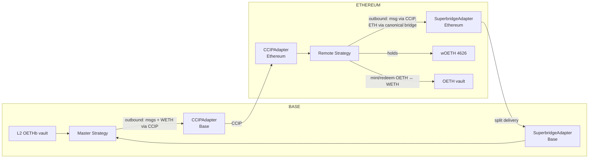
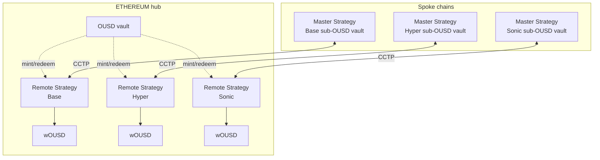
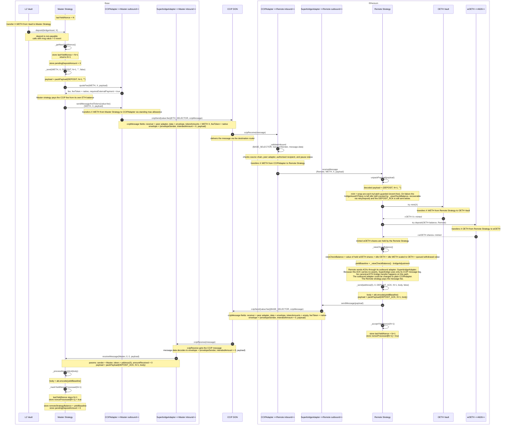
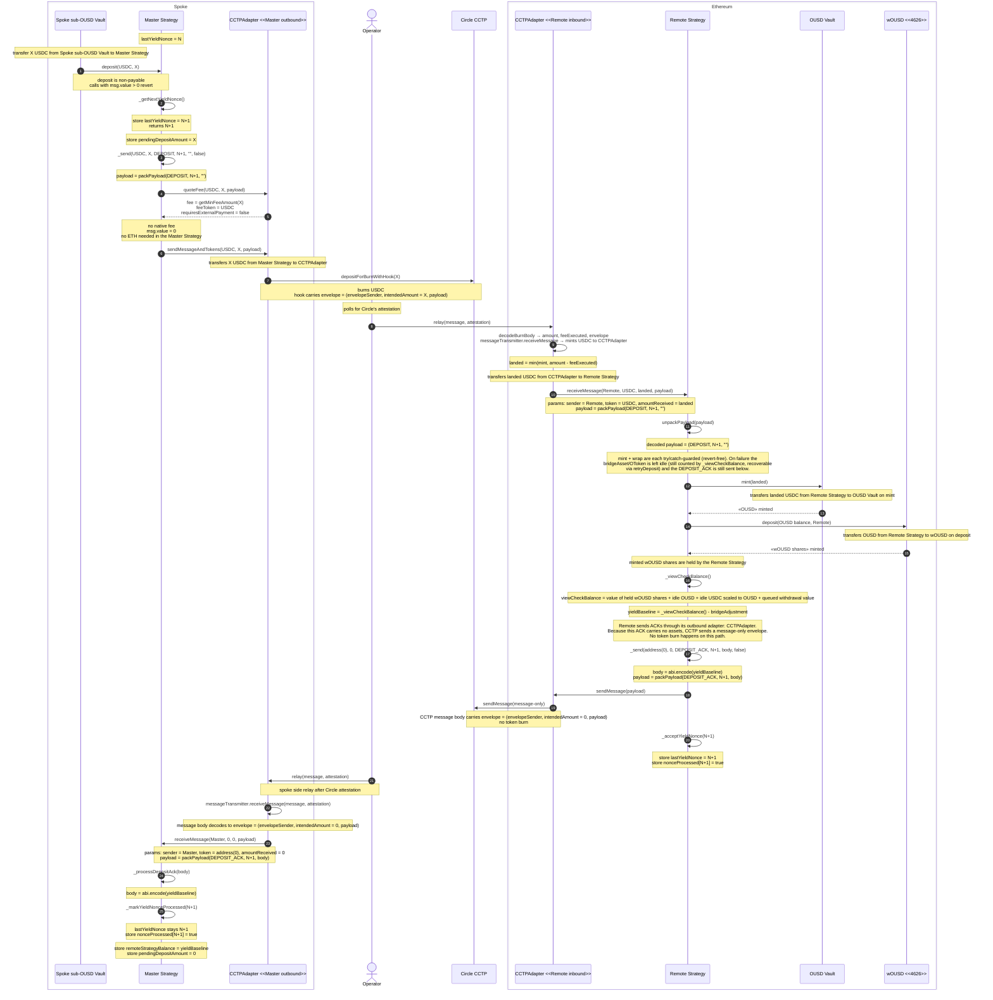
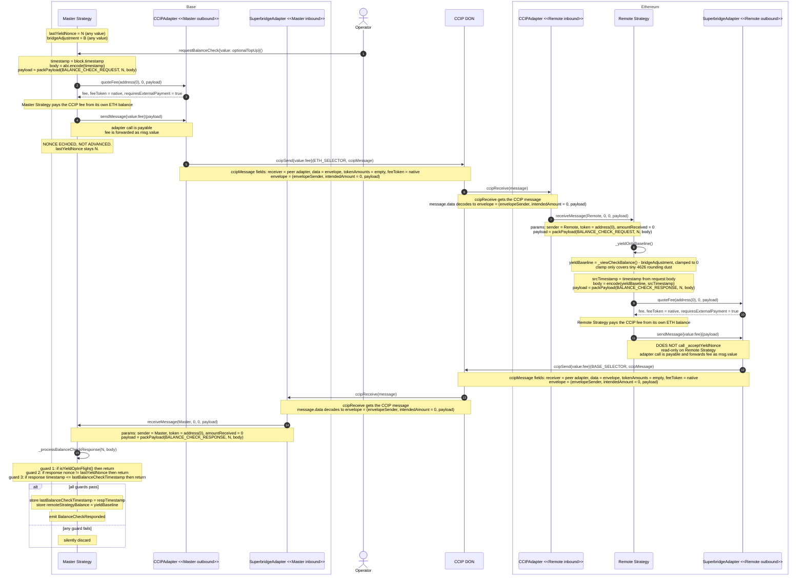
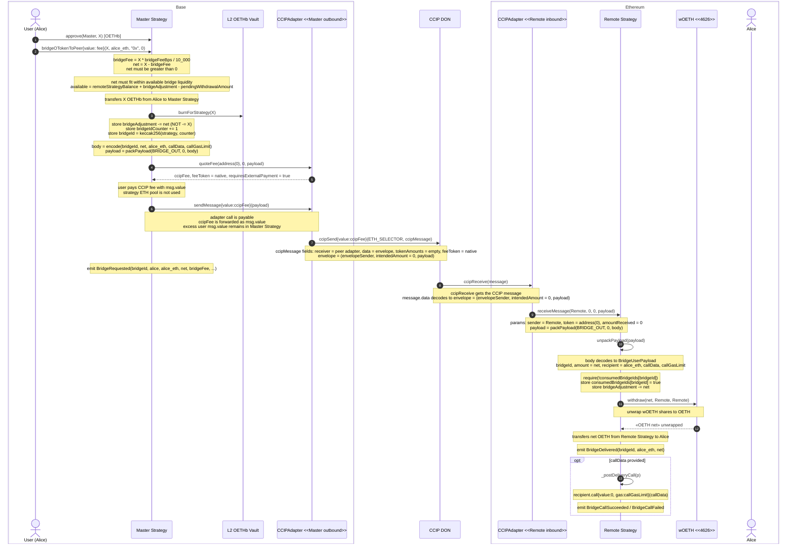
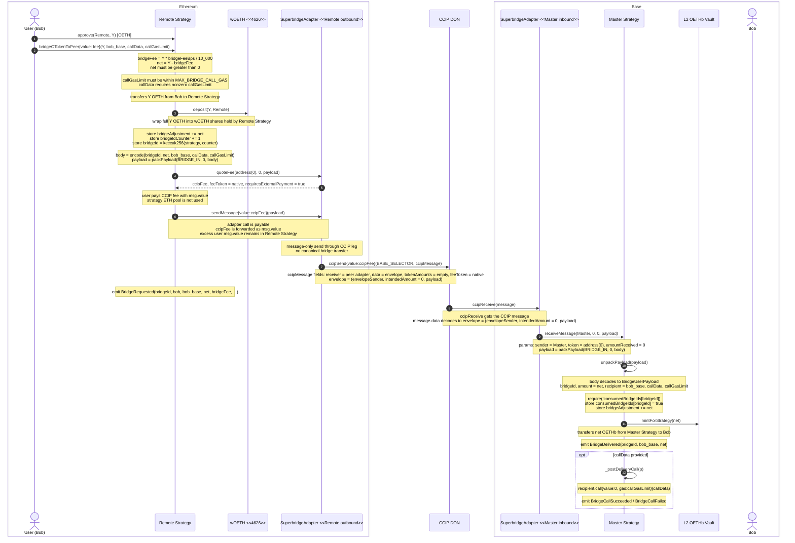
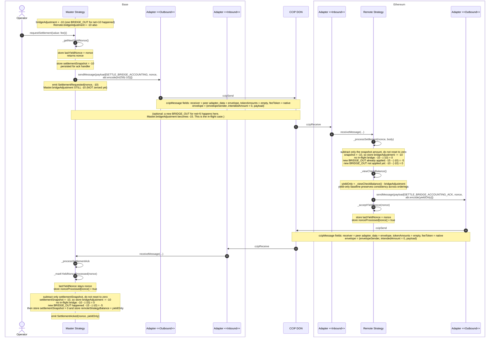

# OUSD V3 Cross-Chain Strategy — Flow Walkthroughs

This document walks through each of the five cross-chain flows end-to-end with
sequence diagrams and prose annotations. Use `README.md` for the reference
material (file map, message envelope, authorisation surface, message-type
table); use this document for "what happens when X."

The contracts are generic across two products:

- **OETHb** — OETH bridged between Base (where OETHb lives) and Ethereum
  (where wOETH lives and earns yield). Bridge mix: CCIP for messages, OP Stack
  canonical bridge for native ETH transfers (split delivery via
  `SuperbridgeAdapter`).
- **OUSD V3** — OUSD bridged between Ethereum (where OUSD lives) and L2 spoke
  chains (Base, HyperEVM, etc.). Bridge mix: Circle CCTP V2 for everything,
  atomic delivery in both directions.

Walkthroughs default to OETHb for concreteness. Differences for OUSD V3 are
called out inline.

---

## 1. Architecture overview

### Master and Remote roles

The strategy pair always has the same role split, regardless of product:

- **Master** lives on the chain that hosts the rebasing OToken vault. It's the
  strategy registered with that vault. The vault calls `Master.deposit()` /
  `Master.withdraw()`. Master holds an accounting view of how much value sits
  on the peer chain via `remoteStrategyBalance` + a signed `bridgeAdjustment`.
  It never holds the yield-earning shares directly.
- **Remote** lives on the chain that hosts the wOToken (the yield-earning
  ERC-4626 wrapper). Remote isn't registered with any vault — it's a custodian
  for wOToken shares held on behalf of the L2 vault. Remote runs the
  bridgeAsset ↔ OToken ↔ wOToken pipeline using the local OToken vault for
  mint/redeem.

For OETHb: Master on Base (OETHb's chain), Remote on Ethereum (wOETH's chain).
For OUSD V3: each spoke chain has a Master in its sub-OUSD vault; Remote on
Ethereum holds the wOUSD that backs that spoke.

### Two channels

The cross-chain protocol carries two distinct kinds of messages, gated
differently:

- **Yield channel** — DEPOSIT, WITHDRAW_REQUEST, WITHDRAW_CLAIM,
  BALANCE_CHECK_REQUEST, SETTLE_BRIDGE_ACCOUNTING and their ACK variants.
  Nonce-gated (yield-channel nonce machinery in
  `AbstractCrossChainV3Strategy`), serialised — one in-flight at a time —
  except for balance check which is non-blocking. Drives the protocol-level
  accounting between Master and Remote. **All yield-channel messages originate
  at Master** (the operator/vault side); Remote only ever replies with ACKs.

- **Bridge channel** — BRIDGE_IN and BRIDGE_OUT. Nonceless and user-facing.
  Multiple can be in flight simultaneously. Replay protection via
  `bridgeId = keccak256(strategy, counter)` on the destination side. No ack.
  Unlike the yield channel, these originate on **either** side: BRIDGE_OUT
  starts at Master, BRIDGE_IN starts at Remote (each from a user's
  `bridgeOTokenToPeer`).

No OToken or wOToken ever crosses the bridge. The yield channel moves the
**backing asset** (WETH / USDC) + a message and mints/wraps on Remote; the
bridge channel **burns** OToken on the source and **mints** `net` on the
destination (message-only). See `DESIGN.md` §3.13 for the rationale.

### Fee model

Two separate fee dimensions, never conflated:

1. **Native fee** (paid in ETH/msg.value) — CCIP and Superbridge charge for
   message delivery. CCTP doesn't.
2. **Token-side fee** (deducted from bridged tokens) — CCTP V2 fast-finality
   takes a fee out of the burned amount. CCIP and Superbridge don't.

Native fees come from one of two places depending on who initiated:

- **User-initiated** (`bridgeOTokenToPeer`) → `msg.value` only. Strict
  requirement; pool is not consulted. Prevents pool drain by user paths.
- **Operator-initiated** (yield channel + every Remote-side ack) → the
  strategy's local ETH pool (`address(this).balance`). Operator pre-funds.

Token-side fees are surfaced on the adapter's `MessageDelivered` event (not
forwarded to `receiveMessage`). The receiving strategy accounts on
`amountReceived`; the delta becomes implicit yield drag.

ETH on the strategy is **never** counted in `checkBalance` — `checkBalance`
only reads bridge-asset-denominated slots. Sweep via
`transferNative(amount) onlyGovernor`.

### Diagram conventions

In the sequence diagrams below:

- **Solid arrows** (`A->>B: call(...)`) are function calls or cross-chain messages.
- **Arrows tagged `«asset N»`** are ERC20 token movements (a `transfer` / `transferFrom`),
  drawn from the party that gives up the asset to the party that receives it. To keep the
  diagrams readable the token contract is not drawn as its own lifeline.
- **`actor`** lifelines are EOAs (operator, users); **`participant`** lifelines are contracts.

---

## 2. Topology

### OETHb (single pair)



Adapters: `CCIPAdapter` (both sides) and `SuperbridgeAdapter` (both sides; L1
side does `bridgeETHTo`, L2 side wraps incoming ETH to WETH).

### OUSD V3 (hub-and-spoke, planned)

Same Master/Remote pattern as OETHb — Master on the spoke chain (where the
sub-OUSD vault lives); Remote on Ethereum (where the wOUSD yield wrapper
lives). One pair per spoke. CCTPAdapter on each chain handles both directions
of that lane atomically.



Each spoke gets its own (Master, Remote) pair. Remote lives on Ethereum
because that's where the OUSD vault is. CCTPAdapter on each chain handles both
directions — atomic delivery, no native fee, but every inbound message
requires an operator-driven `relay(message, attestation)` call.

---

## 3. Deposit

Entry points that move Vault funds into the Master Strategy:

- `Vault.allocate()` is a permissionless vault operation. It calls
  `Master.deposit(asset, amount)` after transferring the allocatable bridge asset
  to the Master Strategy.
- `Vault.mint(amount)` is the LP deposit path. It can auto-allocate when
  `amount >= autoAllocateThreshold`, which follows the same internal
  `_allocate()` path and calls `Master.deposit(asset, amount)`.
- `Vault.depositToStrategy(Master Strategy, [asset], [amount])` is the
  governor/strategist direct path. It transfers funds to the Master Strategy,
  then calls `Master.depositAll()`, which enters the same cross-chain deposit
  machinery.

The sequence below shows the `Vault.allocate()` / auto-allocation shape where
the Vault calls `Master.deposit()`. In that same transaction, the Master
Strategy receives the bridge asset and asks its outbound adapter to send the
cross-chain deposit message. Delivery to the Remote Strategy, and the later ACK
back to the Master Strategy, happen asynchronously via the bridge.

### Sequence diagram



### State changes

**Phase 1 — `Master.deposit(WETH, X)` (Base):**

Assumes `X >= outboundAdapter.minTransferAmount()`. If `X` is below the
adapter minimum, Master leaves the WETH on the Master Strategy and returns
without advancing the nonce.

- `lastYieldNonce: N → N+1`
- `pendingDepositAmount: 0 → X` (counts in `checkBalance` so vault doesn't see backing
  disappear during the bridge round trip)
- `Master.WETH balance: X → 0` (transferred by the outbound adapter via its standing max allowance)
- `outboundAdapter.WETH balance: 0 → X → 0` (held momentarily, then handed to the CCIP router)

**Phase 2 — `Remote._processDeposit(N+1, X)` (Ethereum):**

- Happy path: WETH is consumed by the OETH Vault mint, then the minted OETH is
  wrapped into wOETH.
- `Remote.wOETH balance: increased by ≈X-worth of shares` on the happy path.
- If mint or wrap fails, the WETH or OETH stays idle on the Remote Strategy and
  is still counted by `_viewCheckBalance()`.
- `Remote.lastYieldNonce: → N+1`; `nonceProcessed[N+1] = true`

**Phase 3 — `Master._processDepositAck(N+1, yieldBaseline)` (Base):**

- `remoteStrategyBalance: B → yieldBaseline` (the Remote Strategy's reported
  yield-only baseline)
- `pendingDepositAmount: X → 0`
- `nonceProcessed[N+1] = true`

`Master.checkBalance(WETH)` is consistent throughout: pre-deposit = B,
mid-flight = X (pendingDepositAmount) + B (stale remoteStrategyBalance), post-ack =
yieldBaseline ≈ B + X on the happy path.

### OUSD V3 Deposit Differences

The strategy-side accounting is the same as the WETH deposit flow: Master sends
a deposit message, Remote mints/wraps, then Remote ACKs the new baseline. The
transport is different: CCTP burns USDC on the source chain, mints USDC on the
destination chain, and each inbound CCTP message is delivered by an operator
calling `relay(message, attestation)` after Circle attests it.



Key differences:

- Outbound adapter: `CCTPAdapter`. For the token-bearing deposit,
  `quoteFee(USDC, X, payload)` returns `(getMinFeeAmount(X), USDC, false)`.
  There is no native fee, so `msg.value = 0` works without ETH in the Master
  Strategy. CCTP handles any token-side fee by deducting it from the burned
  USDC.
- Token-bearing inbound uses the CCTP burn-message path. The source-side
  `depositForBurnWithHook` burns USDC and puts the adapter envelope in the
  hook. The destination operator later calls
  `CCTPAdapter.relay(message, attestation)` after Circle attests the message.
- `relay()` manually decodes the CCTP burn body to read `amount`,
  `feeExecuted`, `msgSender` (the peer adapter), and `hookData` (the adapter
  envelope). It then calls `messageTransmitter.receiveMessage`, computes
  `landed = min(actualMint, amount - feeExecuted)`, validates the envelope, and
  calls `_deliver(envelopeSender, USDC, landed, feeExecuted, payload)`.
- `intendedAmount` in the adapter envelope is the full burn amount `X`.
  `amountReceived` passed to the Remote Strategy is `landed`, which may be
  lower if CCTP took a token-side fee. The Deposit ACK's `yieldBaseline`
  reflects the Remote Strategy's actual post-mint/wrap accounting.
- `DEPOSIT_ACK` is message-only. The ACK has no token leg, so CCTP sends a pure
  message whose body is the adapter envelope. On the Master side,
  `relay(message, attestation)` triggers the message hook path, validates
  `intendedAmount == 0`, and dispatches
  `_deliver(envelopeSender, address(0), 0, 0, payload)`.

---

## 4. Withdraw

Withdraw is split into two cross-chain legs. The Vault starts leg 1 by asking
the Master Strategy to request liquidity from the Remote Strategy, which unwraps
wOToken and queues a withdrawal from the Ethereum OToken vault. After that queue
has matured, an operator starts leg 2: the Remote Strategy claims the withdrawn
bridge asset and sends it back to the Master Strategy.

### Sequence diagram



```mermaid
sequenceDiagram
    autonumber
    box Base
    participant Vault as L2 Vault
    participant Master as Master Strategy
    participant Adapter as CCIPAdapter <<Master outbound>>
    participant SuperBase as SuperbridgeAdapter <<Master inbound>>
    end

    actor Op as Operator
    participant Bridge as CCIP DON

    box Ethereum
    participant AdapterEth as CCIPAdapter <<Remote inbound>>
    participant SuperEth as SuperbridgeAdapter <<Remote outbound>>
    participant Remote as Remote Strategy
    participant OEV as OETH Vault
    participant wOETH as wOETH <<4626>>
    end

    Note over Master,Remote: ─── Phase A: vault.withdraw triggers leg 1 synchronously ───
    Vault->>Master: withdraw(vault, WETH, amount)
    Note over Master,Vault: withdraw is non-payable<br/>calls with msg.value > 0 revert
    Note over Vault: recipient = Vault
    Master->>Master: _getNextYieldNonce()
    Note over Master: store lastYieldNonce = N+1<br/>returns N+1
    Note over Master: store pendingWithdrawalAmount = amount
    Note over Master: requested amount must fit within the drawable Remote Strategy balance<br/>drawable = remoteStrategyBalance plus any negative bridgeAdjustment, scaled to WETH
    Note over Master: body = abi.encode(amount)<br/>payload = packPayload(WITHDRAW_REQUEST, N+1, body)
    Note over Master: message-only send. No token, no amount
    Master->>Adapter: quoteFee(address(0), 0, payload)
    Adapter-->>Master: fee, feeToken = native, requiresExternalPayment = true
    Note over Master: Master Strategy pays the CCIP fee from its own ETH balance
    Master->>Adapter: sendMessage{value:fee}(payload)
    Note over Master,Adapter: adapter call is payable<br/>fee is forwarded as msg.value
    Adapter->>Bridge: ccipSend{value:fee}(ETH_SELECTOR, ccipMessage)
    Note over Adapter,Bridge: ccipMessage fields: receiver = peer adapter, data = envelope, tokenAmounts = empty, feeToken = native<br/>envelope = (envelopeSender, intendedAmount = 0, payload)
    Bridge->>AdapterEth: ccipReceive(message)
    Note over Bridge,AdapterEth: ccipReceive gets the CCIP message<br/>message.data decodes to envelope = (envelopeSender, intendedAmount = 0, payload)
    AdapterEth->>Remote: receiveMessage(Remote, 0, 0, payload)
    Note over AdapterEth,Remote: params: sender = Remote, token = address(0), amountReceived = 0<br/>payload = packPayload(WITHDRAW_REQUEST, N+1, body)
    Note over Remote: unwrap + queue are try/catch-guarded (revert-free). On failure: success=false,<br/>nothing queued (any unwrapped OToken left idle, recoverable via retryDeposit).
    Remote->>wOETH: try withdraw(amount, Remote, Remote)
    Note over Remote,wOETH: unwrap shares to OETH
    wOETH-->>Remote: «OETH A» unwrapped
    Remote->>OEV: try requestWithdrawal(amount)
    Note over Remote,OEV: OETH A queued for withdrawal
    OEV-->>Remote: requestId
    Note over Remote: success=true<br/>store outstandingRequestId = requestId (verbatim)<br/>store outstandingRequestAmount = amount

    Note over Master,Remote: ─── Phase B: Remote sends WITHDRAW_REQUEST_ACK ───
    Remote->>Remote: _viewCheckBalance()
    Note over Remote: viewCheckBalance = value of held wOETH shares + idle OETH + idle WETH scaled to OETH + queued withdrawal value
    Note over Remote: yieldBaseline = _viewCheckBalance() - bridgeAdjustment
    Note over Remote: body = abi.encode(yieldBaseline, success)<br/>payload = packPayload(WITHDRAW_REQUEST_ACK, N+1, body)
    Remote->>SuperEth: sendMessage(payload)
    Note over SuperEth: Remote's outbound = SuperbridgeAdapter (Eth).<br/>Message-only rides its CCIP leg (no canonical bridge).
    SuperEth->>Bridge: ccipSend{value:fee}(BASE_SELECTOR, ccipMessage)
    Note over SuperEth,Bridge: ccipMessage fields: receiver = peer adapter, data = envelope, tokenAmounts = empty, feeToken = native<br/>envelope = (envelopeSender, intendedAmount = 0, payload)
    Bridge->>SuperBase: ccipReceive(message)
    Note over Bridge,SuperBase: ccipReceive gets the CCIP message<br/>message.data decodes to envelope = (envelopeSender, intendedAmount = 0, payload)
    SuperBase->>Master: receiveMessage(Master, 0, 0, payload)
    Note over SuperBase,Master: params: sender = Master, token = address(0), amountReceived = 0<br/>payload = packPayload(WITHDRAW_REQUEST_ACK, N+1, body)
    alt success == true (queued)
        Master->>Master: _processWithdrawRequestAck(N+1, body)
        Note over Master: store nonceProcessed[N+1] = true<br/>store remoteStrategyBalance = yieldBaseline
        Note over Master: pendingWithdrawalAmount stays set — gates leg-2
    else success == false (leg-1 NACK, nothing queued)
        Master->>Master: _processWithdrawRequestAck(N+1, body)
        Note over Master: store nonceProcessed[N+1] = true<br/>store remoteStrategyBalance = yieldBaseline<br/>store pendingWithdrawalAmount = 0
        Note over Master: channel freed — the withdrawal can be re-requested
    end

    Note over Master,Remote: ─── Phase C: queue delay (minutes for OUSD, ~10d for OETH) ───

    Note over Master,Remote: ─── Phase D: operator triggers leg 2 ───
    Op->>Master: triggerClaim{value: fee}()
    Master->>Master: _getNextYieldNonce()
    Note over Master: store lastYieldNonce = N+2<br/>returns N+2
    Note over Master: body = ""<br/>payload = packPayload(WITHDRAW_CLAIM, N+2, body)
    Master->>Adapter: sendMessage(payload)
    Adapter->>Bridge: ccipSend{value:fee}(ETH_SELECTOR, ccipMessage)
    Note over Adapter,Bridge: ccipMessage fields: receiver = peer adapter, data = envelope, tokenAmounts = empty, feeToken = native<br/>envelope = (envelopeSender, intendedAmount = 0, payload)
    Bridge->>AdapterEth: ccipReceive(message)
    AdapterEth->>Remote: receiveMessage(Remote, 0, 0, payload)
    Note over AdapterEth,Remote: params: sender = Remote, token = address(0), amountReceived = 0<br/>body = ""<br/>payload = packPayload(WITHDRAW_CLAIM, N+2, body)
    Remote->>Remote: _opportunisticClaim()
    Remote->>OEV: claimWithdrawal(requestId)
    OEV-->>Remote: «WETH claimed» paid out
    Note over Remote: claimed = the WETH the vault actually paid out<br/>store outstandingRequestId = REQUEST_ID_EMPTY<br/>store outstandingRequestAmount = claimed (refined to the payout)
    alt claim succeeded and tokens are in hand
        Note over Remote: yieldBaseline = _yieldOnlyBaselineAfter(_toOToken(claimed))<br/>body = encode(yieldBaseline, true, claimed)<br/>payload = packPayload(WITHDRAW_CLAIM_ACK, N+2, body)
        Remote->>SuperEth: sendMessageAndTokens(WETH, claimed, payload)
        Note over SuperEth: transfers claimed WETH from Remote Strategy to SuperbridgeAdapter
        Note over SuperEth: split delivery Ethereum→Base:<br/>WETH unwrapped to ETH → L1StandardBridge<br/>CCIP message in parallel
        Note over SuperEth,SuperBase: canonical bridge delivers ETH<br/>receive() wraps it to WETH on Base
        SuperEth->>Bridge: ccipSend{value:fee}(BASE_SELECTOR, ccipMessage)
        Note over SuperEth,Bridge: ccipMessage fields: receiver = peer adapter, data = envelope, tokenAmounts = empty, feeToken = native<br/>envelope = (envelopeSender, intendedAmount = claimed, payload)
        Remote->>Remote: _acceptYieldNonce(N+2)
        Note over Remote: store lastYieldNonce = N+2<br/>store nonceProcessed[N+2] = true
        Bridge->>SuperBase: ccipReceive(message)
        SuperBase->>SuperBase: processStoredMessage if needed (split fin.)
        Note over SuperBase: transfers claimed WETH from SuperbridgeAdapter to Master Strategy
        SuperBase->>Master: receiveMessage(Master, WETH, claimed, payload)
        Master->>Master: _processWithdrawClaimAck(N+2, claimed, body)
        Note over Master: store nonceProcessed[N+2] = true<br/>store pendingWithdrawalAmount = 0<br/>store remoteStrategyBalance = yieldBaseline
        Note over Master: transfers full WETH balance from Master Strategy to L2 Vault
    else queue not yet matured (NACK)
        Note over Remote: currentBalance = _yieldOnlyBaseline()<br/>body = encode(currentBalance, false, 0)<br/>payload = packPayload(WITHDRAW_CLAIM_ACK, N+2, body)
        Remote->>SuperEth: sendMessage(payload)
        SuperEth->>Bridge: ccipSend{value:fee}(BASE_SELECTOR, ccipMessage)
        Note over SuperEth,Bridge: ccipMessage fields: receiver = peer adapter, data = envelope, tokenAmounts = empty, feeToken = native<br/>envelope = (envelopeSender, intendedAmount = 0, payload)
        Remote->>Remote: _acceptYieldNonce(N+2)
        Note over Remote: store lastYieldNonce = N+2<br/>store nonceProcessed[N+2] = true
        Bridge->>SuperBase: ccipReceive(message)
        Note over Bridge,SuperBase: ccipReceive gets the CCIP message<br/>message.data decodes to envelope = (envelopeSender, intendedAmount = 0, payload)
        SuperBase->>Master: receiveMessage(Master, 0, 0, payload)
        Note over SuperBase,Master: params: sender = Master, token = address(0), amountReceived = 0<br/>body = encode(currentBalance, false, 0)<br/>payload = packPayload(WITHDRAW_CLAIM_ACK, N+2, body)
        Master->>Master: _processWithdrawClaimAck(N+2, 0, body)
        Note over Master: store nonceProcessed[N+2] = true<br/>store remoteStrategyBalance = yieldBaseline<br/>pendingWithdrawalAmount stays set
        Note over Master: operator retries triggerClaim later<br/>retry uses a fresh nonce, N+3
    end
```

### Phase notes

**Phase A — `Vault.withdraw → Master.withdraw(vault, WETH, amount)`:**
synchronous. `onlyVault`, `nonReentrant`, non-payable. Calls
`_withdrawRequest` which assigns the next yield nonce, sets
`pendingWithdrawalAmount`, and ships WITHDRAW_REQUEST. The CCIP fee for the
message comes from Master's local ETH pool (`_send (userFunded=false)` uses
`address(this).balance`); operator must keep it topped up.

`pendingWithdrawalAmount` gates concurrent ops but is NOT part of
`checkBalance` — the value is still in `remoteStrategyBalance` until the
leg-2 claim ack lands.

For `withdrawAll` (vault or governor sweep), `_withdrawRequest` is called with
`min(remoteStrategyBalance, inboundAdapter.maxTransferAmount())` so a sweep
larger than the bridge's per-tx limit lands as a partial withdrawal rather
than reverting.

**Phase B — Remote queues + acks:** Remote unwraps wOETH shares to OETH and
queues the OETH withdrawal on the Ethereum-side OETH vault. Replies with the
new balance. From here Remote's outbound adapter is `SuperbridgeAdapter` on
Ethereum; for message-only sends it just uses CCIP under the hood.

**Phase C — queue delay.** OETH vault: ~10 days. OUSD vault: ~30 minutes.
During this window Master is in "withdrawal pending" state; the operator must
wait before triggering leg 2.

**Phase D — `triggerClaim{value: fee}()`:** operator-driven, second leg.
`triggerClaim` is `payable` so the operator funds the CCIP fee for
WITHDRAW_CLAIM; pool-fallback also works. Remote runs `_opportunisticClaim`,
then ships tokens back via WITHDRAW_CLAIM_ACK if successful. NACK if the
queue delay hasn't elapsed — operator retries later.
`outstandingRequestAmount` is refined inside `_opportunisticClaim` to
whatever the vault actually paid out (rounding-safe).

**Tokens forwarded to vault:** `_processWithdrawClaimAck` success branch
transfers received bridgeAsset to the vault before clearing
`pendingWithdrawalAmount`. Vault sees
`Withdrawal(bridgeAsset, bridgeAsset, claimed)` on Master and the funds in
its own balance.

### State transition table (Remote)

From `README.md`, reproduced here for completeness. Each row is a single
intermediate state; value lives in exactly one slot per row, and `checkBalance`
equals the total in every row.

| State                                  | wOETH share value | OToken bal | bridgeAsset bal | queued\* | outstandingRequestId | checkBalance |
| -------------------------------------- | ----------------- | ---------- | --------------- | -------- | -------------------- | ------------ |
| Idle                                   | X                 | 0          | 0               | 0        | EMPTY                | X            |
| Requested (post-leg-1)                 | X − A             | 0          | 0               | A        | id (verbatim)        | X            |
| Claimed (post-`claimRemoteWithdrawal`) | X − A             | 0          | A               | 0        | EMPTY                | X            |
| Bridging-out (post-leg-2 send)         | X − A             | 0          | 0               | 0        | EMPTY                | X − A        |
| Completed                              | X − A             | 0          | 0               | 0        | EMPTY                | X − A        |

Failure branches (revert-free handlers; value preserved, recoverable):

| State                               | wOETH share value | OToken bal | bridgeAsset bal | queued | outstandingRequestId | checkBalance |
| ----------------------------------- | ----------------- | ---------- | --------------- | ------ | -------------------- | ------------ |
| Deposit mint-failed                 | X                 | 0          | D (idle)        | 0      | EMPTY                | X + D        |
| Unwrap-ok / queue-fail (leg-1 NACK) | X − A             | A (idle)   | 0               | 0      | EMPTY                | X            |

The idle `D` / `A` are re-wrapped into wOETH by the operator `retryDeposit()`; the leg-1 NACK also
clears Master's `pendingWithdrawalAmount`. `EMPTY` = `REQUEST_ID_EMPTY` (`type(uint256).max`).

\* `queued` is no longer a stored slot — it's derived as
`outstandingRequestId != REQUEST_ID_EMPTY ? outstandingRequestAmount : 0` (so it's `A` only while the
queue request is outstanding, and `0` once claimed).

### Permissionless touchpoints

- **`claimRemoteWithdrawal()`** on Remote — anyone can poke the queue claim
  once it's matured. Idempotent; safe to spam.
- **`processStoredMessage(target)`** on the split-delivery adapter — once
  both CCIP envelope and canonical ETH have landed, anyone can finalise.

### OUSD V3 Withdraw Differences

OUSD uses the same two-leg withdraw cycle, but the transport is CCTP instead
of CCIP/Superbridge. Request, request ACK, and claim trigger are message-only
relays; the successful claim ACK burns USDC on Ethereum and mints it on the
spoke with the ACK payload attached. Every inbound delivery is operator-relayed:

```mermaid
sequenceDiagram
    autonumber
    box Spoke
    participant Vault as Spoke sub-OUSD Vault
    participant Master as Master Strategy
    participant Adapter as CCTPAdapter <<Master outbound>>
    end

    actor Op as Operator
    participant CCTP as Circle CCTP

    box Ethereum
    participant AdapterEth as CCTPAdapter <<Remote inbound>>
    participant Remote as Remote Strategy
    participant OUV as OUSD Vault
    participant wOUSD as wOUSD <<4626>>
    end

    Note over Master,Remote: ─── Leg 1: request (message-only) ───
    Vault->>Master: withdraw(vault, USDC, amount)
    Note over Master,Vault: withdraw is non-payable<br/>calls with msg.value > 0 revert
    Note over Vault: recipient = Vault
    Master->>Master: _getNextYieldNonce()
    Note over Master: store lastYieldNonce = N+1<br/>returns N+1
    Note over Master: store pendingWithdrawalAmount = amount
    Note over Master: requested amount must fit within the drawable Remote Strategy balance<br/>drawable = remoteStrategyBalance plus any negative bridgeAdjustment, scaled to USDC
    Note over Master: body = abi.encode(amount)<br/>payload = packPayload(WITHDRAW_REQUEST, N+1, body)
    Master->>Adapter: sendMessage(payload)
    Adapter->>CCTP: sendMessage(message)
    Note over Adapter,CCTP: message-only leg<br/>native fee = 0
    Op->>AdapterEth: relay(message, attestation)
    AdapterEth->>Remote: receiveMessage(Remote, 0, 0, payload)
    Note over AdapterEth,Remote: params: sender = Remote, token = address(0), amountReceived = 0<br/>payload = packPayload(WITHDRAW_REQUEST, N+1, body)
    Note over Remote: unwrap + queue are try/catch-guarded (revert-free). On failure: success=false,<br/>nothing queued (any unwrapped OToken left idle, recoverable via retryDeposit).
    Remote->>wOUSD: withdraw(amount)
    Note over Remote,wOUSD: unwrap wOUSD to OUSD
    Remote->>OUV: requestWithdrawal(amount)
    OUV-->>Remote: requestId
    Note over Remote: success=true<br/>store outstandingRequestId = requestId (verbatim)<br/>store outstandingRequestAmount = amount
    Remote->>Remote: _viewCheckBalance()
    Note over Remote: viewCheckBalance = value of held wOUSD shares + idle OUSD + idle USDC scaled to OUSD + queued withdrawal value
    Note over Remote: yieldBaseline = _viewCheckBalance() - bridgeAdjustment
    Note over Remote: body = abi.encode(yieldBaseline, success)<br/>payload = packPayload(WITHDRAW_REQUEST_ACK, N+1, body)
    Remote->>AdapterEth: sendMessage(payload)
    AdapterEth->>CCTP: sendMessage(message)
    Note over AdapterEth,CCTP: message-only ACK<br/>native fee = 0
    Op->>Adapter: relay(message, attestation)
    Note over Op,Adapter: spoke side relay
    Adapter->>Master: receiveMessage(Master, 0, 0, payload)
    Note over Adapter,Master: params: sender = Master, token = address(0), amountReceived = 0<br/>payload = packPayload(WITHDRAW_REQUEST_ACK, N+1, body)
    alt success == true (queued)
        Master->>Master: _processWithdrawRequestAck(N+1, body)
        Note over Master: store nonceProcessed[N+1] = true<br/>store remoteStrategyBalance = yieldBaseline
        Note over Master: pendingWithdrawalAmount stays set — gates leg-2
    else success == false (leg-1 NACK, nothing queued)
        Master->>Master: _processWithdrawRequestAck(N+1, body)
        Note over Master: store nonceProcessed[N+1] = true<br/>store remoteStrategyBalance = yieldBaseline<br/>store pendingWithdrawalAmount = 0
        Note over Master: channel freed — the withdrawal can be re-requested
    end

    Note over Master,Remote: ─── queue delay (~30 min for OUSD) ───

    Note over Master,Remote: ─── Leg 2: claim (atomic burn+mint, carries tokens) ───
    Op->>Master: triggerClaim()
    Master->>Master: _getNextYieldNonce()
    Note over Master: store lastYieldNonce = N+2<br/>returns N+2
    Note over Master: body = ""<br/>payload = packPayload(WITHDRAW_CLAIM, N+2, body)
    Master->>Adapter: sendMessage(payload)
    Adapter->>CCTP: sendMessage(message)
    Note over Adapter,CCTP: message-only leg<br/>native fee = 0
    Op->>AdapterEth: relay(message, attestation)
    AdapterEth->>Remote: receiveMessage(Remote, 0, 0, payload)
    Note over AdapterEth,Remote: params: sender = Remote, token = address(0), amountReceived = 0<br/>body = ""<br/>payload = packPayload(WITHDRAW_CLAIM, N+2, body)
    Remote->>Remote: _opportunisticClaim()
    Remote->>OUV: claimWithdrawal(requestId)
    OUV-->>Remote: «USDC claimed» paid out
    Note over Remote: claimed = the USDC the vault actually paid out<br/>store outstandingRequestId = REQUEST_ID_EMPTY<br/>store outstandingRequestAmount = claimed (refined to the payout)
    alt claim succeeded and tokens are in hand
        Note over Remote: yieldBaseline = _yieldOnlyBaselineAfter(_toOToken(claimed))<br/>body = encode(yieldBaseline, true, claimed)<br/>payload = packPayload(WITHDRAW_CLAIM_ACK, N+2, body)
        Remote->>AdapterEth: sendMessageAndTokens(USDC, claimed, payload)
        Note over AdapterEth: transfers claimed USDC from Remote Strategy to CCTPAdapter
        AdapterEth->>CCTP: depositForBurnWithHook(claimed)
        Note over AdapterEth,CCTP: burns USDC and carries the ACK hook atomically
        Remote->>Remote: _acceptYieldNonce(N+2)
        Note over Remote: store lastYieldNonce = N+2<br/>store nonceProcessed[N+2] = true
        Op->>Adapter: relay(message, attestation)
        Note over Op,Adapter: spoke side relay
        Adapter->>Adapter: messageTransmitter.receiveMessage(message, attestation)
        Note over Adapter: CCTP mints USDC to CCTPAdapter
        Note over Adapter: transfers landed USDC from CCTPAdapter to Master Strategy<br/>landed = min(mint, claimed - feeExecuted)
        Adapter->>Master: receiveMessage(Master, USDC, landed, payload)
        Master->>Master: _processWithdrawClaimAck(N+2, landed, body)
        Note over Master: store nonceProcessed[N+2] = true<br/>store pendingWithdrawalAmount = 0<br/>store remoteStrategyBalance = yieldBaseline
        Note over Master: transfers full USDC balance from Master Strategy to Spoke sub-OUSD Vault
    else queue not yet matured (NACK)
        Note over Remote: currentBalance = _yieldOnlyBaseline()<br/>body = encode(currentBalance, false, 0)<br/>payload = packPayload(WITHDRAW_CLAIM_ACK, N+2, body)
        Remote->>AdapterEth: sendMessage(payload)
        AdapterEth->>CCTP: sendMessage(message)
        Note over AdapterEth,CCTP: message-only NACK<br/>native fee = 0
        Remote->>Remote: _acceptYieldNonce(N+2)
        Note over Remote: store lastYieldNonce = N+2<br/>store nonceProcessed[N+2] = true
        Op->>Adapter: relay(message, attestation)
        Note over Op,Adapter: spoke side relay
        Adapter->>Master: receiveMessage(Master, 0, 0, payload)
        Note over Adapter,Master: params: sender = Master, token = address(0), amountReceived = 0<br/>body = encode(currentBalance, false, 0)<br/>payload = packPayload(WITHDRAW_CLAIM_ACK, N+2, body)
        Master->>Master: _processWithdrawClaimAck(N+2, 0, body)
        Note over Master: store nonceProcessed[N+2] = true<br/>store remoteStrategyBalance = yieldBaseline<br/>pendingWithdrawalAmount stays set
        Note over Master: operator retries triggerClaim later<br/>retry uses a fresh nonce, N+3
    end
```



Key differences:

- Transport is CCTP for every hop. The request, request ACK, and claim trigger
  are message-only CCTP relays. The successful claim ACK is token-bearing: CCTP
  burns USDC on Ethereum, carries the ACK payload as hook data, and mints USDC
  on the spoke when relayed.
- Each inbound delivery requires an operator `relay(message, attestation)`.
  A full successful cycle has four relays: request to Remote Strategy, request
  ACK to Master Strategy, claim trigger to Remote Strategy, and claim ACK to
  Master Strategy.
- On the token-bearing claim ACK, CCTP fast-finality can deduct a token-side fee.
  Remote encodes the claimed amount in the ACK body, while Master receives the
  landed amount. Master accepts `landed <= claimed`, forwards the landed USDC to
  the vault, and the shortfall is absorbed as yield drag until the next balance
  refresh. With finalised delivery and no token-side fee, `landed == claimed`.

---

## 5. Check balance

The operator's "heartbeat" — refreshes `remoteStrategyBalance` to pick up
yield that's accrued on Remote's wOToken shares. **Non-blocking** and
**nonce-echo** (no nonce advance) so it can run any time without blocking
other yield ops.

### Sequence diagram



### Why the three guards

The response can arrive in three "bad" situations; each guard catches one:

1. **`isYieldOpInFlight()`** — a deposit/withdraw was kicked off between the
   request and the response. Accepting now would race with the upcoming
   deposit/withdraw ack and corrupt `remoteStrategyBalance` or `pendingDepositAmount`.
   Skip.

2. **`respNonce != lastYieldNonce`** — a yield op happened and the nonce
   advanced. The response is from a prior epoch and reflects pre-op state.
   Skip.

3. **`respTimestamp <= lastBalanceCheckTimestamp`** — multiple balance checks
   in flight with the same nonce, but CCIP delivered them out of order.
   Without the timestamp guard, an older snapshot could overwrite a newer one
   (subtle wOToken-depeg edge case). Strict monotonic timestamp preserves the
   latest read.

### Yield-only baseline (why Remote subtracts `bridgeAdjustment`)

The math:

- For each BRIDGE_OUT processed on Remote: `_viewCheckBalance` drops by `net`
  AND `bridgeAdjustment -= net`. Difference unchanged.
- For each BRIDGE_IN processed on Remote: `_viewCheckBalance` grows by `full
amount X` AND `bridgeAdjustment += net`. Difference grows by `fee` (the
  retained protocol fee).
- Yield accrual on wOToken: `_viewCheckBalance` grows; `bridgeAdjustment`
  unchanged. Difference grows monotonically.

So `_viewCheckBalance - bridgeAdjustment` strips out bridge-channel effects
and reports a pure "yield-and-protocol-fee" baseline. Master adds back its own
`bridgeAdjustment` (always equal in magnitude to Remote's) to reconstruct true
backing in `checkBalance`. The reconstruction is correct regardless of
whether bridge messages have reached Remote yet — out-of-order delivery
between balance check and bridge messages doesn't desync the picture.

### Why no `_acceptYieldNonce` on Remote

Balance check is purely read-only on Remote. Bumping the nonce there would
desynchronise Master and Remote's nonce streams (Master's nonce didn't advance
for this op either). The nonce in the envelope is a stale-detection token,
not a state-advance trigger.

### OUSD V3 differences

- Both legs use CCTP message-only sends. No native fee.
- Each inbound (request on Ethereum, response on Base) needs an operator
  `relay(message, attestation)` call.
- Non-blocking nature is preserved; just requires operator action on each hop.

---

## 6. Bridge in / Bridge out

User-facing OToken transfers. Independent of yield channel; nonceless;
fire-and-forget (no ack). The "burn-full / deliver-net" mechanic retains a
configurable `bridgeFeeBps` as protocol yield.

### BRIDGE_OUT (Master burns, Remote unwraps)



### BRIDGE_IN (Remote wraps, Master mints) — mirror image



### Yield retention math

|                           | Source side                                             | Destination side          |
| ------------------------- | ------------------------------------------------------- | ------------------------- |
| OToken consumed           | full `X` burned (BRIDGE_OUT) or `Y` wrapped (BRIDGE_IN) | —                         |
| OToken produced           | —                                                       | `net` delivered           |
| `bridgeAdjustment` change | `-net` (BRIDGE_OUT) / `+net` (BRIDGE_IN)                | `-net` / `+net`           |
| Side note                 | full amount consumed locally                            | only net produced locally |

The `fee` worth of value stays on the wOToken side (Remote retains an extra
`fee` of wOETH shares per BRIDGE_OUT; Remote wraps an extra `fee` of OToken
per BRIDGE_IN). When the next BALANCE_CHECK runs and `remoteStrategyBalance`
refreshes, that extra value shows up. L2 vault's per-OToken backing rises by
`fee` — distributed to all OToken holders on the next rebase.

### Why no ack

Bridge channel is fire-and-forget by design. Replay protection lives in
`consumedBridgeIds[bridgeId]` on the destination, not in a nonce that needs
acking. State delta is recorded locally on each side at op-time;
`bridgeAdjustment` accumulates and is reconciled via SETTLE_BRIDGE_ACCOUNTING
periodically.

If CCIP fails to deliver (rare but possible), the source side has burned and
recorded the deduction in `bridgeAdjustment`, but the destination never marks
the bridgeId consumed. After the next BALANCE_CHECK, the picture self-heals
via yield-only baseline math. No permanent loss, just a temporary undercount
until settlement runs.

### `callData` callback safety

- Tokens delivered BEFORE the callback runs (CEI). Revert in callback doesn't
  strand funds.
- `callGasLimit ≤ MAX_BRIDGE_CALL_GAS` (500_000) — caps griefing surface.
- No `msg.value` forwarded — callback is pure-data.
- `nonReentrant` on the inbound dispatcher prevents re-entering Master/Remote.

### User pays via `msg.value`

`_send(..., userFunded=true)` requires `msg.value >= fee`; pool is NOT consulted.
This is the security gate that prevents a bridge_in/out path from being a pool-drain
vector. Excess `msg.value` becomes pool donation (no refund); user can quote
exactly via `adapter.quoteFee` to avoid this.

### OUSD V3 differences

- All transit via CCTP (atomic, no native fee). User passes `msg.value = 0` —
  `requiresExternalPayment == false` from `quoteFee`, no payment required.
- Each inbound needs operator `relay`. So user-initiated bridges still depend
  on operator presence on the destination side, even though the user did
  everything they need to do on the source.

---

## 7. Settlement

Operator-driven housekeeping. Bounds `bridgeAdjustment` magnitude and provides
a clean state for audit. With the locked design's yield-only baseline in
balance check, `Master.checkBalance` is already accurate without settlement —
settlement is no longer correctness-critical, just hygiene.

### Sequence diagram



### Why snapshot-subtract instead of `= 0`

If a new BRIDGE_OUT happens between `requestSettlement` and the ack:

- Master sees the new burn, `bridgeAdjustment` moves to `-15` (was `-10`).
- If we did `bridgeAdjustment = 0` on ack, the new op would be silently erased.
- Snapshot-subtract preserves it: `-15 - (-10) = -5`, the new op stays.

The same logic applies on Remote, regardless of whether the new BRIDGE_OUT
arrived on Remote before or after the SETTLE message:

| Ordering on Remote            | Before settle                                    | After settle                                                        | yield-only reported                |
| ----------------------------- | ------------------------------------------------ | ------------------------------------------------------------------- | ---------------------------------- |
| BRIDGE_OUT first, then SETTLE | bridgeAdj = -15, wOETH-value = X-4.95            | bridgeAdj -= -10 = -5                                               | (X-4.95) - (-5) = X+0.05           |
| SETTLE first, then BRIDGE_OUT | bridgeAdj = -10, wOETH-value = X (no unwrap yet) | bridgeAdj -= -10 = 0 → then later -= 4.95 = -4.95 (post BRIDGE_OUT) | At settle ack send-time: X - 0 = X |

The exact reported value depends on Remote's processing order, BUT the
combination of (Master's residual bridgeAdjustment after subtract) + (the
reported yieldBaseline) is consistent and equals true backing. The yield-only
baseline construction is what makes both orderings converge.

### When to run settlement

- Periodic housekeeping (~weekly cadence in production).
- When `|bridgeAdjustment|` is growing uncomfortable relative to
  `remoteStrategyBalance` (e.g., > 1%).
- Before any rebase that wants pure yield-based accounting without bridge
  channel deltas in the picture.

### OUSD V3 differences

- Settlement is still nonce-gated (no change). CCTP relays add operator
  intervention on each inbound; pattern is otherwise identical.

---

## 8. Fee model reference

### Two fee categories, never conflated

| Category       | Where paid                                | When non-zero                                                      | How surfaced                                                                                                                                                       |
| -------------- | ----------------------------------------- | ------------------------------------------------------------------ | ------------------------------------------------------------------------------------------------------------------------------------------------------------------ |
| **Native**     | Caller's wallet (`msg.value`) → adapter   | CCIP always; Superbridge always (CCIP message leg); CCTP **never** | `quoteFee` returns `requiresExternalPayment = true`, `feeToken = address(0)`; strategy enforces `msg.value >= fee`                                                 |
| **Token-side** | Bridged token (auto-deducted by protocol) | CCTP V2 fast-finality only                                         | Strategy operates on `amountReceived` (delta becomes yield drag); the fee is emitted on the adapter's `MessageDelivered` event, not forwarded to `receiveMessage`. |

### One send path, two funding modes

```solidity
// Single helper. `token == address(0)` selects message-only; userFunded selects who pays.
//   userFunded=true  — user-initiated bridge_in/out; msg.value MUST cover fee, pool NOT consulted.
//   userFunded=false — operator yield ops + ack-triggered sends; pool (address(this).balance)
//                      covers fee. msg.value (if any) lands via receive() first, augmenting the pool.
function _send(token, amount, msgType, nonce, body, userFunded) internal { ... }
```

The split prevents pool-drain attacks: an unauthenticated user-facing path
can't siphon the operator-funded pool. Each bridge tx is paid by the actor
who originated it.

### `quoteFee` return — what each adapter says

| Adapter                     | `(fee, feeToken, requiresExternalPayment)` | Notes                                  |
| --------------------------- | ------------------------------------------ | -------------------------------------- |
| `CCIPAdapter`               | `(routerFee, address(0), true)`            | LINK-mode not supported                |
| `CCTPAdapter` (msg-only)    | `(0, address(0), false)`                   | Nothing to pay                         |
| `CCTPAdapter` (with tokens) | `(getMinFeeAmount(amount), USDC, false)`   | Informational; CCTP auto-deducts       |
| `SuperbridgeAdapter`        | `(ccipMessageFee, address(0), true)`       | CCIP leg native; canonical bridge free |

### Pool semantics

- Pool = `address(this).balance` on Master and on Remote independently.
- Anyone can send ETH to either strategy (`receive() external payable`). Pool
  is operationally topped up by the operator/governor.
- ETH **never** counted in `checkBalance` (only bridge-asset slots are
  summed; ETH is naturally invisible).
- Sweep via `transferNative(amount) onlyGovernor` (strategy) or
  `transferToken(address(0), amount) onlyGovernor` (adapter).
- No refunds anywhere — caller overpayment stays in pool; recover via sweep.

### Operational pre-funding by product

| Product     | Master pool needs ETH?             | Remote pool needs ETH?                     |
| ----------- | ---------------------------------- | ------------------------------------------ |
| **OETHb**   | Yes — CCIP outbound from Base      | Yes — CCIP outbound from Ethereum for acks |
| **OUSD V3** | No — CCTP everywhere, fee=0 native | No — same reason                           |

---

## 9. Adapter knobs reference

Governor-settable configuration on each adapter. All setters are
`onlyGovernor` and emit a corresponding `*Updated` event.

### All adapters (via `AbstractAdapter`)

| Knob                                             | Type    | Default       | Purpose                                                                                                                                                             |
| ------------------------------------------------ | ------- | ------------- | ------------------------------------------------------------------------------------------------------------------------------------------------------------------- |
| `authorise(sender, ChainConfig)`                 | call    | —             | Adds a strategy to the lane whitelist with `(paused, chainSelector, destGasLimit)`.                                                                                 |
| `revoke(sender)`                                 | call    | —             | Removes strategy from whitelist.                                                                                                                                    |
| `setLaneConfig(sender, ChainConfig)`             | call    | —             | Updates lane config in place (mutates routing — governance-grade).                                                                                                  |
| `pauseLane(sender)` / `unpauseLane(sender)`      | call    | —             | Strategist OR governor: emergency freeze of a single lane.                                                                                                          |
| `addStrategist(addr)` / `removeStrategist(addr)` | call    | —             | Manage the pause/unpause role list.                                                                                                                                 |
| `maxTransferAmount`                              | uint256 | 0 (unlimited) | Per-tx cap enforced in `sendMessageAndTokens`. Strategies on the peer chain read this as "max this adapter can deliver inbound" to size their withdrawAll requests. |
| `setMaxTransferAmount(amount)`                   | call    | —             | Governor sets the cap. `0` re-disables enforcement.                                                                                                                 |
| `transferToken(address, amount)`                 | call    | —             | Governor sweep of stuck tokens / pool ETH (use `address(0)` for native).                                                                                            |

### CCTPAdapter-specific

| Knob                   | Type     | Default                         | Purpose                                                                                                                                                                                                                                                                                             |
| ---------------------- | -------- | ------------------------------- | --------------------------------------------------------------------------------------------------------------------------------------------------------------------------------------------------------------------------------------------------------------------------------------------------- |
| `MAX_TRANSFER_AMOUNT`  | constant | `10_000_000 * 10**6` (10M USDC) | CCTP V2 protocol cap per burn. Hard-coded; not settable. Enforced ON TOP of the configurable `maxTransferAmount`.                                                                                                                                                                                   |
| `minTransferAmount`    | uint256  | 0                               | Dust floor. Reject sends below this. Governor-settable.                                                                                                                                                                                                                                             |
| `minFinalityThreshold` | uint32   | 0 (must be set post-deploy)     | CCTP V2 finality threshold for outbound sends. 2000 = finalised (zero fee, ~13 min). 1000–1999 = fast finality (non-zero token-side fee, sub-minute). `_sendMessage` / `_sendMessageAndTokens` revert with `"CCTP: threshold not set"` if unset. NOT initialised at declaration to stay proxy-safe. |
| `operator`             | address  | `address(0)`                    | The single address authorised to call `relay(message, attestation)` (the off-chain attestation poller). Required for inbound finalisation since `destinationCaller == address(this)` on every burn.                                                                                                 |

### Inbound dispatch paths

CCTP V2 has two on-wire message shapes; `CCTPAdapter` handles them on different paths:

- **Burn-message + hook** (sourced from `TokenMessenger.depositForBurnWithHook`).
  Routed through `relay()`, which manually parses the burn body
  (`CCTPMessageHelper.decodeBurnBody`) for authoritative `amount`,
  `feeExecuted`, `msgSender`, and `hookData`. Calls
  `messageTransmitter.receiveMessage` to credit USDC, then dispatches
  `_deliver` with `amount - feeExecuted`. The `handleReceiveMessage` hook is
  NOT used for these — that's V2.1-only behaviour and we don't rely on it.

- **Pure message** (sourced from `MessageTransmitter.sendMessage`).
  `relay()` invokes `messageTransmitter.receiveMessage` which fires the
  callback hook. The hook is restricted to `intendedAmount == 0` and reverts
  otherwise — token-bearing messages going through this path is a design
  violation.

### Finality handler gates

Both `handleReceiveFinalizedMessage` and `handleReceiveUnfinalizedMessage`
accept inbound (pure-message) deliveries; the difference is the finality gate:

- **`handleReceiveFinalizedMessage`** — fires when CCTP confirms with
  `finalityThresholdExecuted >= 2000`. Always accepts (since 2000 ≥ any
  configured threshold).
- **`handleReceiveUnfinalizedMessage`** — fires when CCTP confirms with
  `1000 <= finalityThresholdExecuted < 2000`. Accepts only when
  `finalityThresholdExecuted >= minFinalityThreshold`. This is the fast-finality
  path; rejecting it (the old behaviour) broke fast-finality entirely.

### Master `_depositToRemote` / `_withdrawRequest` interaction

- `Master.depositAll` clamps `local bridgeAsset balance` to
  `outboundAdapter.maxTransferAmount()` before sending. Vault sweep larger
  than the bridge's per-tx limit becomes a partial deposit; remainder stays on
  Master for the next cycle.
- `Master.withdrawAll` draws `_drawableRemoteBalance()` (`remoteStrategyBalance +
min(bridgeAdjustment, 0)` — folds in a negative bridge adjustment so a net
  BRIDGE_OUT can't over-request), clamped to `inboundAdapter.maxTransferAmount()`
  before sending WITHDRAW_REQUEST. Same partial-fill rationale. Inbound adapter is
  used because Master can't query Remote's outbound across chains — the symmetric
  inbound adapter on this chain holds the same protocol-level cap (outbound +
  inbound are mirrors of the same lane).
- `Master.deposit` and `Master.withdraw` (specific-amount, vault-driven) do
  NOT clamp — they propagate the adapter's revert if amount exceeds the cap.
  Operator splits via depositAll/withdrawAll or sequenced batches.

### Suggested per-deployment values

| Deployment                                       | Adapter                                        | maxTransferAmount                                                    | Other |
| ------------------------------------------------ | ---------------------------------------------- | -------------------------------------------------------------------- | ----- |
| OETHb / Base CCIPAdapter (Master outbound)       | `1000 ether`                                   | CCIP lane rate ~1000 WETH/hour                                       | —     |
| OETHb / Eth SuperbridgeAdapter (Remote outbound) | `0` (unlimited)                                | canonical bridge has no per-tx limit                                 | —     |
| OETHb / Base SuperbridgeAdapter (Master inbound) | match Remote outbound                          | mirror; `0` works                                                    | —     |
| OETHb / Eth CCIPAdapter (Remote inbound)         | match Master outbound (`1000 ether`)           | —                                                                    | —     |
| OUSD V3 / Spoke CCTPAdapter                      | `10_000_000 * 10**6` (or less for tighter ops) | also set `minTransferAmount = 1 USDC`, `minFinalityThreshold = 2000` | —     |
| OUSD V3 / Eth CCTPAdapter                        | same                                           | —                                                                    | —     |

---

## 10. Glossary

| Term                          | Meaning                                                                                                                                                                                                                                                       |
| ----------------------------- | ------------------------------------------------------------------------------------------------------------------------------------------------------------------------------------------------------------------------------------------------------------- |
| **Master**                    | Strategy on the chain that hosts the rebasing OToken vault. Registered with that vault.                                                                                                                                                                       |
| **Remote**                    | Strategy on the chain that hosts the wOToken (yield-earning wrapper). Not registered with any vault — custodian for shares.                                                                                                                                   |
| **wOToken**                   | ERC-4626 wrapper of the OToken (wOETH wraps OETH; wOUSD wraps OUSD).                                                                                                                                                                                          |
| **Yield channel**             | Protocol-internal messages (deposit/withdraw/ack/balance check/settle). Nonce-gated except balance check.                                                                                                                                                     |
| **Bridge channel**            | User-facing messages (BRIDGE_IN, BRIDGE_OUT). Nonceless.                                                                                                                                                                                                      |
| **bridgeAdjustment**          | Signed net delta from bridge-channel activity since last settlement. Tracked on both sides; always equal in magnitude.                                                                                                                                        |
| **remoteStrategyBalance**     | Master's cached snapshot of Remote's `_viewCheckBalance` minus Remote's `bridgeAdjustment` (i.e., yield-only baseline). Updated by balance check and settlement acks.                                                                                         |
| **pendingDepositAmount**      | Master's in-flight deposit value. Counts in `checkBalance` so vault doesn't see backing dip during bridge round-trip.                                                                                                                                         |
| **pendingWithdrawalAmount**   | Master's in-flight withdrawal amount. Gates concurrent ops; NOT in `checkBalance` (value is already in `remoteStrategyBalance` until claim ack).                                                                                                              |
| **claimed**                   | The bridgeAsset the OToken vault actually paid out on `claimWithdrawal(requestId)` (`RemoteWOTokenStrategy._opportunisticClaim`). `outstandingRequestAmount` is refined to it so leg-2 ships exactly the vault's payout, not the originally-requested amount. |
| **settlementSnapshot**        | `bridgeAdjustment` value captured at request time, persisted on Master so the ack handler can subtract exactly that delta. Preserves in-flight bridge ops.                                                                                                    |
| **lastBalanceCheckTimestamp** | Most recently accepted balance check timestamp. Enforces strict monotonic ordering across out-of-order CCIP delivery.                                                                                                                                         |
| **bridgeId**                  | `keccak256(strategy, counter)`. Unique per user bridge op. Recorded in `consumedBridgeIds[bridgeId]` on destination for replay protection.                                                                                                                    |
| **bridgeFeeBps**              | Protocol fee on the bridge channel in basis points. Default 0; capped at 1000 (10%). Burn-full / deliver-net: full `_amount` consumed locally; only `net = _amount - fee` flows to destination; difference becomes rebase yield.                              |
| **Yield-only baseline**       | `_viewCheckBalance() - bridgeAdjustment` — strips bridge-channel effects from the reported balance. Master adds back its own `bridgeAdjustment` to reconstruct true backing.                                                                                  |

---

For deeper rationale on any design decision, see inline `why` comments at the
relevant function in source. Each non-obvious decision (yield-only baseline,
snapshot-subtract, three-guard balance check, user-vs-op fee split, no-refunds
policy) is documented at its call site.
