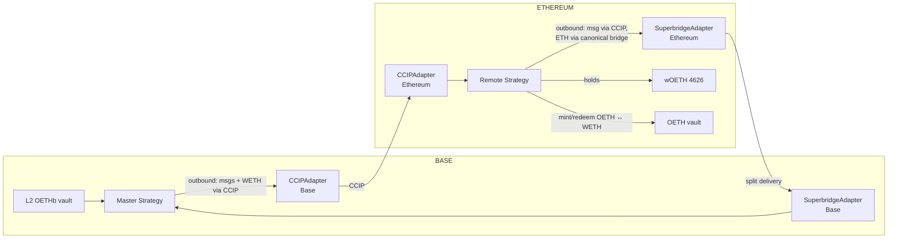
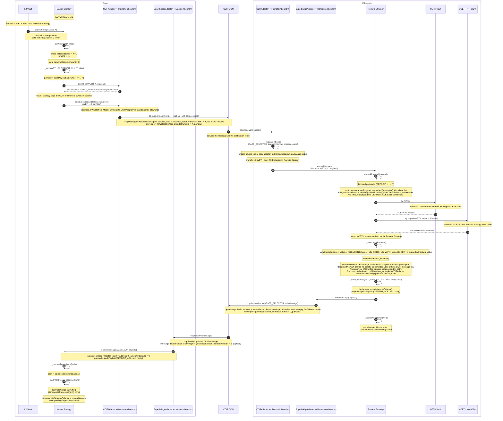
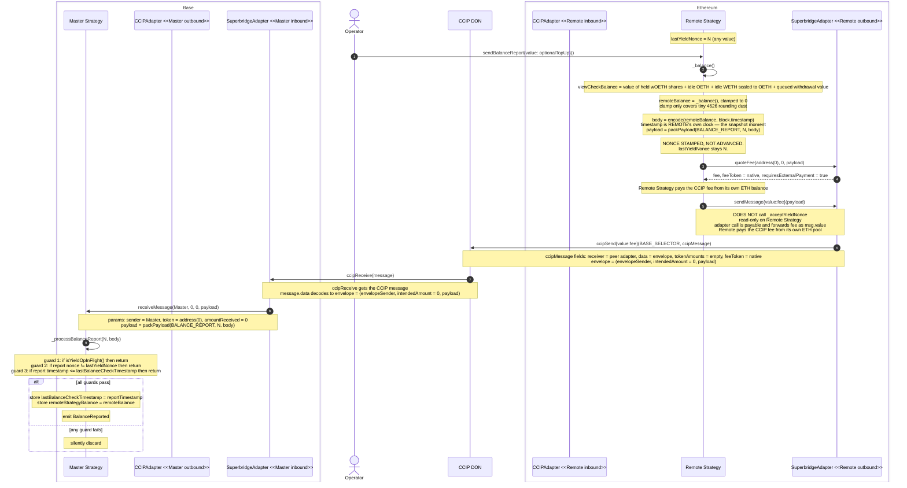

# OETHb V3 Cross-Chain Strategy — Flow Walkthroughs

This document walks through each of the three cross-chain flows end-to-end with
sequence diagrams and prose annotations. Use `README.md` for the reference
material (file map, message envelope, authorisation surface, message-type
table); use this document for "what happens when X."

The deployed pair is **OETHb**: OETH value moved between Base (where OETHb
lives) and Ethereum (where wOETH lives and earns yield). Bridge mix: CCIP for
messages and for the Base→Ethereum WETH leg, OP Stack canonical bridge for the
Ethereum→Base native ETH leg (split delivery via `SuperbridgeAdapter`).

The contracts themselves are chain-pair generic — nothing below is
OETHb-specific except the concrete addresses and the ~10-day OETH withdrawal
queue delay.

---

## 1. Architecture overview

### Master and Remote roles

The strategy pair always has the same role split:

- **Master** lives on the chain that hosts the rebasing OToken vault. It's the
  strategy registered with that vault. The vault calls `Master.deposit()` /
  `Master.withdraw()`. Master holds `bridgeAsset` (WETH) plus an accounting view
  of how much value sits on the peer chain, via `remoteStrategyBalance`. It never
  holds the yield-earning shares, and never holds or moves the OToken.
- **Remote** lives on the chain that hosts the wOToken (the yield-earning
  ERC-4626 wrapper). Remote isn't registered with any vault — it's a custodian
  for wOToken shares held on behalf of the L2 vault. Remote runs the
  bridgeAsset ↔ OToken ↔ wOToken pipeline using the local OToken vault for
  mint/redeem.

For OETHb: Master on Base (OETHb's chain), Remote on Ethereum (wOETH's chain).

### One channel, serialised

Every cross-chain message belongs to a single nonce-gated channel: DEPOSIT,
WITHDRAW_REQUEST, WITHDRAW_CLAIM and their ACK variants, plus BALANCE_REPORT
(nonce machinery in `AbstractCrossChainV3Strategy`). One operation is in flight
at a time, except the balance report, which does not advance the nonce — see §5.

**Every message is nonce-stamped and adapter-authenticated**, and only the vault
or an operator can originate one; there is no user-callable entrypoint on either
side. Master starts every *operation*; Remote replies with ACKs and, on its own
operator cadence, sends the one unprompted message in the protocol — the balance
report.

No OToken or wOToken ever crosses the bridge. The channel moves the **backing
asset** (WETH) plus a message, and Remote mints/wraps on arrival. See
`DESIGN.md` §3.11 for the rationale.

### Fee model

Two separate fee dimensions, never conflated:

1. **Native fee** (paid in ETH) — CCIP and Superbridge charge for message
   delivery.
2. **Token-side fee** (deducted from bridged tokens) — no configured transport
   charges one. Master still tolerates a shortfall on the claim ack
   (`amount <= ackAmount`) so a future fee-charging transport degrades to yield
   drag rather than a stalled channel. See `DESIGN.md` §3.3.

Native fees always come from the strategy's local ETH pool
(`address(this).balance`), which the operator pre-funds. There is no user-funded
path.

Token-side fees, if a transport ever charges one, are surfaced on the adapter's
`MessageDelivered` event (not forwarded to `receiveMessage`). The receiving
strategy accounts on `amountReceived`; the delta becomes implicit yield drag.

ETH on the strategy is **never** counted in `checkBalance` — `checkBalance`
only reads bridge-asset-denominated slots. Sweep via
`transferNative(amount) onlyGovernor`.
### Diagram conventions

In the sequence diagrams below:

- **Solid arrows** (`A->>B: call(...)`) are function calls or cross-chain messages.
- **Arrows tagged `«asset N»`** are ERC20 token movements (a `transfer` / `transferFrom`),
  drawn from the party that gives up the asset to the party that receives it. To keep the
  diagrams readable the token contract is not drawn as its own lifeline.
- **`actor`** lifelines are EOAs (operator, users); **`participant`** lifelines are contracts.

---

## 2. Topology

### OETHb


```mermaid
flowchart LR
    subgraph BASE
        L2V[L2 OETHb vault]
        Master[Master Strategy]
        CCIPb[CCIPAdapter<br/>Base]
        Superb[SuperbridgeAdapter<br/>Base]
    end
    subgraph ETHEREUM
        CCIPe[CCIPAdapter<br/>Ethereum]
        Supere[SuperbridgeAdapter<br/>Ethereum]
        Remote[Remote Strategy]
        wOETH[wOETH 4626]
        OEV[OETH vault]
    end

    L2V --> Master
    Master -->|outbound: msgs + WETH via CCIP| CCIPb
    CCIPb -->|CCIP| CCIPe
    CCIPe --> Remote
    Remote -->|outbound: msg via CCIP,<br/>ETH via canonical bridge| Supere
    Supere -->|split delivery| Superb
    Superb --> Master
    Remote -->|holds| wOETH
    Remote -->|mint/redeem OETH ↔ WETH| OEV
```

Adapters: `CCIPAdapter` (both sides) and `SuperbridgeAdapter` (both sides; L1
side does `bridgeETHTo`, L2 side wraps incoming ETH to WETH).

## 3. Deposit

Entry points that move Vault funds into the Master Strategy:

- `Vault.allocate()` is a permissionless vault operation. It calls
  `Master.deposit(asset, amount)` after transferring the allocatable bridge asset
  to the Master Strategy.
- `Vault.mint(amount)` is the LP deposit path. It can auto-allocate when
  `amount >= autoAllocateThreshold`, which follows the same internal
  `_allocate()` path and calls `Master.deposit(asset, amount)`.
- `Vault.depositToStrategy(Master Strategy, [asset], [amount])` is the
  governor/strategist direct path. It transfers funds to the Master Strategy,
  then calls `Master.depositAll()`, which enters the same cross-chain deposit
  machinery.

The sequence below shows the `Vault.allocate()` / auto-allocation shape where
the Vault calls `Master.deposit()`. In that same transaction, the Master
Strategy receives the bridge asset and asks its outbound adapter to send the
cross-chain deposit message. Delivery to the Remote Strategy, and the later ACK
back to the Master Strategy, happen asynchronously via the bridge.

### Sequence diagram


```mermaid
sequenceDiagram
    autonumber
    box Base
    participant Vault as L2 Vault
    participant Master as Master Strategy
    participant Adapter as CCIPAdapter <<Master outbound>>
    participant SuperBase as SuperbridgeAdapter <<Master inbound>>
    end

    participant Bridge as CCIP DON

    box Ethereum
    participant AdapterEth as CCIPAdapter <<Remote inbound>>
    participant SuperEth as SuperbridgeAdapter <<Remote outbound>>
    participant Remote as Remote Strategy
    participant OEV as OETH Vault
    participant wOETH as wOETH <<4626>>
    end

    Note over Master: lastYieldNonce = N
    Note over Vault: transfer X WETH from Vault to Master Strategy
    Vault->>Master: deposit(bridgeAsset, X)
    Note over Master,Vault: deposit is non-payable<br/>calls with msg.value > 0 revert
    Master->>Master: _getNextYieldNonce()
    Note over Master: store lastYieldNonce = N+1<br/>returns N+1
    Note over Master: store pendingDepositAmount = X
    Master->>Master: _send(WETH, X, DEPOSIT, N+1, "", false)
    Note over Master: payload = packPayload(DEPOSIT, N+1, "")
    Master->>Adapter: quoteFee(WETH, X, payload)
    Adapter-->>Master: fee, feeToken = native, requiresExternalPayment = true
    Note over Master: Master strategy pays the CCIP fee from its own ETH balance
    Master->>Adapter: sendMessageAndTokens{value:fee}<br/>(WETH, X, payload)
    Note over Adapter: transfers X WETH from Master Strategy to CCIPAdapter via standing max allowance
    Adapter->>Bridge: ccipSend{value:fee}(ETH_SELECTOR, ccipMessage)
    Note over Adapter,Bridge: ccipMessage fields: receiver = peer adapter, data = envelope, tokenAmounts = WETH X, feeToken = native<br/>envelope = (envelopeSender, intendedAmount = X, payload)
    Bridge->>AdapterEth: ccipReceive(message)
    Note over Bridge: delivers the message via the destination router
    AdapterEth->>AdapterEth: _validateInbound<br/>(BASE_SELECTOR, transportSender, message.data)
    Note over AdapterEth: checks source chain, peer adapter, authorised recipient, and pause status
    Note over AdapterEth: transfers X WETH from CCIPAdapter to Remote Strategy
    AdapterEth->>Remote: receiveMessage<br/>(Remote, WETH, X, payload)
    Remote->>Remote: unpackPayload(payload)
    Note over Remote: decoded payload = (DEPOSIT, N+1, "")
    Note over Remote: mint + wrap are each try/catch-guarded (revert-free). On failure the<br/>bridgeAsset/OToken is left idle (still counted by _viewCheckBalance, recoverable<br/>via retryDeposit) and the DEPOSIT_ACK is still sent below.
    Remote->>OEV: try mint(X)
    Note over OEV: transfers X WETH from Remote Strategy to OETH Vault
    OEV-->>Remote: «OETH X» minted
    Remote->>wOETH: try deposit(OETH balance, Remote)
    Note over wOETH: transfers X OETH from Remote Strategy to wOETH
    wOETH-->>Remote: «wOETH shares» minted
    Note over Remote: minted wOETH shares are held by the Remote Strategy
    Remote->>Remote: _viewCheckBalance()
    Note over Remote: viewCheckBalance = value of held wOETH shares + idle OETH + idle WETH scaled to OETH + queued withdrawal value
    Note over Remote: remoteBalance = _balance()
    Note over Remote: Remote sends ACKs through its outbound adapter: SuperbridgeAdapter.<br/>Because this ACK carries no assets, Superbridge uses only its CCIP message leg.<br/>No canonical ETH bridge transfer happens on this path.<br/>The outbound adapter could be changed to plain CCIPAdapter.<br/>The Remote strategy pays the message fee.
    Remote->>Remote: _send(address(0), 0, DEPOSIT_ACK, N+1, body, false)
    Note over Remote: body = abi.encode(remoteBalance)<br/>payload = packPayload(DEPOSIT_ACK, N+1, body)
    Remote->>SuperEth: sendMessage(payload)
    SuperEth->>Bridge: ccipSend{value:fee}(BASE_SELECTOR, ccipMessage)
    Note over SuperEth,Bridge: ccipMessage fields: receiver = peer adapter, data = envelope, tokenAmounts = empty, feeToken = native<br/>envelope = (envelopeSender, intendedAmount = 0, payload)
    Remote->>Remote: _acceptYieldNonce(N+1)
    Note over Remote: store lastYieldNonce = N+1<br/>store nonceProcessed[N+1] = true
    Bridge->>SuperBase: ccipReceive(message)
    Note over Bridge,SuperBase: ccipReceive gets the CCIP message<br/>message.data decodes to envelope = (envelopeSender, intendedAmount = 0, payload)
    SuperBase->>Master: receiveMessage(Master, 0, 0, payload)
    Note over SuperBase,Master: params: sender = Master, token = address(0), amountReceived = 0<br/>payload = packPayload(DEPOSIT_ACK, N+1, body)
    Master->>Master: _processDepositAck(body)
    Note over Master: body = abi.encode(remoteBalance)
    Master->>Master: _markYieldNonceProcessed(N+1)
    Note over Master: lastYieldNonce stays N+1<br/>store nonceProcessed[N+1] = true
    Note over Master: store remoteStrategyBalance = remoteBalance<br/>store pendingDepositAmount = 0
```

### State changes

**Phase 1 — `Master.deposit(WETH, X)` (Base):**

Assumes `X >= outboundAdapter.minTransferAmount()`. If `X` is below the
adapter minimum, Master leaves the WETH on the Master Strategy and returns
without advancing the nonce.

- `lastYieldNonce: N → N+1`
- `pendingDepositAmount: 0 → X` (counts in `checkBalance` so vault doesn't see backing
  disappear during the bridge round trip)
- `Master.WETH balance: X → 0` (transferred by the outbound adapter via its standing max allowance)
- `outboundAdapter.WETH balance: 0 → X → 0` (held momentarily, then handed to the CCIP router)

**Phase 2 — `Remote._processDeposit(N+1, X)` (Ethereum):**

- Happy path: WETH is consumed by the OETH Vault mint, then the minted OETH is
  wrapped into wOETH.
- `Remote.wOETH balance: increased by ≈X-worth of shares` on the happy path.
- If mint or wrap fails, the WETH or OETH stays idle on the Remote Strategy and
  is still counted by `_viewCheckBalance()`.
- `Remote.lastYieldNonce: → N+1`; `nonceProcessed[N+1] = true`

**Phase 3 — `Master._processDepositAck(N+1, remoteBalance)` (Base):**

- `remoteStrategyBalance: B → remoteBalance` (the Remote Strategy's reported
  custody value)
- `pendingDepositAmount: X → 0`
- `nonceProcessed[N+1] = true`

`Master.checkBalance(WETH)` is consistent throughout: pre-deposit = B,
mid-flight = X (pendingDepositAmount) + B (stale remoteStrategyBalance), post-ack =
remoteBalance ≈ B + X on the happy path.

## 4. Withdraw

Withdraw is split into two cross-chain legs. The Vault starts leg 1 by asking
the Master Strategy to request liquidity from the Remote Strategy, which unwraps
wOToken and queues a withdrawal from the Ethereum OToken vault. After that queue
has matured, an operator starts leg 2: the Remote Strategy claims the withdrawn
bridge asset and sends it back to the Master Strategy.

### Sequence diagram


```mermaid
sequenceDiagram
    autonumber
    box Base
    participant Vault as L2 Vault
    participant Master as Master Strategy
    participant Adapter as CCIPAdapter <<Master outbound>>
    participant SuperBase as SuperbridgeAdapter <<Master inbound>>
    end

    actor Op as Operator
    participant Bridge as CCIP DON

    box Ethereum
    participant AdapterEth as CCIPAdapter <<Remote inbound>>
    participant SuperEth as SuperbridgeAdapter <<Remote outbound>>
    participant Remote as Remote Strategy
    participant OEV as OETH Vault
    participant wOETH as wOETH <<4626>>
    end

    Note over Master,Remote: ─── Phase A: vault.withdraw triggers leg 1 synchronously ───
    Vault->>Master: withdraw(vault, WETH, amount)
    Note over Master,Vault: withdraw is non-payable<br/>calls with msg.value > 0 revert
    Note over Vault: recipient = Vault
    Master->>Master: _getNextYieldNonce()
    Note over Master: store lastYieldNonce = N+1<br/>returns N+1
    Note over Master: store pendingWithdrawalAmount = amount
    Note over Master: requested amount must fit within remoteStrategyBalance
    Note over Master: body = abi.encode(amount)<br/>payload = packPayload(WITHDRAW_REQUEST, N+1, body)
    Note over Master: message-only send. No token, no amount
    Master->>Adapter: quoteFee(address(0), 0, payload)
    Adapter-->>Master: fee, feeToken = native, requiresExternalPayment = true
    Note over Master: Master Strategy pays the CCIP fee from its own ETH balance
    Master->>Adapter: sendMessage{value:fee}(payload)
    Note over Master,Adapter: adapter call is payable<br/>fee is forwarded as msg.value
    Adapter->>Bridge: ccipSend{value:fee}(ETH_SELECTOR, ccipMessage)
    Note over Adapter,Bridge: ccipMessage fields: receiver = peer adapter, data = envelope, tokenAmounts = empty, feeToken = native<br/>envelope = (envelopeSender, intendedAmount = 0, payload)
    Bridge->>AdapterEth: ccipReceive(message)
    Note over Bridge,AdapterEth: ccipReceive gets the CCIP message<br/>message.data decodes to envelope = (envelopeSender, intendedAmount = 0, payload)
    AdapterEth->>Remote: receiveMessage(Remote, 0, 0, payload)
    Note over AdapterEth,Remote: params: sender = Remote, token = address(0), amountReceived = 0<br/>payload = packPayload(WITHDRAW_REQUEST, N+1, body)
    Note over Remote: unwrap + queue are try/catch-guarded (revert-free). On failure: success=false,<br/>nothing queued (any unwrapped OToken left idle, recoverable via retryDeposit).
    Remote->>wOETH: try withdraw(amount, Remote, Remote)
    Note over Remote,wOETH: unwrap shares to OETH
    wOETH-->>Remote: «OETH A» unwrapped
    Remote->>OEV: try requestWithdrawal(amount)
    Note over Remote,OEV: OETH A queued for withdrawal
    OEV-->>Remote: requestId
    Note over Remote: success=true<br/>store outstandingRequestId = requestId (verbatim)<br/>store outstandingRequestAmount = amount

    Note over Master,Remote: ─── Phase B: Remote sends WITHDRAW_REQUEST_ACK ───
    Remote->>Remote: _viewCheckBalance()
    Note over Remote: viewCheckBalance = value of held wOETH shares + idle OETH + idle WETH scaled to OETH + queued withdrawal value
    Note over Remote: remoteBalance = _balance()
    Note over Remote: body = abi.encode(remoteBalance, success)<br/>payload = packPayload(WITHDRAW_REQUEST_ACK, N+1, body)
    Remote->>SuperEth: sendMessage(payload)
    Note over SuperEth: Remote's outbound = SuperbridgeAdapter (Eth).<br/>Message-only rides its CCIP leg (no canonical bridge).
    SuperEth->>Bridge: ccipSend{value:fee}(BASE_SELECTOR, ccipMessage)
    Note over SuperEth,Bridge: ccipMessage fields: receiver = peer adapter, data = envelope, tokenAmounts = empty, feeToken = native<br/>envelope = (envelopeSender, intendedAmount = 0, payload)
    Bridge->>SuperBase: ccipReceive(message)
    Note over Bridge,SuperBase: ccipReceive gets the CCIP message<br/>message.data decodes to envelope = (envelopeSender, intendedAmount = 0, payload)
    SuperBase->>Master: receiveMessage(Master, 0, 0, payload)
    Note over SuperBase,Master: params: sender = Master, token = address(0), amountReceived = 0<br/>payload = packPayload(WITHDRAW_REQUEST_ACK, N+1, body)
    alt success == true (queued)
        Master->>Master: _processWithdrawRequestAck(N+1, body)
        Note over Master: store nonceProcessed[N+1] = true<br/>store remoteStrategyBalance = remoteBalance
        Note over Master: pendingWithdrawalAmount stays set — gates leg-2
    else success == false (leg-1 NACK, nothing queued)
        Master->>Master: _processWithdrawRequestAck(N+1, body)
        Note over Master: store nonceProcessed[N+1] = true<br/>store remoteStrategyBalance = remoteBalance<br/>store pendingWithdrawalAmount = 0
        Note over Master: channel freed — the withdrawal can be re-requested
    end

    Note over Master,Remote: ─── Phase C: queue delay (~10d for the OETH vault) ───

    Note over Master,Remote: ─── Phase D: operator triggers leg 2 ───
    Op->>Master: triggerClaim{value: fee}()
    Master->>Master: _getNextYieldNonce()
    Note over Master: store lastYieldNonce = N+2<br/>returns N+2
    Note over Master: body = ""<br/>payload = packPayload(WITHDRAW_CLAIM, N+2, body)
    Master->>Adapter: sendMessage(payload)
    Adapter->>Bridge: ccipSend{value:fee}(ETH_SELECTOR, ccipMessage)
    Note over Adapter,Bridge: ccipMessage fields: receiver = peer adapter, data = envelope, tokenAmounts = empty, feeToken = native<br/>envelope = (envelopeSender, intendedAmount = 0, payload)
    Bridge->>AdapterEth: ccipReceive(message)
    AdapterEth->>Remote: receiveMessage(Remote, 0, 0, payload)
    Note over AdapterEth,Remote: params: sender = Remote, token = address(0), amountReceived = 0<br/>body = ""<br/>payload = packPayload(WITHDRAW_CLAIM, N+2, body)
    Remote->>Remote: _opportunisticClaim()
    Remote->>OEV: claimWithdrawal(requestId)
    OEV-->>Remote: «WETH claimed» paid out
    Note over Remote: claimed = the WETH the vault actually paid out<br/>store outstandingRequestId = REQUEST_ID_EMPTY<br/>store outstandingRequestAmount = claimed (refined to the payout)
    alt claim succeeded and tokens are in hand
        Note over Remote: remoteBalance = _balanceAfter(claimed)<br/>body = encode(remoteBalance, true, claimed)<br/>payload = packPayload(WITHDRAW_CLAIM_ACK, N+2, body)
        Remote->>SuperEth: sendMessageAndTokens(WETH, claimed, payload)
        Note over SuperEth: transfers claimed WETH from Remote Strategy to SuperbridgeAdapter
        Note over SuperEth: split delivery Ethereum→Base:<br/>WETH unwrapped to ETH → L1StandardBridge<br/>CCIP message in parallel
        Note over SuperEth,SuperBase: canonical bridge delivers ETH<br/>receive() wraps it to WETH on Base
        SuperEth->>Bridge: ccipSend{value:fee}(BASE_SELECTOR, ccipMessage)
        Note over SuperEth,Bridge: ccipMessage fields: receiver = peer adapter, data = envelope, tokenAmounts = empty, feeToken = native<br/>envelope = (envelopeSender, intendedAmount = claimed, payload)
        Remote->>Remote: _acceptYieldNonce(N+2)
        Note over Remote: store lastYieldNonce = N+2<br/>store nonceProcessed[N+2] = true
        Bridge->>SuperBase: ccipReceive(message)
        SuperBase->>SuperBase: processStoredMessage if needed (split fin.)
        Note over SuperBase: transfers claimed WETH from SuperbridgeAdapter to Master Strategy
        SuperBase->>Master: receiveMessage(Master, WETH, claimed, payload)
        Master->>Master: _processWithdrawClaimAck(N+2, claimed, body)
        Note over Master: store nonceProcessed[N+2] = true<br/>store pendingWithdrawalAmount = 0<br/>store remoteStrategyBalance = remoteBalance
        Note over Master: transfers full WETH balance from Master Strategy to L2 Vault
    else NACK (outstandingRequestId != EMPTY / amount == 0 / bridgeAssetHeld < amount / ship out of [min,max])
        Note over Remote: currentBalance = _balance()<br/>body = encode(currentBalance, false, 0)<br/>payload = packPayload(WITHDRAW_CLAIM_ACK, N+2, body)
        Remote->>SuperEth: sendMessage(payload)
        SuperEth->>Bridge: ccipSend{value:fee}(BASE_SELECTOR, ccipMessage)
        Note over SuperEth,Bridge: ccipMessage fields: receiver = peer adapter, data = envelope, tokenAmounts = empty, feeToken = native<br/>envelope = (envelopeSender, intendedAmount = 0, payload)
        Remote->>Remote: _acceptYieldNonce(N+2)
        Note over Remote: store lastYieldNonce = N+2<br/>store nonceProcessed[N+2] = true
        Bridge->>SuperBase: ccipReceive(message)
        Note over Bridge,SuperBase: ccipReceive gets the CCIP message<br/>message.data decodes to envelope = (envelopeSender, intendedAmount = 0, payload)
        SuperBase->>Master: receiveMessage(Master, 0, 0, payload)
        Note over SuperBase,Master: params: sender = Master, token = address(0), amountReceived = 0<br/>body = encode(currentBalance, false, 0)<br/>payload = packPayload(WITHDRAW_CLAIM_ACK, N+2, body)
        Master->>Master: _processWithdrawClaimAck(N+2, 0, body)
        Note over Master: store nonceProcessed[N+2] = true<br/>store remoteStrategyBalance = remoteBalance<br/>pendingWithdrawalAmount stays set
        Note over Master: operator retries triggerClaim later<br/>retry uses a fresh nonce, N+3
    end
```

### Phase notes

**Phase A — `Vault.withdraw → Master.withdraw(vault, WETH, amount)`:**
synchronous. `onlyVault`, `nonReentrant`, non-payable. Calls
`_withdrawRequest` which assigns the next yield nonce, sets
`pendingWithdrawalAmount`, and ships WITHDRAW_REQUEST. The CCIP fee for the
message comes from Master's local ETH pool (`_send` always draws on
`address(this).balance`); operator must keep it topped up.

`pendingWithdrawalAmount` gates concurrent ops but is NOT part of
`checkBalance` — the value is still in `remoteStrategyBalance` until the
leg-2 claim ack lands.

For `withdrawAll` (vault or governor sweep), `_withdrawRequest` is called with
`min(remoteStrategyBalance, inboundAdapter.maxTransferAmount())` so a sweep
larger than the bridge's per-tx limit lands as a partial withdrawal rather
than reverting.

**Phase B — Remote queues + acks:** Remote unwraps wOETH shares to OETH and
queues the OETH withdrawal on the Ethereum-side OETH vault. Replies with the
new balance. From here Remote's outbound adapter is `SuperbridgeAdapter` on
Ethereum; for message-only sends it just uses CCIP under the hood.

**Phase C — queue delay.** OETH vault: ~10 days.
During this window Master is in "withdrawal pending" state; the operator must
wait before triggering leg 2.

**Phase D — `triggerClaim{value: fee}()`:** operator-driven, second leg.
`triggerClaim` is `payable` so the operator funds the CCIP fee for
WITHDRAW_CLAIM; pool-fallback also works. Remote runs `_opportunisticClaim`,
then ships tokens back via WITHDRAW_CLAIM_ACK if successful. NACK if the
queue delay hasn't elapsed — operator retries later.
`outstandingRequestAmount` is refined inside `_opportunisticClaim` to
whatever the vault actually paid out (rounding-safe).

**Tokens forwarded to vault:** `_processWithdrawClaimAck` success branch
transfers received bridgeAsset to the vault before clearing
`pendingWithdrawalAmount`. Vault sees
`Withdrawal(bridgeAsset, bridgeAsset, claimed)` on Master and the funds in
its own balance.

### State transition table (Remote)

From `README.md`, reproduced here for completeness. Each row is a single
intermediate state; value lives in exactly one slot per row, and `checkBalance`
equals the total in every row.

| State                                  | wOETH share value | OToken bal | bridgeAsset bal | queued\* | outstandingRequestId | checkBalance |
| -------------------------------------- | ----------------- | ---------- | --------------- | -------- | -------------------- | ------------ |
| Idle                                   | X                 | 0          | 0               | 0        | EMPTY                | X            |
| Requested (post-leg-1)                 | X − A             | 0          | 0               | A        | id (verbatim)        | X            |
| Claimed (post-`claimRemoteWithdrawal`) | X − A             | 0          | A               | 0        | EMPTY                | X            |
| Bridging-out (post-leg-2 send)         | X − A             | 0          | 0               | 0        | EMPTY                | X − A        |
| Completed                              | X − A             | 0          | 0               | 0        | EMPTY                | X − A        |

Failure branches (revert-free handlers; value preserved, recoverable):

| State                               | wOETH share value | OToken bal | bridgeAsset bal | queued | outstandingRequestId | checkBalance |
| ----------------------------------- | ----------------- | ---------- | --------------- | ------ | -------------------- | ------------ |
| Deposit mint-failed                 | X                 | 0          | D (idle)        | 0      | EMPTY                | X + D        |
| Unwrap-ok / queue-fail (leg-1 NACK) | X − A             | A (idle)   | 0               | 0      | EMPTY                | X            |

The idle `D` / `A` are re-wrapped into wOETH by the operator `retryDeposit()`; the leg-1 NACK also
clears Master's `pendingWithdrawalAmount`. `EMPTY` = `REQUEST_ID_EMPTY` (`type(uint256).max`).

\* `queued` is derived, not a stored slot:
`outstandingRequestId != REQUEST_ID_EMPTY ? outstandingRequestAmount : 0` (so it's `A` only while the
queue request is outstanding, and `0` once claimed).

### Permissionless touchpoints

- **`claimRemoteWithdrawal()`** on Remote — anyone can poke the queue claim
  once it's matured. Idempotent; safe to spam.
- **`processStoredMessage(target)`** on the split-delivery adapter — once
  both CCIP envelope and canonical ETH have landed, anyone can finalise.

## 5. Balance report

The operator's "heartbeat" — refreshes `remoteStrategyBalance` to pick up yield
that's accrued on Remote's wOToken shares. Pushed by **Remote**, unprompted: there
is no request leg, so a reading costs one message rather than two. It does not
advance the nonce, so it never blocks a deposit or withdrawal.

The report is stamped with Remote's **own** `block.timestamp` — the moment the
snapshot was taken, not the moment anyone asked for it. Master orders readings on
that value alone, which is what makes an out-of-order delivery safe to resolve
(see "Why the three guards").

### Sequence diagram


```mermaid
sequenceDiagram
    autonumber
    box Base
    participant Master as Master Strategy
    participant Adapter as CCIPAdapter <<Master outbound>>
    participant SuperBase as SuperbridgeAdapter <<Master inbound>>
    end

    actor Op as Operator
    participant Bridge as CCIP DON

    box Ethereum
    participant AdapterEth as CCIPAdapter <<Remote inbound>>
    participant Remote as Remote Strategy
    participant SuperEth as SuperbridgeAdapter <<Remote outbound>>
    end

    Note over Remote: lastYieldNonce = N (any value)
    Op->>Remote: sendBalanceReport{value: optionalTopUp}()
    Remote->>Remote: _balance()
    Note over Remote: viewCheckBalance = value of held wOETH shares + idle OETH + idle WETH scaled to OETH + queued withdrawal value
    Note over Remote: remoteBalance = _balance(), clamped to 0<br/>clamp only covers tiny 4626 rounding dust
    Note over Remote: body = encode(remoteBalance, block.timestamp)<br/>timestamp is REMOTE's own clock — the snapshot moment<br/>payload = packPayload(BALANCE_REPORT, N, body)
    Note over Remote: NONCE STAMPED, NOT ADVANCED.<br/>lastYieldNonce stays N.
    Remote->>SuperEth: quoteFee(address(0), 0, payload)
    SuperEth-->>Remote: fee, feeToken = native, requiresExternalPayment = true
    Note over Remote: Remote Strategy pays the CCIP fee from its own ETH balance
    Remote->>SuperEth: sendMessage{value:fee}(payload)
    Note over Remote,SuperEth: DOES NOT call _acceptYieldNonce<br/>read-only on Remote Strategy<br/>adapter call is payable and forwards fee as msg.value<br/>Remote pays the CCIP fee from its own ETH pool
    SuperEth->>Bridge: ccipSend{value:fee}(BASE_SELECTOR, ccipMessage)
    Note over SuperEth,Bridge: ccipMessage fields: receiver = peer adapter, data = envelope, tokenAmounts = empty, feeToken = native<br/>envelope = (envelopeSender, intendedAmount = 0, payload)
    Bridge->>SuperBase: ccipReceive(message)
    Note over Bridge,SuperBase: ccipReceive gets the CCIP message<br/>message.data decodes to envelope = (envelopeSender, intendedAmount = 0, payload)
    SuperBase->>Master: receiveMessage(Master, 0, 0, payload)
    Note over SuperBase,Master: params: sender = Master, token = address(0), amountReceived = 0<br/>payload = packPayload(BALANCE_REPORT, N, body)
    Master->>Master: _processBalanceReport(N, body)
    Note over Master: guard 1: if isYieldOpInFlight() then return<br/>guard 2: if report nonce != lastYieldNonce then return<br/>guard 3: if report timestamp <= lastBalanceCheckTimestamp then return
    alt all guards pass
        Note over Master: store lastBalanceCheckTimestamp = reportTimestamp<br/>store remoteStrategyBalance = remoteBalance
        Note over Master: emit BalanceReported
    else any guard fails
        Note over Master: silently discard
    end
```

### Why the three guards

A report is a snapshot of Remote taken at some earlier moment. It can arrive in
three "bad" situations; each guard catches one:

1. **`isYieldOpInFlight()`** — a deposit/withdraw is mid-flight. Remote's balance
   already reflects it, while Master still counts the same value in
   `pendingDepositAmount`, so accepting would double-count it in `checkBalance`.
   The op's own ack carries the correct post-op figure. Skip.

2. **`reportNonce != lastYieldNonce`** — the narrower case where the op
   *completed* while the report was in transit, so guard 1 has already cleared.
   Remote stamps the report with its own `lastYieldNonce`, so a pre-op snapshot
   necessarily carries the pre-op nonce and is rejected here. Without this guard
   a stale snapshot would overwrite the post-op balance the ack just wrote.

3. **`reportTimestamp <= lastBalanceCheckTimestamp`** — two reports in flight at
   the same nonce, delivered out of order. Both timestamps are Remote's own
   `block.timestamp`, so the comparison is an exact ordering on one clock; strict
   `>` preserves the latest read.

### Why no `_acceptYieldNonce` on Remote

The report is read-only on Remote — nothing changes there when it is sent.
Bumping the nonce would desynchronise Master and Remote's nonce streams (Master's
nonce doesn't advance for this either). The nonce in the envelope is a
stale-detection token, not a state-advance trigger.

### The reverse coupling, and why it matters

Guard 1 also runs the other way: while a nonce sits unprocessed, **every** report
is discarded and `remoteStrategyBalance` freezes at its last value. A permanently
stuck ack therefore freezes the number the OETHb vault rebases against, while real
yield keeps accruing on Remote. See `DESIGN.md` §4.3 for the recovery path — it is
the more damaging direction of the coupling and there is no on-chain release valve
today.

## 6. Fee model reference

### Two fee categories, never conflated

| Category       | Where paid                                        | When non-zero                                        | How surfaced                                                                                                                                          |
| -------------- | ------------------------------------------------- | ---------------------------------------------------- | ------------------------------------------------------------------------------------------------------------------------------------------------------ |
| **Native**     | Strategy's ETH pool (`address(this).balance`)     | CCIP always; Superbridge always (CCIP message leg)   | `quoteFee` returns `requiresExternalPayment = true`, `feeToken = address(0)`; `_send` requires `address(this).balance >= fee`                          |
| **Token-side** | Bridged token (auto-deducted by the protocol)     | No configured transport charges one today            | Strategy operates on `amountReceived` (delta becomes yield drag); the fee is emitted on the adapter's `MessageDelivered` event, not forwarded to `receiveMessage`. |

### One send path, one funding mode

```solidity
// Single helper. `token == address(0)` selects message-only.
// The fee always comes from the pool (address(this).balance); msg.value sent to the
// strategy lands via receive() first, augmenting the pool. Overpayment is not refunded.
function _send(token, amount, msgType, nonce, body) internal { ... }
```

Every send is operator- or vault-driven, so there is exactly one funding mode and
the fee concern stays out of the vault-facing entry points — see `DESIGN.md` §3.6.

### `quoteFee` return — what each adapter says

| Adapter                     | `(fee, feeToken, requiresExternalPayment)` | Notes                                  |
| --------------------------- | ------------------------------------------ | -------------------------------------- |
| `CCIPAdapter`               | `(routerFee, address(0), true)`            | LINK-mode not supported                |
| `SuperbridgeAdapter`        | `(ccipMessageFee, address(0), true)`       | CCIP leg native; canonical bridge free |

### Pool semantics

- Pool = `address(this).balance` on Master and on Remote independently.
- Anyone can send ETH to either strategy (`receive() external payable`). Pool
  is operationally topped up by the operator/governor.
- ETH **never** counted in `checkBalance` (only bridge-asset slots are
  summed; ETH is naturally invisible).
- Sweep via `transferNative(amount) onlyGovernor` (strategy) or
  `transferToken(address(0), amount) onlyGovernor` (adapter).
- No refunds anywhere — overpayment stays in the pool and funds the next send;
  recover via sweep.

### Operational pre-funding

| Pool        | Needs ETH? | Why                                       |
| ----------- | ---------- | ----------------------------------------- |
| **Master**  | Yes        | CCIP outbound from Base                   |
| **Remote**  | Yes        | CCIP outbound from Ethereum for every ack |

Both pools must stay funded: a Remote pool at zero means acks can't be sent, and
because the channel is serialised, a missing ack blocks every subsequent
operation until the governor swaps adapters or the pool is topped up.

---

## 7. Adapter knobs reference

Governor-settable configuration on each adapter. All setters are
`onlyGovernor` and emit a corresponding `*Updated` event.

### All adapters (via `AbstractAdapter`)

| Knob                                             | Type    | Default       | Purpose                                                                                                                                                             |
| ------------------------------------------------ | ------- | ------------- | ------------------------------------------------------------------------------------------------------------------------------------------------------------------- |
| `authorise(sender, ChainConfig)`                 | call    | —             | Adds a strategy to the lane whitelist with `(paused, chainSelector, destGasLimit)`.                                                                                 |
| `revoke(sender)`                                 | call    | —             | Removes strategy from whitelist.                                                                                                                                    |
| `setLaneConfig(sender, ChainConfig)`             | call    | —             | Updates lane config in place (mutates routing — governance-grade).                                                                                                  |
| `pauseLane(sender)` / `unpauseLane(sender)`      | call    | —             | Strategist OR governor: emergency freeze of a single lane.                                                                                                          |
| `addStrategist(addr)` / `removeStrategist(addr)` | call    | —             | Manage the pause/unpause role list.                                                                                                                                 |
| `maxTransferAmount`                              | uint256 | 0 (unlimited) | Per-tx cap enforced in `sendMessageAndTokens`. Strategies on the peer chain read this as "max this adapter can deliver inbound" to size their withdrawAll requests. |
| `minTransferAmount`                              | uint256 | 0             | Dust floor. Virtual view on `AbstractAdapter`; an adapter overrides it if its transport has one.                                                                     |
| `setMaxTransferAmount(amount)`                   | call    | —             | Governor sets the cap. `0` re-disables enforcement.                                                                                                                 |
| `transferToken(address, amount)`                 | call    | —             | Governor sweep of stuck tokens / pool ETH (use `address(0)` for native).                                                                                            |

### Master `_depositToRemote` / `_withdrawRequest` interaction

- `Master.depositAll` clamps `local bridgeAsset balance` to
  `outboundAdapter.maxTransferAmount()` before sending. Vault sweep larger
  than the bridge's per-tx limit becomes a partial deposit; remainder stays on
  Master for the next cycle.
- `Master.withdrawAll` draws `remoteStrategyBalance`, clamped to
  `inboundAdapter.maxTransferAmount()` before sending WITHDRAW_REQUEST. Same
  partial-fill rationale. The **inbound** adapter is used because Master can't
  query Remote's outbound across chains — the symmetric inbound adapter on this
  chain holds the same protocol-level cap (outbound + inbound are mirrors of the
  same lane).
- `Master.deposit` and `Master.withdraw` (specific-amount, vault-driven) do
  NOT clamp — they propagate the adapter's revert if amount exceeds the cap.
  Operator splits via depositAll/withdrawAll or sequenced batches.

### Suggested per-deployment values

| Deployment                                       | maxTransferAmount                    | Rationale                            |
| ------------------------------------------------ | ------------------------------------ | ------------------------------------ |
| Base CCIPAdapter (Master outbound)               | `1000 ether`                         | CCIP lane rate ~1000 WETH/hour       |
| Ethereum SuperbridgeAdapter (Remote outbound)    | `0` (unlimited)                      | canonical bridge has no per-tx limit |
| Base SuperbridgeAdapter (Master inbound)         | match Remote outbound                | mirror; `0` works                    |
| Ethereum CCIPAdapter (Remote inbound)            | match Master outbound (`1000 ether`) | mirror                               |

---

## 8. Glossary

| Term                          | Meaning                                                                                                                                                                                                                                                       |
| ----------------------------- | ------------------------------------------------------------------------------------------------------------------------------------------------------------------------------------------------------------------------------------------------------------- |
| **Master**                    | Strategy on the chain that hosts the rebasing OToken vault. Registered with that vault. Holds `bridgeAsset` and accounting only — never the OToken.                                                                                                            |
| **Remote**                    | Strategy on the chain that hosts the wOToken (yield-earning wrapper). Not registered with any vault — custodian for shares.                                                                                                                                    |
| **wOToken**                   | ERC-4626 wrapper of the OToken (wOETH wraps OETH).                                                                                                                                                                                                            |
| **Yield channel**             | The single nonce-gated message channel (deposit / withdraw / claim and their acks, plus the balance report). Serialised except the balance report, which does not advance the nonce.                                                                           |
| **remoteBalance**             | Remote's `_balance()` — its full custody value, reported to Master on every ack. Denominated in OToken (18dp).                                                                                                                                                 |
| **remoteStrategyBalance**     | Master's cached copy of the last reported `remoteBalance`. Updated by every ack (deposit, withdraw, claim) and by an accepted balance report.                                                                                                                  |
| **pendingDepositAmount**      | Master's in-flight deposit value. Counts in `checkBalance` so the vault doesn't see backing dip during the bridge round-trip.                                                                                                                                  |
| **pendingWithdrawalAmount**   | Master's in-flight withdrawal amount. Gates concurrent ops; NOT in `checkBalance` (value is already in `remoteStrategyBalance` until the claim ack).                                                                                                           |
| **claimed**                   | The bridgeAsset the OToken vault actually paid out on `claimWithdrawal(requestId)` (`RemoteWOTokenStrategy._opportunisticClaim`). `outstandingRequestAmount` is refined to it so leg-2 ships exactly the vault's payout, not the originally-requested amount. |
| **lastBalanceCheckTimestamp** | Remote's `block.timestamp` from the most recently accepted balance report. Enforces strict monotonic ordering across out-of-order CCIP delivery.                                                                                                               |
| **REQUEST_ID_EMPTY**          | `type(uint256).max` sentinel in `outstandingRequestId` meaning "no request outstanding", so a real requestId of `0` is unambiguous.                                                                                                                            |

---

For deeper rationale on any design decision, see inline `why` comments at the
relevant function in source. Each non-obvious decision (the three-guard balance
check, the clamp in `_balanceAfter`, the no-refunds pool policy, the
`amount <= ackAmount` claim tolerance) is documented at its call site.