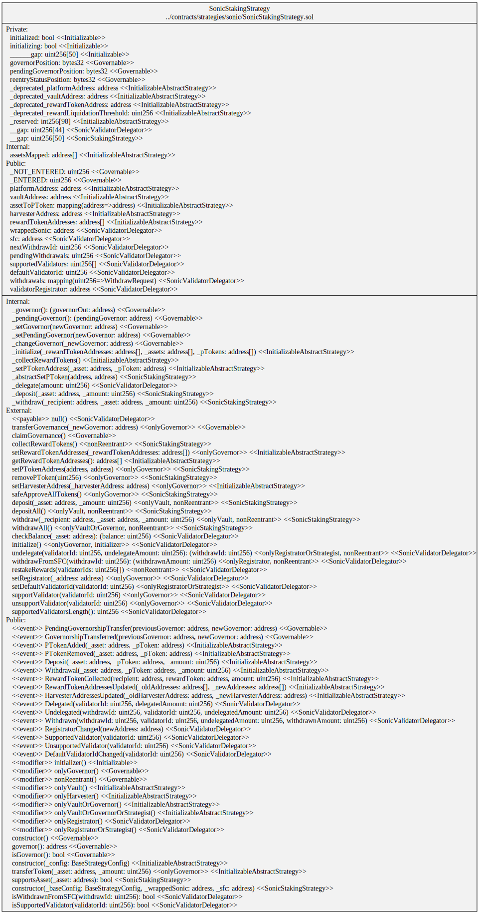
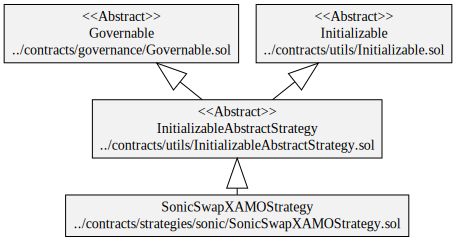

# Diagrams

## Sonic Staking Strategy

### Hierarchy

### Squashed

### Storage

## Curve AMO Strategy

### Hierarchy

### Squashed

### Storage

## SwapX AMO Strategy

### Hierarchy

### Squashed

### Storage

