# Diagrams

## Origin Dollar (OUSD)

- Symbol `OUSD`
- Name `Origin Dollar`

### Hierarchy

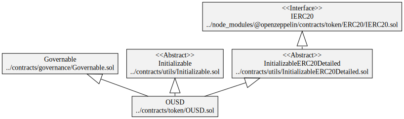

### Squashed

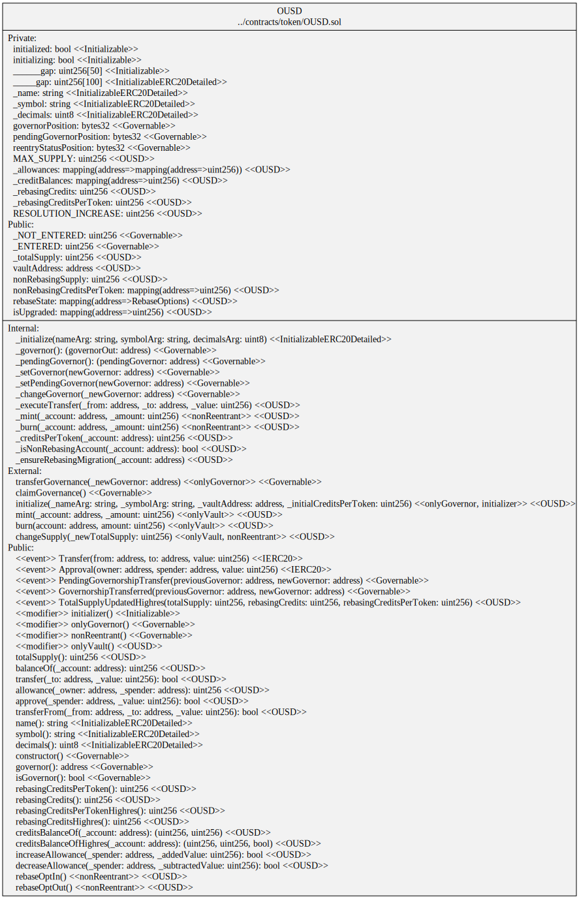

### Storage

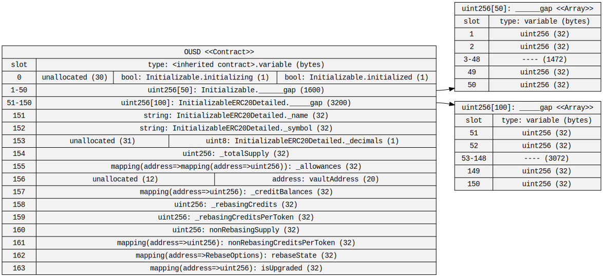

## Wrapped Origin Dollar (WOUSD)

- Symbol `WOUSD`
- Name `Wrapped OUSD`

### Hierarchy

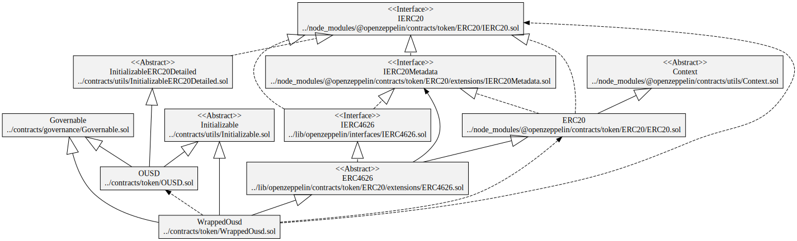

### Squashed

### Storage

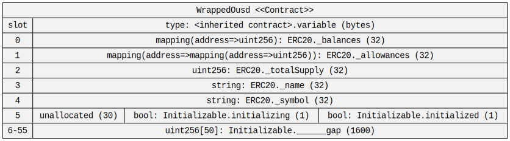

## Origin Ether (OETH)

- Symbol `OETH`
- Name `Origin Ether`

### Hierarchy

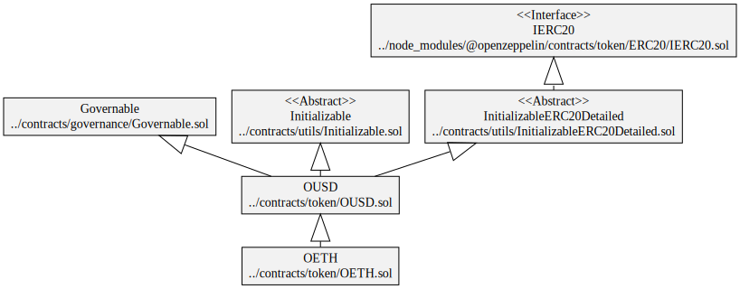

### Squashed

### Storage

## Wrapped Origin Ether (WOETH)

- Symbol `WOETH`
- Name `Wrapped OETH`

### Hierarchy

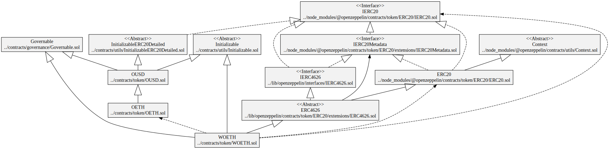

### Squashed

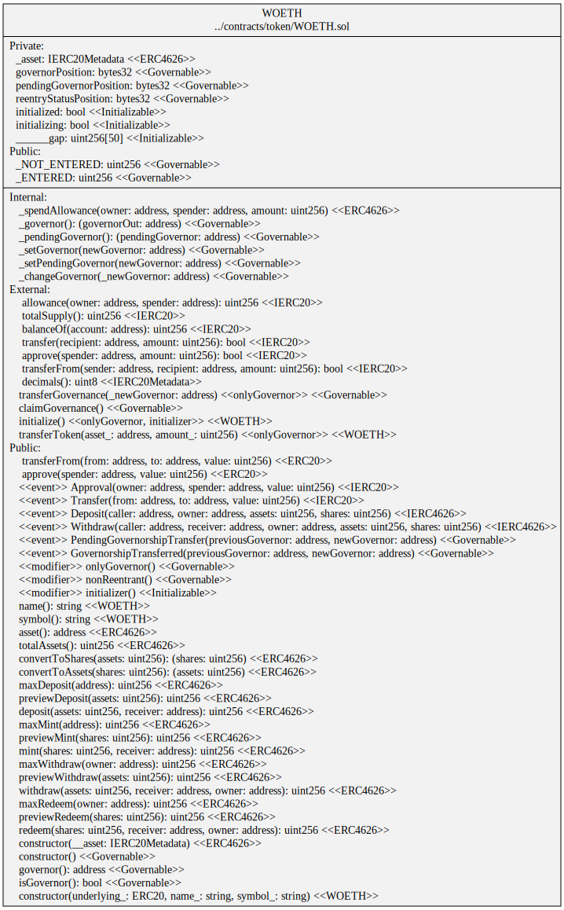

### Storage

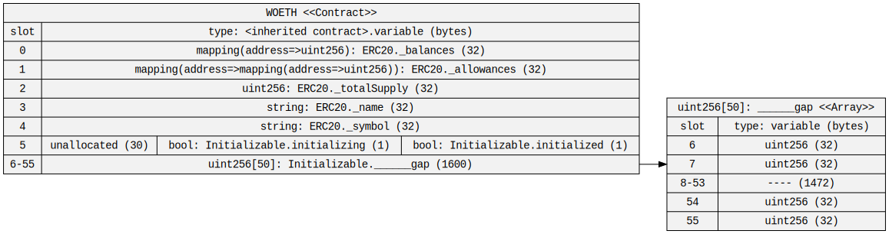

## Base Origin Ether (OETHBase)

- Symbol `superOETHb`
- Name `Super OETH`

### Hierarchy

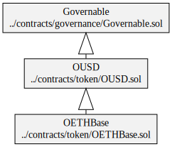

### Squashed

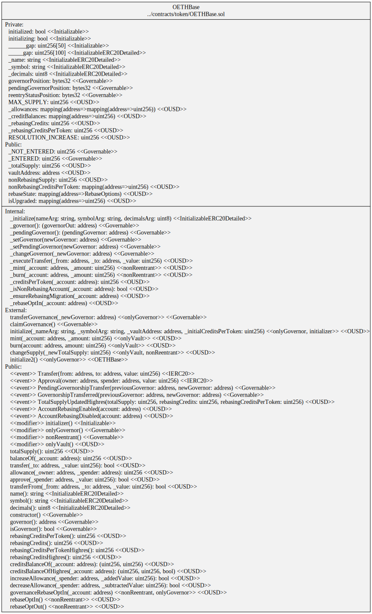

### Storage

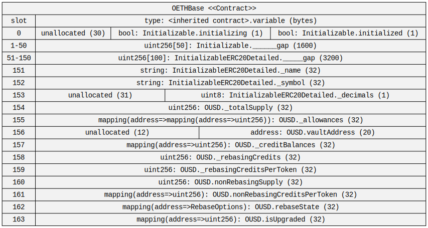

## Base Wrapped Origin Ether (WOETHBase)

- Symbol `wsuperOETHb`
- Name `Wrapped Super OETH`

### Hierarchy

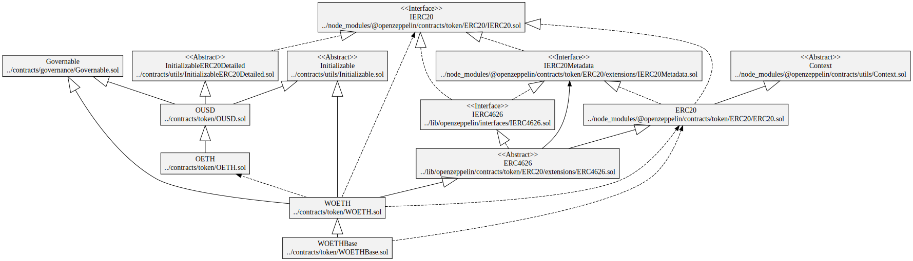

### Squashed

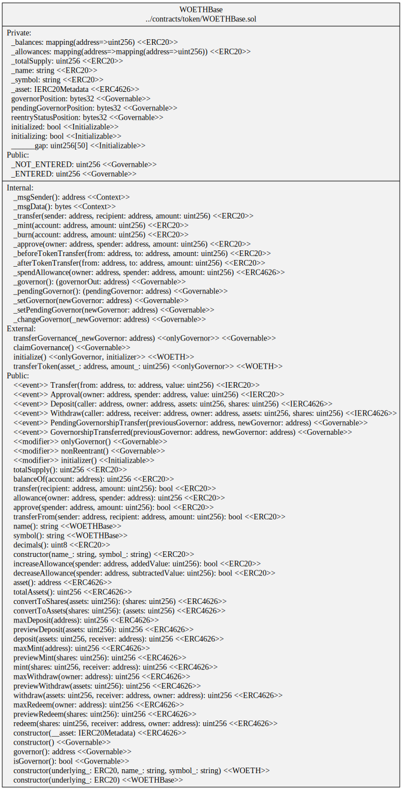

### Storage

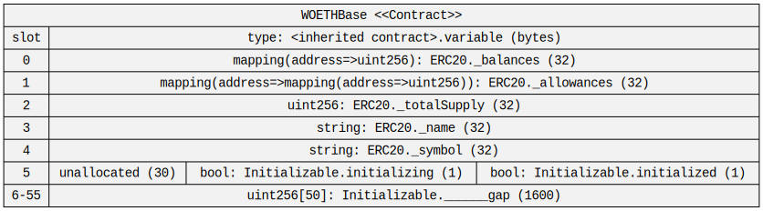

## Origin Sonic (OS)

- Symbol `OS`
- Name `Origin Sonic`

### Hierarchy

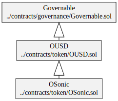

### Squashed

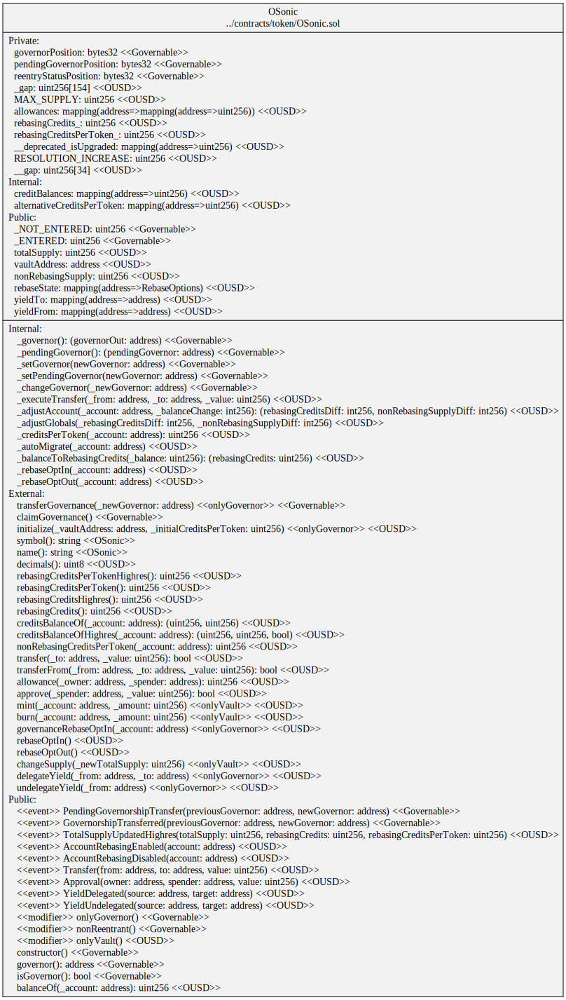

### Storage

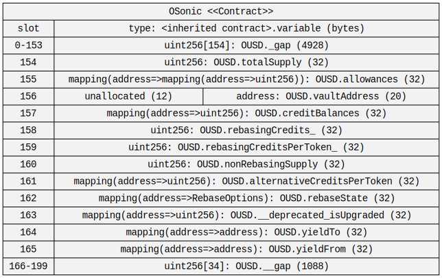

## Wrapped Origin Sonic (wOS)

- Symbol `wOS`
- Name `Wrapped Origin Sonic`

### Hierarchy

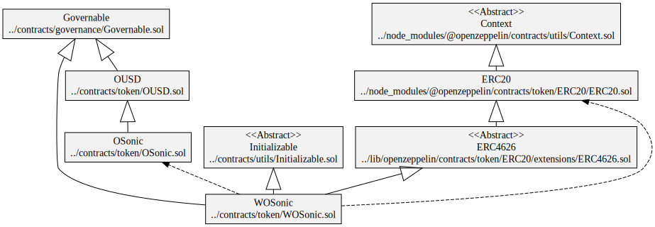

### Squashed

### Storage

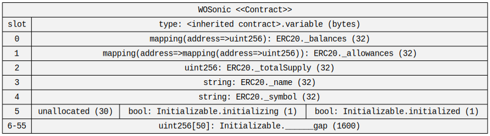
