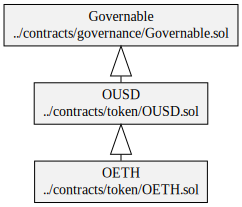

# Diagrams

## Origin Dollar (OUSD)

### Hierarchy

### Squashed

### Storage

## Wrapped Origin Dollar (WOUSD)

### Hierarchy

### Squashed

### Storage

## Origin Ether (OETH)

### Hierarchy

### Squashed

### Storage

## Wrapped Origin Ether (WOETH)

### Hierarchy

### Squashed

### Storage

