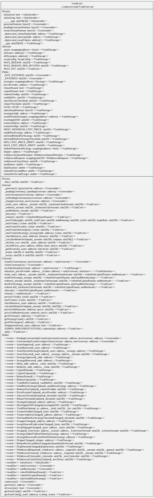
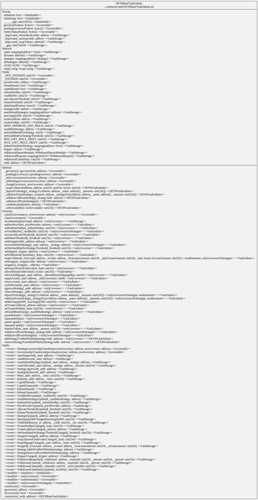
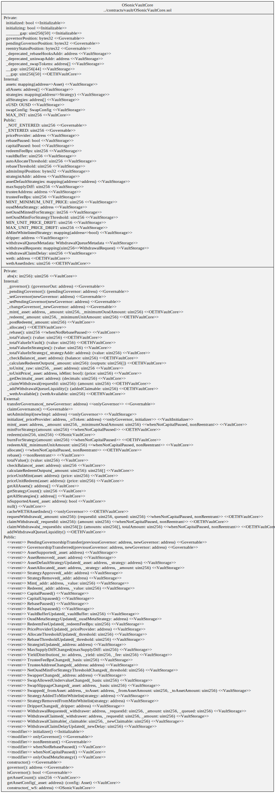

# Diagrams

## Hierarchy

## OUSD Vault

## Vault Core Squashed

### Storage

## Vault Admin Squashed

## OETH Vault

## Vault Core Squashed

## Vault Admin Squashed

### Storage

## Base OETH Vault

## Vault Core Squashed

## Vault Admin Squashed

### Storage

## Origin Sonic (OS) Vault

## Vault Core Squashed

## Vault Admin Squashed

### Storage

