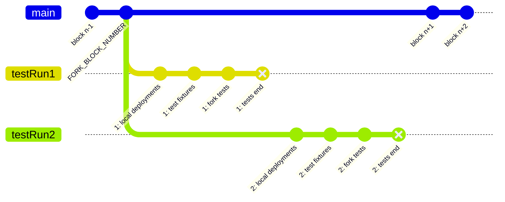
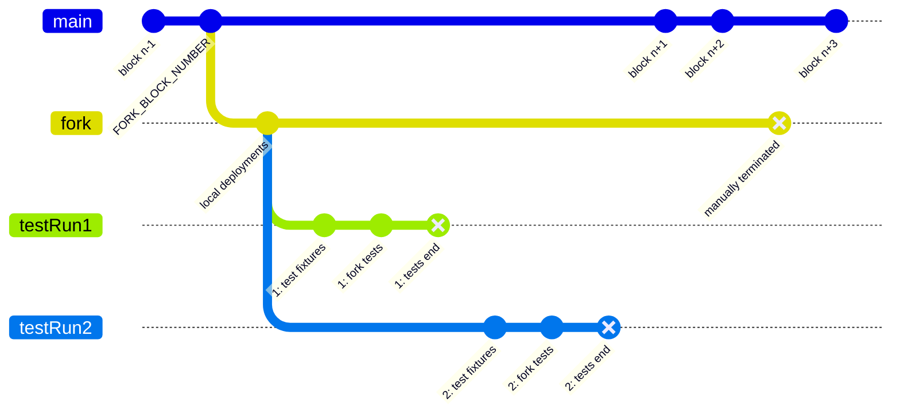

# Fork Tests

## What and Why?
Fork tests are similar to unit tests, except that it is run on a mainnet fork against already deployed contracts. It is also run as part of the CI. It helps to reduce manual testing when any changes to contracts are made. Also useful in testing contracts that depend on external contracts (like Oracle or Uniswap or Metapools).

## Running Fork Tests

### Option 1: Fork each time (just like CI)
- Set `PROVIDER_URL` in `.env` file
- Run `yarn test:fork` (or `yarn test:fork -- filename.fork-test.js`)

This forks the blockchain (using `PROVIDER_URL`) every time you run the command, might take a lot of time.

### Option 2: Nested forking (only for local/dev usage)
In cases where you don't want to fork or run the deployments again and again
- Start the node in a separate terminal using `FORK=true yarn run node`
- Run `yarn test:fork` in a new terminal

#### How it works
Basically, you start a forked node that runs the deployments and all. Next, the hardhat forks from this forked node when running the tests. Since any new deployments have already been run on the base fork, running `yarn test:fork` will be much faster. This can be useful when you are just writing tests and there isn't any change to contracts or deployment files.

#### Things to know
- Hardhat always runs the test under the default `hardhat` network
- When `forking.url` is set for a network in `hardhat.config.js` file, hardhat internally spins up its own node (aka Hardhat Runtime Environment or HRE) with the network name `hardhat`, forks the network and snapshots it to run the tests against. 
- No changes are persisted to the actual node. All deployments and contract calls are only made on the forked node, not the actual node

### Environment Variables used on CI
- `MAX_CHUNKS` - The number of runners to use to run fork tests parallelly on CI, hardcoded to 4 in defi.yml file
- `CHUNK_ID` - Current runner ID (will be set by Github Actions), see defi.yml for the definition
